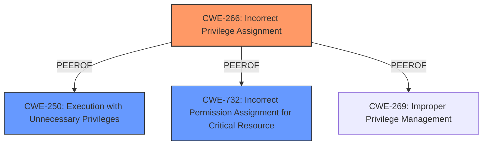

# Enhanced Analysis for CVE-2024-45496

# Summary
| CWE ID  | CWE Name                                                        | Confidence | CWE Abstraction Level | CWE Vulnerability Mapping Label | CWE-Vulnerability Mapping Notes |
| :-------- | :-------------------------------------------------------------- | :--------- | :-------------------- | :------------------------------ | :------------------------------ |
| CWE-266   | Incorrect Privilege Assignment                                | 0.9        | Base                  | Primary                         | Allowed                         |
| CWE-250   | Execution with Unnecessary Privileges                           | 0.7        | Base                  | Secondary                       | Allowed                         |
| CWE-732   | Incorrect Permission Assignment for Critical Resource         | 0.6        | Class                 | Secondary                       | Allowed-with-Review           |

## Evidence and Confidence

*   **Confidence Score:** 0.8
*   **Evidence Strength:** HIGH

## Relationship Analysis
The primary relationship influencing the CWE selection is the parent-child relationship and the specific guidance on privilege vs. permissions. CWE-266 is chosen as the root cause because the vulnerability stems from the **misuse of elevated privileges**, which aligns with the definition of incorrect privilege assignment. CWE-250 is considered as a secondary weakness because the `git-clone` container is running with higher privileges than it needs. While CWE-732 relates to permissions, the issue is more directly tied to the initial assignment of elevated privileges.



## Vulnerability Chain
The vulnerability chain starts with the **misuse of elevated privileges** (CWE-266) assigned to the `git-clone` container. Because the container has more privileges than necessary (CWE-250), an attacker can then use a crafted .gitconfig file to execute arbitrary commands, ultimately leading to a compromise of the worker node.

## Summary of Analysis
The primary CWE, CWE-266, is selected based on the clear statement in the vulnerability description that the issue arises from the **misuse of elevated privileges**. The "Vulnerability Description Key Phrases" also highlights "**misuse of elevated privileges**" as a rootcause. The CVE reference summary further confirms that the `git-clone` container runs with elevated privileges.

The retriever results also showed CWE-732, Incorrect Permission Assignment for Critical Resource, as the top hit. However, that CWE is listed as an "Allowed-with-Review" because "this is often misused for vulnerabilities in which 'permissions' are not checked, which is an 'authorization' weakness." The guidance on "Privileges vs Permissions" also states that "Privileges = rights assigned to a user role" while "Permissions = access rules applied to specific objects/resources". The core issue is the elevated privileges of the container and not the permissions of a resource.

Therefore, based on the evidence and the CWE mapping guidance, CWE-266 best represents the root cause of the vulnerability.

Relevant CWE Information:

# Enhanced Context (25 CWEs)
The following CWEs were identified as potentially relevant to this vulnerability:

## CWE-266: Incorrect Privilege Assignment
**Abstraction Level**: Base
**Similarity Score**: 0.81
**Source**: dense

**Description**:
A product incorrectly assigns a privilege to a particular actor, creating an unintended sphere of control for that actor.

**Mapping Guidance**:
- Usage: Allowed
- Rationale: This CWE entry is at the Base level of abstraction, which is a preferred level of abstraction for mapping to the root causes of vulnerabilities.

**Explanation:** This CWE directly addresses the **misuse of elevated privileges** in the OpenShift Container Platforms build process. The `git-clone` container is assigned incorrect privileges, which allows unrestricted access to the node.

## CWE-250: Execution with Unnecessary Privileges
**Abstraction Level**: Base
**Similarity Score**: 0.593

**Explanation:** While the root cause is the incorrect assignment, the container also has higher privileges than it needs. This makes CWE-250 a relevant secondary CWE.
# Complete CWE Specifications

CWE-266: Incorrect Privilege Assignment
Technical Explanation: The `git-clone` container in OpenShift is incorrectly assigned elevated privileges, allowing it unrestricted access to the node. This means that the container is given more authority than it needs to perform its intended function.
Security Implications: An attacker with developer-level access can exploit this vulnerability by providing a crafted .gitconfig file. This allows them to execute arbitrary commands on the worker node.
Parent-Child Relationships: N/A
Primary/Secondary: Primary
MITRE Mapping Guidance: Allowed

CWE-250: Execution with Unnecessary Privileges
Technical Explanation: The `git-clone` container runs with elevated privileges even though it only needs a limited set of privileges to perform its task.
Security Implications: This allows an attacker to escalate their permissions on the node running the container.
Parent-Child Relationships: N/A
Primary/Secondary: Secondary
MITRE Mapping Guidance: Allowed

CWE-732: Incorrect Permission Assignment for Critical Resource
Technical Explanation: Although the container has elevated privileges it should not have, this results in incorrect permissions for the "node" resource.
Security Implications: An attacker with developer-level access can exploit this vulnerability by providing a crafted .gitconfig file. This allows them to execute arbitrary commands on the worker node.
Parent-Child Relationships: N/A
Primary/Secondary: Secondary
MITRE Mapping Guidance: Allowed-with-Review


## CWE Relationship Analysis

Current CWEs represent these abstraction levels: .


### Vulnerability Chain Analysis

**Chain starting from CWE-266:**
- 266 (Incorrect Privilege Assignment) - ROOT


**Chain starting from CWE-269:**
- 269 (Improper Privilege Management) - ROOT


### CWE Relationship Diagram

```mermaid
graph TD
    classDef primary fill:#f96,stroke:#333,stroke-width:2px
    classDef secondary fill:#69f,stroke:#333
    classDef tertiary fill:#9e9,stroke:#333
```