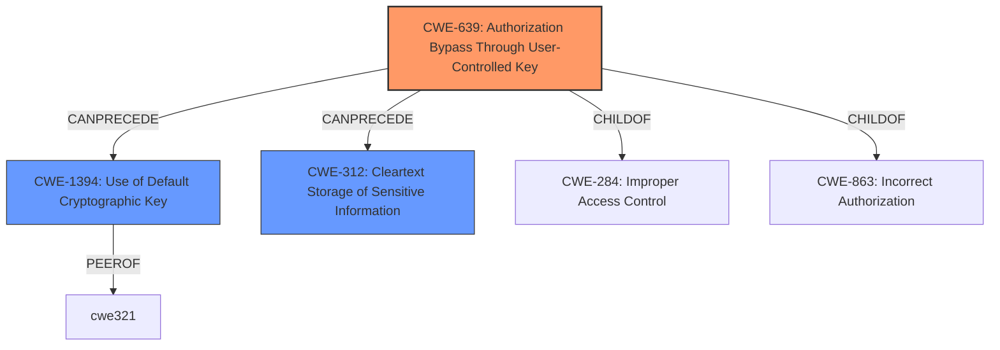

# Analysis for CVE-2024-45556

# Summary
| CWE ID | CWE Name | Confidence | CWE Abstraction Level | CWE Vulnerability Mapping Label | CWE-Vulnerability Mapping Notes |
|---|---|---|---|---|---|
| CWE-639 | Authorization Bypass Through User-Controlled Key | 0.7 | Base | Allowed | Primary CWE. The access control configuration permits Linux to read key registers in TCSR, which can be viewed as a form of authorization bypass where a user can control the key to gain access to sensitive information. |
| CWE-1394 | Use of Default Cryptographic Key | 0.6 | Base | Allowed | Secondary candidate. While not explicitly stated, the vulnerability could potentially involve the use of default cryptographic keys if the key registers are accessible due to the access control misconfiguration. |
| CWE-312 | Cleartext Storage of Sensitive Information | 0.5 | Base | Allowed | Secondary candidate. If the key registers are being read, the keys might be stored in cleartext, representing a potential vulnerability. |

## Evidence and Confidence

*   **Confidence Score:** 0.7
*   **Evidence Strength:** MEDIUM

## Relationship Analysis
The primary CWE identified is CWE-639, which focuses on authorization bypass through user-controlled keys. This is a base-level CWE, offering a specific characterization of the vulnerability. The secondary CWEs, CWE-1394 and CWE-312, are also base-level CWEs that represent potential related weaknesses, such as the use of default keys or cleartext storage.

## Vulnerability Chain
The vulnerability chain starts with an access control misconfiguration, allowing unauthorized reading of key registers. This could lead to the use of default cryptographic keys, cleartext storage of sensitive information, and ultimately, cryptographic issues.

Misconfigured Access Control -> Unauthorized Key Register Access -> Potential Use of Default Keys/Cleartext Storage -> Cryptographic Issues

The **Primary CWE** is CWE-639. It identifies the issue that led to the vulnerability i.e. the first in the "Vulnerability Chain".

## Summary of Analysis
The analysis is based on the provided vulnerability description, which indicates a **cryptographic issue** arising from an access control misconfiguration that permits reading key registers in TCSR. The primary CWE, CWE-639, is selected because it directly addresses the authorization bypass aspect. The secondary CWEs, CWE-1394 and CWE-312, are considered based on potential implications of the vulnerability, such as the use of default keys or cleartext storage.

The evidence from the vulnerability description is limited, focusing on the access control misconfiguration and the ability to read key registers. This evidence supports the selection of CWE-639.

The CWEs are selected at the base level of abstraction to provide a specific characterization of the vulnerability.
The retriever results also suggest some cryptographic key related CWEs.

Relevant CWE Information:
*   CWE-639: Authorization Bypass Through User-Controlled Key
*   CWE-1394: Use of Default Cryptographic Key
*   CWE-312: Cleartext Storage of Sensitive Information