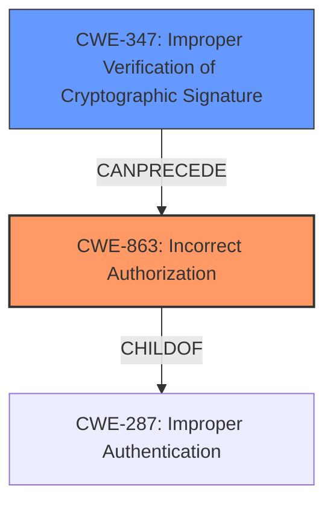

# Analysis for CVE-2024-45607

# Summary
| CWE ID | CWE Name | Confidence | CWE Abstraction Level | CWE Vulnerability Mapping Label | CWE-Vulnerability Mapping Notes |
|---|---|---|---|---|---|
| CWE-863 | Incorrect Authorization | 0.9 | Class | Allowed-with-Review | Primary CWE. The product performs an authorization check when an actor attempts to access a resource or perform an action, but it does not correctly perform the check. |
| CWE-347 | Improper Verification of Cryptographic Signature | 0.7 | Base | Allowed | Secondary candidate.  The product does not properly verify cryptographic signatures, allowing an attacker to bypass security mechanisms. |

## Evidence and Confidence

*   **Confidence Score:** 0.8
*   **Evidence Strength:** HIGH

## Relationship Analysis
The primary CWE is CWE-863, Incorrect Authorization, which is a Class-level CWE. It is related to other authorization-related CWEs such as CWE-285 (Improper Authorization) and CWE-639 (Authorization Bypass Through User-Controlled Key). CWE-347, Improper Verification of Cryptographic Signature, can lead to authorization bypass. The vulnerability description indicates an **incorrect access control** due to a flaw in signature verification, making CWE-863 the most appropriate primary classification.

## Vulnerability Chain
The vulnerability chain starts with a flawed implementation of the `verifyRequestSignature` method, leading to **incorrect access control**. The chain is:

1.  **Improper Verification of Cryptographic Signature (CWE-347):** The `verifyRequestSignature` method has a logic error that causes it to incorrectly validate message signatures.
2.  **Incorrect Authorization (CWE-863):** Due to the flawed signature verification, unauthorized requests are treated as valid, leading to **incorrect access control**.

## Summary of Analysis
The analysis is based on the vulnerability description and the CVE reference summary. The key phrase "**incorrect access control**" points towards an authorization issue. The root cause is the flawed signature verification logic within the `verifyRequestSignature` method. The retriever results also suggest CWE-863 as a strong candidate.

CWE-863 is chosen because the application performs an authorization check (signature verification) but does so incorrectly. CWE-347 is considered a secondary issue because the signature verification is flawed, which leads to the incorrect authorization.

The selection of CWE-863 is at the Class level because a more specific Base-level CWE isn't apparent without deeper code analysis.

Other CWEs Considered and Rejected:

*   CWE-287 (Improper Authentication): Rejected because the issue is not about missing authentication but about flawed authorization after a form of authentication (signature verification) is performed.
*   CWE-306 (Missing Authentication for Critical Function): Rejected because the code attempts to verify the request signature. Thus, it is not missing authentication, but rather performing it incorrectly.
*   CWE-639 (Authorization Bypass Through User-Controlled Key): Rejected as the primary weakness because the bypass occurs due to a flaw in the signature verification process itself, not necessarily through direct user manipulation of a key.
*   CWE-345 (Insufficient Verification of Data Authenticity): Rejected because CWE-347 is a more specific child that focuses on cryptographic signature verification.
*   CWE-940 (Improper Verification of Source of a Communication Channel): Rejected as the weakness is related to the verification of a cryptographic signature, not the communication channel itself.