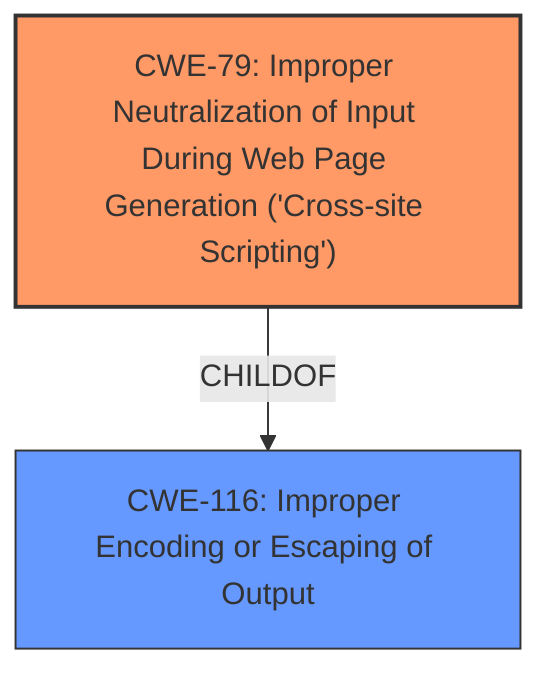

# Analysis for CVE-2024-4564

# Summary
| CWE ID | CWE Name | Confidence | CWE Abstraction Level | CWE Vulnerability Mapping Label | CWE-Vulnerability Mapping Notes |
|---|---|---|---|---|---|
| CWE-79 | Improper Neutralization of Input During Web Page Generation ('Cross-site Scripting') | 1.0 | Base | Allowed | Primary CWE. The vulnerability is caused by **insufficient input sanitization and output escaping**, leading to **Stored Cross-Site Scripting**. |
| CWE-116 | Improper Encoding or Escaping of Output | 0.7 | Class | Allowed-with-Review | Secondary CWE. The root cause, **insufficient output escaping**, aligns with this CWE. |

## Evidence and Confidence

*   **Confidence Score:** 1.0
*   **Evidence Strength:** HIGH

## Relationship Analysis
The primary CWE is CWE-79, which directly addresses the **improper neutralization of input** leading to XSS. CWE-116 is a related class-level CWE describing the broader issue of **improper encoding or escaping of output**. The relationship between these CWEs lies in the fact that CWE-79 is often a consequence of failures described by CWE-116.

## Vulnerability Chain
The vulnerability chain starts with **insufficient input sanitization and output escaping**, leading to **Stored Cross-Site Scripting** which allows authenticated attackers to **inject arbitrary web scripts** that execute when a user accesses the injected page.
  - **Root Cause:** Insufficient Input Sanitization and Output Escaping
  - **Weakness:** Stored Cross-Site Scripting (CWE-79)
  - **Impact:** Arbitrary web scripts can be injected

## Summary of Analysis
The primary weakness is **Stored Cross-Site Scripting**, caused by **insufficient input sanitization and output escaping**. This aligns directly with CWE-79. The vulnerability description explicitly mentions these key phrases, providing strong evidence for this classification.

The retriever results also list CWE-79 with a high score, further validating the selection. CWE-116 is included as a secondary CWE because the **insufficient output escaping** is a type of improper encoding or escaping of output, but it is at a higher abstraction level and the description aligns best with CWE-79, as the vulnerability leads to Cross-Site Scripting.

The evidence from the vulnerability description:
> The CoDesigner WooCommerce Builder for Elementor - Customize Checkout, Shop, Email, Products & More plugin for WordPress is vulnerable to **Stored Cross-Site Scripting** via the plugins Shop Slider, Tabs Classic, and Image Comparison widgets in all versions up to, and including, 4.4.1 due to **insufficient input sanitization and output escaping on user supplied attributes**.

The evidence from the CVE Reference Links Content Summary:
> The CoDesigner WooCommerce Builder for Elementor plugin for WordPress is vulnerable to Stored Cross-Site Scripting via the plugin's Shop Slider, Tabs Classic, and Image Comparison widgets due to insufficient input sanitization and output escaping on user supplied attributes.

The selection of CWE-79 is at the optimal level of specificity because it directly addresses the root cause of **improper neutralization of input** leading to Cross-Site Scripting.

Relevant CWE Information:

# Enhanced Context (25 CWEs)
The following CWEs were identified as potentially relevant to this vulnerability:

## CWE-352: Cross-Site Request Forgery (CSRF)
**Abstraction Level**: Compound
**Similarity Score**: 0.75
**Source**: dense

**Description**:
The web application does not, or can not, sufficiently verify whether a well-formed, valid, consistent request was intentionally provided by the user who submitted the request.

**Mapping Guidance**:
- Usage: Allowed
- Rationale: This is a well-known Composite of multiple weaknesses that must all occur simultaneously, although it is attack-oriented in nature.

*Not Selected*: This CWE doesn't fit because there is no mention of Cross-Site Request Forgery in the description.

## CWE-425: Direct Request ('Forced Browsing')
**Abstraction Level**: Base
**Similarity Score**: 0.73
**Source**: dense

**Description**:
The web application does not adequately enforce appropriate authorization on all restricted URLs, scripts, or files.

**Mapping Guidance**:
- Usage: Allowed
- Rationale: This CWE entry is at the Base level of abstraction, which is a preferred level of abstraction for mapping to the root causes of vulnerabilities.

*Not Selected*: The vulnerability is not related to authorization, so this CWE is not applicable.

## CWE-80: Improper Neutralization of Script-Related HTML Tags in a Web Page (Basic XSS)
**Abstraction Level**: Variant
**Similarity Score**: 0.72
**Source**: dense

**Description**:
The product receives input from an upstream component, but it does not neutralize or incorrectly neutralizes special characters such as "<", ">", and "&" that could be interpreted as web-scripting elements when they are sent to a downstream component that processes web pages.

**Mapping Guidance**:
- Usage: Allowed
- Rationale: This CWE entry is at the Variant level of abstraction, which is a preferred level of abstraction for mapping to the root causes of vulnerabilities.

*Not Selected*: While this is an XSS related CWE, CWE-79 is a more general case that applies.

## CWE-434: Unrestricted Upload of File with Dangerous Type
**Abstraction Level**: Base
**Similarity Score**: 0.72
**Source**: dense

**Description**:
The product allows the upload or transfer of dangerous file types that are automatically processed within its environment.

**Mapping Guidance**:
- Usage: Allowed
- Rationale: This CWE entry is at the Base level of abstraction, which is a preferred level of abstraction for mapping to the root causes of vulnerabilities.

*Not Selected*: File uploads are not mentioned in the description.

## CWE-96: Improper Neutralization of Directives in Statically Saved Code ('Static Code Injection')
**Abstraction Level**: Base
**Similarity Score**: 0.72
**Source**: dense

**Description**:
The product receives input from an upstream component, but it does not neutralize or incorrectly neutralizes code syntax before inserting the input into an executable resource, such as a library, configuration file, or template.

**Mapping Guidance**:
- Usage: Allowed
- Rationale: This CWE entry is at the Base level of abstraction, which is a preferred level of abstraction for mapping to the root causes of vulnerabilities.

*Not Selected*: This CWE is specific to static code injection, and the vulnerability does not specify code being injected into an executable resource.

## CWE-472: External Control of Assumed-Immutable Web Parameter
**Abstraction Level**: Base
**Similarity Score**: 0.72
**Source**: dense

**Description**:
The web application does not sufficiently verify inputs that are assumed to be immutable but are actually externally controllable, such as hidden form fields.

**Mapping Guidance**:
- Usage: Allowed
- Rationale: This CWE entry is at the Base level of abstraction, which is a preferred level of abstraction for mapping to the root causes of vulnerabilities.

*Not Selected*: The description does not specify any externally controlled immutable web parameters being the cause.

## CWE-116: Improper Encoding or Escaping of Output
**Abstraction Level**: Class
**Similarity Score**: 0.72
**Source**: dense

**Description**:
The product prepares a structured message for communication with another component, but encoding or escaping of the data is either missing or done incorrectly. As a result, the intended structure of the message is not preserved.

**Mapping Guidance**:
- Usage: Allowed-with-Review
- Rationale: This CWE entry is a Class and might have Base-level children that would be more appropriate

*Selected as Secondary*: As the root cause includes **insufficient output escaping**, this CWE matches.

## CWE-138: Improper Neutralization of Special Elements
**Abstraction Level**: Class
**Similarity Score**: 0.70
**Source**: dense

**Description**:
The product receives input from an upstream component, but it does not neutralize or incorrectly neutralizes special elements that could be interpreted as control elements or syntactic markers when they are sent to a downstream component.

**Mapping Guidance**:
- Usage: Discouraged
- Rationale: This CWE entry is a level-1 Class (i.e., a child of a Pillar). It might have lower-level children that would be more appropriate

*Not Selected*: CWE-79 is more specific to the Stored XSS vulnerability.

## CWE-79: Improper Neutralization of Input During Web Page Generation ('Cross-site Scripting')
**Abstraction Level**: Base
**Similarity Score**: 0.69
**Source**: dense

**Description**:
The product does not neutralize or incorrectly neutralizes user-controllable input before it is placed in output that