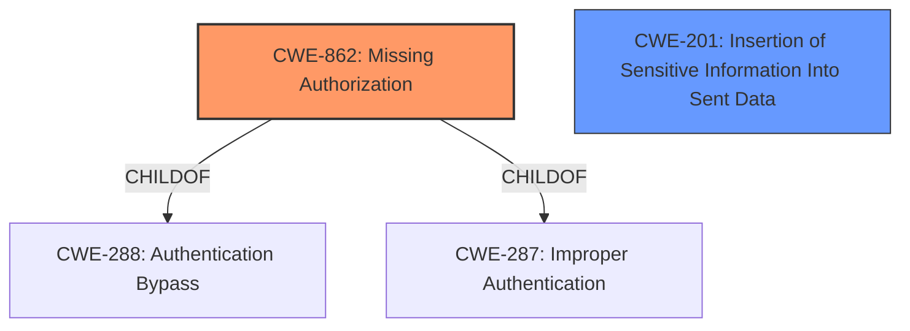

# Analysis for CVE-2024-4565

# Summary
| CWE ID | CWE Name | Confidence | CWE Abstraction Level | CWE Vulnerability Mapping Label | CWE-Vulnerability Mapping Notes |
|---|---|---|---|---|---|
| CWE-862 | Missing Authorization | 0.9 | Class | Primary | Allowed-with-Review |
| CWE-201 | Insertion of Sensitive Information Into Sent Data | 0.6 | Base | Secondary | Allowed |

## Evidence and Confidence

*   **Confidence Score:** 0.75
*   **Evidence Strength:** HIGH

## Relationship Analysis
The primary relationship that influenced the CWE selection is the ChildOf relationship. CWE-862 Missing Authorization is a child of CWE-288 Authentication Bypass and CWE-287 Improper Authentication. The vulnerability involves bypassing access control checks, which falls under the umbrella of authorization issues.

## Vulnerability Chain
The vulnerability chain starts with **Missing Authorization** (CWE-862), leading to the **insertion of sensitive information into sent data** (CWE-201), and ultimately resulting in information disclosure. The root cause is the **lack of access control checks** when displaying custom field values via shortcodes.

## Summary of Analysis
The initial analysis focused on identifying the root cause of the vulnerability. The **Vulnerability Description** and **CVE Reference Links Content Summary** sections clearly indicate that the Advanced Custom Fields plugin lacks proper access control checks when displaying custom field values via shortcodes. This **missing authorization** allows unauthorized users to access sensitive information, leading to information disclosure.

CWE-862 (Missing Authorization) is selected as the primary CWE because it accurately represents the root cause of the vulnerability, which is the **absence of proper authorization checks**. The "CVE Reference Links Content Summary" states that the vulnerability involves "Broken Access Control" and "Improper Authorization".

CWE-201 (Insertion of Sensitive Information Into Sent Data) is included as a secondary CWE because the **missing authorization** leads to the **exposure of sensitive information**. The vulnerability allows a contributor-level user to access and view custom field values of any post, including private and password-protected posts, which means sensitive information is being inserted into the sent data without proper authorization.

The selected CWEs are at the optimal level of specificity. CWE-862 is a Class-level CWE, but it accurately represents the **lack of authorization checks**. The retriever results also list other relevant CWEs such as CWE-425 (Direct Request), CWE-639 (Authorization Bypass Through User-Controlled Key), and CWE-863 (Incorrect Authorization). However, CWE-862 is more appropriate because the vulnerability involves a complete **lack of authorization checks**, rather than an incorrect or bypassed authorization mechanism.

Relevant CWE Information:

# Enhanced Context (25 CWEs)
The following CWEs were identified as potentially relevant to this vulnerability:

## CWE-352: Cross-Site Request Forgery (CSRF)
**Abstraction Level**: Compound
**Similarity Score**: 0.73
**Source**: dense

**Description**:
The web application does not, or can not, sufficiently verify whether a well-formed, valid, consistent request was intentionally provided by the user who submitted the request.

**Mapping Guidance**:
- Usage: Allowed
- Rationale: This is a well-known Composite of multiple weaknesses that must all occur simultaneously, although it is attack-oriented in nature.

*Not Selected*: This vulnerability is not related to CSRF.

## CWE-472: External Control of Assumed-Immutable Web Parameter
**Abstraction Level**: Base
**Similarity Score**: 0.69
**Source**: dense

**Description**:
The web application does not sufficiently verify inputs that are assumed to be immutable but are actually externally controllable, such as hidden form fields.

**Mapping Guidance**:
- Usage: Allowed
- Rationale: This CWE entry is at the Base level of abstraction, which is a preferred level of abstraction for mapping to the root causes of vulnerabilities.

*Not Selected*: While the vulnerability involves user-controlled input (post ID or option name), the core issue is the **lack of authorization**, not the external control of immutable parameters.

## CWE-425: Direct Request ('Forced Browsing')
**Abstraction Level**: Base
**Similarity Score**: 0.69
**Source**: dense

**Description**:
The web application does not adequately enforce appropriate authorization on all restricted URLs, scripts, or files.

**Mapping Guidance**:
- Usage: Allowed
- Rationale: This CWE entry is at the Base level of abstraction, which is a preferred level of abstraction for mapping to the root causes of vulnerabilities.

*Not Selected*: CWE-425 is similar, but CWE-862 is a better fit because it's more specific to **missing authorization** checks.

## CWE-434: Unrestricted Upload of File with Dangerous Type
**Abstraction Level**: Base
**Similarity Score**: 0.68
**Source**: dense

**Description**:
The product allows the upload or transfer of dangerous file types that are automatically processed within its environment.

**Mapping Guidance**:
- Usage: Allowed
- Rationale: This CWE entry is at the Base level of abstraction, which is a preferred level of abstraction for mapping to the root causes of vulnerabilities.

*Not Selected*: This vulnerability is not related to file uploads.

## CWE-639: Authorization Bypass Through User-Controlled Key
**Abstraction Level**: Base
**Similarity Score**: 0.67
**Source**: dense

**Description**:
The system's authorization functionality does not prevent one user from gaining access to another user's data or record by modifying the key value identifying the data.

**Mapping Guidance**:
- Usage: Allowed
- Rationale: This CWE entry is at the Base level of abstraction, which is a preferred level of abstraction for mapping to the root causes of vulnerabilities.

*Not Selected*: While the attacker needs to know/guess a valid post ID or option name (which could be considered a "key"), the fundamental issue is the **lack of authorization** checks, not specifically the bypass through a user-controlled key.

## CWE-116: Improper Encoding or Escaping of Output
**Abstraction Level**: Class
**Similarity Score**: 0.65
**Source**: dense

**Description**:
The product prepares a structured message for communication with another component, but encoding or escaping of the data is either missing or done incorrectly. As a result, the intended structure of the message is not preserved.

**Mapping Guidance**:
- Usage: Allowed-with-Review
- Rationale: This CWE entry is a Class and might have Base-level children that would be more appropriate

*Not Selected*: This vulnerability is not related to encoding or escaping of output.

## CWE-538: Insertion of Sensitive Information into Externally-Accessible File or Directory
**Abstraction Level**: Base
**Similarity Score**: 0.65
**Source**: dense

**Description**:
The product places sensitive information into files or directories that are accessible to actors who are allowed to have access to the files, but not to the sensitive information.

**Mapping Guidance**:
- Usage: Allowed
- Rationale: This CWE entry is at the Base level of abstraction, which is a preferred level of abstraction for mapping to the root causes of vulnerabilities.

*Not Selected*: The sensitive information is not being placed into externally-accessible files or directories, but is instead being sent in the data.

## CWE-201: Insertion of Sensitive Information Into Sent Data
**Abstraction Level**: Base
**Similarity Score**: 0.65
**Source**: dense

**Description**:
The code transmits data to another actor, but a portion of the data includes sensitive information that should not be accessible to that actor.

**Mapping Guidance**:
- Usage: Allowed
- Rationale: This CWE entry is at the Base level of abstraction, which is a preferred level of abstraction for mapping to the root causes of vulnerabilities.

*Selected as Secondary*: The **missing authorization** (CWE-862) directly leads to the **insertion of sensitive information into sent data** (CWE-201).

## CWE-96: Improper Neutralization of Directives in Statically Saved Code ('Static Code Injection')
**Abstraction Level**: Base
**Similarity Score**: 0.65
**Source**: dense

**Description**:
The product receives input from an upstream component, but it does not neutralize or incorrectly neutralizes code syntax before inserting the input into an executable resource, such as a library, configuration file, or template.

**Mapping Guidance**:
- Usage: Allowed
- Rationale: This CWE entry is at the Base level of abstraction, which is a preferred level of abstraction for mapping to the root causes of vulnerabilities.