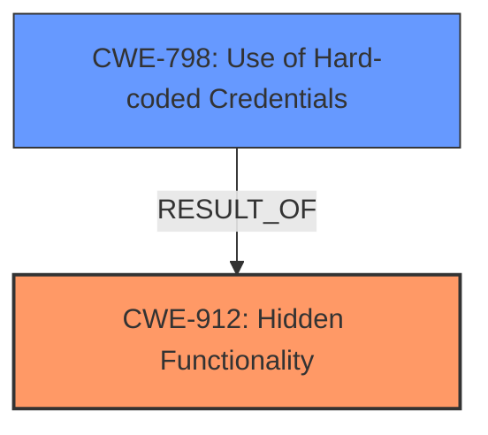

# Raw Analyzer Response for CVE-2024-45696

# Summary

| CWE ID | CWE Name | Confidence | CWE Abstraction Level | CWE Vulnerability Mapping Label | CWE-Vulnerability Mapping Notes |
|---|---|---|---|---|---|
| CWE-912 | Hidden Functionality | 0.9 | Class | Allowed-with-Review | Primary CWE. The vulnerability stems from **hidden functionality** within the D-Link router's firmware. |
| CWE-798 | Use of Hard-coded Credentials | 0.8 | Base | Allowed | The **hidden functionality** leads to the enablement of Telnet with **hard-coded credentials**. |

## Evidence and Confidence

*   **Confidence Score:** 0.85
*   **Evidence Strength:** MEDIUM

## Relationship Analysis

The primary weakness is the existence of **hidden functionality** (CWE-912). This **hidden functionality** then allows an attacker to enable Telnet using **hard-coded credentials** (CWE-798). CWE-912 is a class-level CWE, and while it might ideally have a more specific base-level child, it accurately represents the overarching issue of undocumented and unintended features. CWE-798 represents the direct consequence of this **hidden functionality**, allowing unauthorized access.

## Vulnerability Chain

The vulnerability chain starts with **hidden functionality** (CWE-912). This then leads to the ability to enable Telnet and login with **hard-coded credentials** (CWE-798), which results in unauthorized access to the device.

## Summary of Analysis

The primary vulnerability is the **hidden functionality** within the D-Link router, which is represented by CWE-912. This **hidden functionality** allows the attacker to enable the Telnet service and log in using **hard-coded credentials**, represented by CWE-798. The evidence directly states the existence of **hidden functionality**, and that it allows attackers to enable Telnet and log in using **hard-coded credentials**.

The Retriever Results identified CWE-912 as a strong candidate, however, it is a Class level CWE. The mapping guidance suggests that this is allowed-with-review, and suggests looking for a more specific Base-level child. No child CWE was identified. It is being used as the primary CWE since the **hidden functionality** is the root cause.

CWE-798 is added as a secondary CWE as it directly follows from the **hidden functionality**.

Relevant CWE Information:

# Enhanced Context (25 CWEs)
The following CWEs were identified as potentially relevant to this vulnerability:

## CWE-912: Hidden Functionality
**Abstraction Level**: Class
**Similarity Score**: 0.77
**Source**: dense

**Description**:
The product contains functionality that is not documented, not part of the specification, and not accessible through an interface or command sequence that is obvious to the product's users or administrators.

**Mapping Guidance**:
- Usage: Allowed-with-Review
- Rationale: This CWE entry is a Class and might have Base-level children that would be more appropriate

## CWE-259: Use of Hard-coded Password
**Abstraction Level**: Variant
**Similarity Score**: 0.73
**Source**: dense

**Description**:
The product contains a hard-coded password, which it uses for its own inbound authentication or for outbound communication to external components.

**Mapping Guidance**:
- Usage: Allowed
- Rationale: This CWE entry is at the Variant level of abstraction, which is a preferred level of abstraction for mapping to the root causes of vulnerabilities.

## CWE-798: Use of Hard-coded Credentials
**Abstraction Level**: Base
**Similarity Score**: 0.73
**Source**: dense

**Description**:
The product contains hard-coded credentials, such as a password or cryptographic key.

**Mapping Guidance**:
- Usage: Allowed
- Rationale: This CWE entry is at the Base level of abstraction, which is a preferred level of abstraction for mapping to the root causes of vulnerabilities.