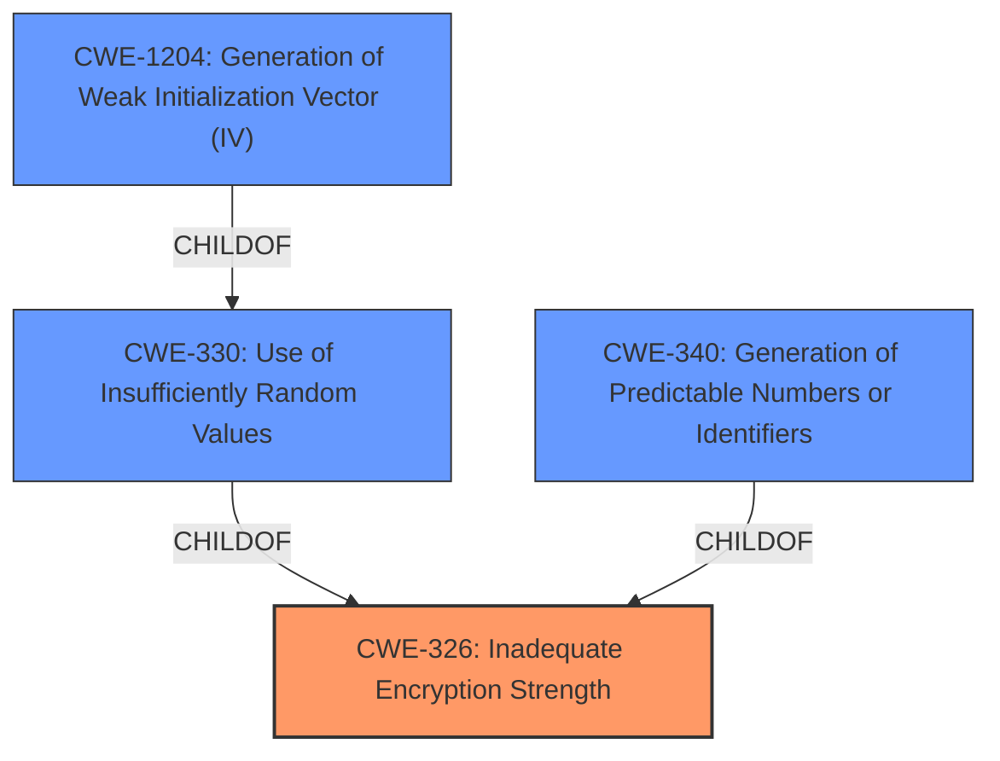

# Raw Analyzer Response for CVE-2024-45719

# Summary

| CWE ID   | CWE Name                                                      | Confidence | CWE Abstraction Level | CWE Vulnerability Mapping Label | CWE-Vulnerability Mapping Notes |
| :--------- | :------------------------------------------------------------ | :--------- | :-------------------- | :------------------------------ | :------------------------------ |
| CWE-326    | Inadequate Encryption Strength                                | 1.0        | Class                 | Primary                         | Allowed-with-Review             |
| CWE-330    | Use of Insufficiently Random Values                           | 0.8        | Class                 | Secondary                       | Discouraged                     |
| CWE-340    | Generation of Predictable Numbers or Identifiers            | 0.7        | Class                 | Secondary                       | Allowed-with-Review             |
| CWE-1204   | Generation of Weak Initialization Vector (IV)                 | 0.6        | Base                  | Secondary                       | Allowed                         |

## Evidence and Confidence

*   **Confidence Score:** 0.8
*   **Evidence Strength:** HIGH

## Relationship Analysis

The primary relationship considered was the hierarchical structure within the CWE framework. CWE-326, **Inadequate Encryption Strength**, serves as a higher-level classification that encompasses the more specific issues. While CWE-330, **Use of Insufficiently Random Values**, CWE-340, **Generation of Predictable Numbers or Identifiers**, and CWE-1204, **Generation of Weak Initialization Vector (IV)**, are all related to the specific mechanism of weakness (predictable UUID generation), CWE-326 captures the overall **rootcause** of the vulnerability. These are all related to cryptographic issues, but are at varying abstraction levels.

## Vulnerability Chain

The vulnerability chain starts with the **Inadequate Encryption Strength** (CWE-326) due to the use of UUIDv1. This leads to the **Use of Insufficiently Random Values** (CWE-330), resulting in **predictable generated tokens**. An attacker can then potentially predict valid authorization tokens, leading to unauthorized access and account compromise.

The chain is: CWE-326 (Root Cause) -> CWE-330 -> CWE-340 -> CWE-1204 -> Predictable Tokens (Impact) -> Unauthorized Access (Impact).

## Summary of Analysis

Initially, the analysis focused on identifying the most specific CWE related to the **rootcause** of the vulnerability. The use of UUIDv1, which is based on MAC address and timestamp, makes the generated tokens predictable. The description highlights **"Inadequate Encryption Strength"** as the primary issue.

The retriever results pointed to several potential CWEs including CWE-326, CWE-330, CWE-340, and CWE-1204.

The final decision was to primarily map to CWE-326 (**Inadequate Encryption Strength**) because it encapsulates the higher-level issue. CWE-330, CWE-340, and CWE-1204 are kept as secondary candidates since they refer to the specific mechanisms that contribute to the **inadequate encryption strength**.

The evidence to support this is in the Vulnerability Description Key Phrases:
*   **rootcause:** **Inadequate Encryption Strength**
*   **impact:** predictable generated token

Relevant CWE Information:

**CWE-326: Inadequate Encryption Strength**
The product uses encryption, but it does not provide adequate cryptographic strength for the level of protection required.

**CWE-330: Use of Insufficiently Random Values**
The product uses insufficiently random numbers or values in a security context that depends on unpredictable numbers.

**CWE-340: Generation of Predictable Numbers or Identifiers**
The product uses a scheme that generates numbers or identifiers that are more predictable than required.

**CWE-1204: Generation of Weak Initialization Vector (IV)**
The product uses a cryptographic primitive that uses an Initialization Vector (IV), but the product does not generate IVs that are sufficiently unpredictable or unique according to the expected cryptographic requirements for that primitive.