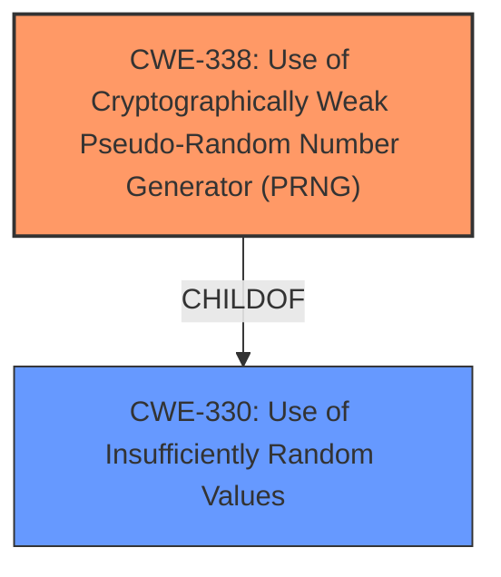

# Analysis Report for CVE-2024-45723

# Vulnerability Analysis Report: CVE-2024-45723

## Description

The goTenna Pro ATAK Plugin **does not use SecureRandom when generating passwords for sharing cryptographic keys**. The random function in use makes it easier for attackers to brute force this password if the broadcasted encryption key is captured over RF. This only applies to the optional broadcast of an encryption key, so it is advised to share the key with local QR code for higher security operations.

## Vulnerability Description Key Phrases

- **Weakness:** does not use SecureRandom when generating passwords for sharing cryptographic keys
- **Impact:** brute force this password
- **Vector:** captured over RF
- **Attacker:** attackers
- **Product:** goTenna Pro ATAK Plugin

## Analysis (with Relationship Data)

# Summary
| CWE ID | CWE Name | Confidence | CWE Abstraction Level | CWE Vulnerability Mapping Label | CWE-Vulnerability Mapping Notes |
|---|---|---|---|---|---|
| CWE-338 | Use of Cryptographically Weak Pseudo-Random Number Generator (PRNG) | 1.0 | Base | Primary CWE | Allowed |
| CWE-330 | Use of Insufficiently Random Values | 0.7 | Class | Secondary Candidate | Discouraged |

## Evidence and Confidence

*   **Confidence Score:** 1.0
*   **Evidence Strength:** HIGH

## Relationship Analysis
The primary CWE is CWE-338 Use of Cryptographically Weak Pseudo-Random Number Generator (PRNG), which is a child of CWE-330 Use of Insufficiently Random Values. While CWE-330 is a parent, CWE-338 is a more specific Base level weakness and a better fit for the vulnerability. There aren't any other meaningful relationships that change this assesment.



## Vulnerability Chain
The vulnerability chain starts with the **use of a cryptographically weak PRNG** (CWE-338). This leads to the generation of weak passwords, which can be brute-forced by attackers to decrypt the encryption key and compromise communications.

## Summary of Analysis
The initial assessment strongly points to CWE-338 as the primary weakness, which aligns with the "CWE for similar CVE Descriptions" and the Retriever results, and is the **root cause** of the vulnerability. The "Vulnerability Description Key Phrases" also indicate that the **weakness** is that it **does not use SecureRandom when generating passwords for sharing cryptographic keys**. The CVE Reference Links Content Summary also confirms this. CWE-338 is at the Base level of abstraction, which is preferred for root cause analysis.

Relevant CWE Information:

# Enhanced Context (25 CWEs)
The following CWEs were identified as potentially relevant to this vulnerability:

## CWE-330: Use of Insufficiently Random Values
**Abstraction Level**: Class
**Similarity Score**: 0.73
**Source**: dense

**Description**:
The product uses insufficiently random numbers or values in a security context that depends on unpredictable numbers.

**Mapping Guidance**:
- Usage: Discouraged
- Rationale: This CWE entry is a level-1 Class (i.e., a child of a Pillar). It might have lower-level children that would be more appropriate

## CWE-335: Incorrect Usage of Seeds in Pseudo-Random Number Generator (PRNG)
**Abstraction Level**: Base
**Similarity Score**: 0.71
**Source**: dense

**Description**:
The product uses a Pseudo-Random Number Generator (PRNG) but does not correctly manage seeds.

**Mapping Guidance**:
- Usage: Allowed
- Rationale: This CWE entry is at the Base level of abstraction, which is a preferred level of abstraction for mapping to the root causes of vulnerabilities.

## CWE-338: Use of Cryptographically Weak Pseudo-Random Number Generator (PRNG)
**Abstraction Level**: Base
**Similarity Score**: 0.71
**Source**: dense

**Description**:
The product uses a Pseudo-Random Number Generator (PRNG) in a security context, but the PRNG's algorithm is not cryptographically strong.

**Mapping Guidance**:
- Usage: Allowed
- Rationale: This CWE entry is at the Base level of abstraction, which is a preferred level of abstraction for mapping to the root causes of vulnerabilities.

## CWE-1391: Use of Weak Credentials
**Abstraction Level**: Class
**Similarity Score**: 0.71
**Source**: dense

**Description**:
The product uses weak credentials (such as a default key or hard-coded password) that can be calculated, derived, reused, or guessed by an attacker.

**Mapping Guidance**:
- Usage: Allowed-with-Review
- Rationale: This CWE entry is a Class and might have Base-level children that would be more appropriate

### CWE Selection:

*   **CWE-338: Use of Cryptographically Weak Pseudo-Random Number Generator (PRNG)**
    *   **Explanation:** This is the primary CWE because the vulnerability description explicitly states that the goTenna Pro ATAK Plugin **does not use SecureRandom when generating passwords for sharing cryptographic keys**. This aligns directly with the definition of CWE-338, which focuses on the use of PRNGs that are not cryptographically strong. The CVE Reference Links Content Summary confirms that the root cause is the use of a **cryptographically weak pseudo-random number generator (PRNG)**.
    *   **Security Implications:** Using a weak PRNG makes the generated passwords predictable and easier to brute-force, compromising the confidentiality of the encrypted communications.
    *   **CWE Relationships:** This is a child of CWE-330.
    *   **Mapping Guidance:** The Usage is Allowed.
    *   **Confidence:** 1.0

*   **CWE-330: Use of Insufficiently Random Values**
    *   **Explanation:** This CWE is considered as a secondary candidate because CWE-338 is a child of CWE-330 and more precisely describes the vulnerability. While the product **does not use SecureRandom**, it is more specific to say that the PRNG it does use is cryptographically weak (CWE-338).
    *   **Security Implications:** Insufficient randomness can lead to predictable passwords, session IDs, or other security-sensitive values, making them vulnerable to attack.
    *   **CWE Relationships:** This is a parent of CWE-338.
    *   **Mapping Guidance:** The Usage is Discouraged because this is a Class level CWE.
    *   **Confidence:** 0.7

Other CWEs Considered:

*   **CWE-335: Incorrect Usage of Seeds in Pseudo-Random Number Generator (PRNG)** - Not selected because the vulnerability description does not mention issues with seed management, but instead focuses on the use of a weak PRNG algorithm.
*   **CWE-1391: Use of Weak Credentials** - Not selected because while the resulting passwords are weak, the **root cause** is the use of a weak PRNG, not directly the use of weak credentials.
*   **CWE-327: Use of a Broken or Risky Cryptographic Algorithm** - Not selected because it's a broader category. CWE-338 is more specific to the **root cause**.
*   **CWE-321: Use of Hard-coded Cryptographic Key** - Not selected as the keys are generated, not hard-coded.
*   **CWE-259: Use of Hard-coded Password** - Not selected as the passwords are generated, not hard-coded.


## CWE Relationship Analysis

Current CWEs represent these abstraction levels: .


### Vulnerability Chain Analysis

**Chain starting from CWE-321:**
- 321 (Use of Hard-coded Cryptographic Key) - ROOT


**Chain starting from CWE-338:**
- 338 (Use of Cryptographically Weak Pseudo-Random Number Generator (PRNG)) - ROOT


### CWE Relationship Diagram

```mermaid
graph TD
    classDef primary fill:#f96,stroke:#333,stroke-width:2px
    classDef secondary fill:#69f,stroke:#333
    classDef tertiary fill:#9e9,stroke:#333
```


*Report generated on 2025-07-13 16:52:26*
