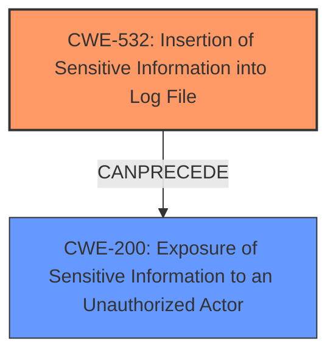

# Raw Analyzer Response for CVE-2024-45738

# Summary

| CWE ID | CWE Name | Confidence | CWE Abstraction Level | CWE Vulnerability Mapping Label | CWE-Vulnerability Mapping Notes |
|---|---|---|---|---|---|
| CWE-532 | Insertion of Sensitive Information into Log File | 0.9 | Base | Allowed | Primary CWE. This is the root cause of the vulnerability. |
| CWE-200 | Exposure of Sensitive Information to an Unauthorized Actor | 0.7 | Class | Discouraged | Secondary CWE. This is the impact of the vulnerability. |

## Evidence and Confidence

*   **Confidence Score:** 0.8
*   **Evidence Strength:** HIGH

## Relationship Analysis

The primary relationship that influenced my decision was the parent-child relationship between CWE-532 (Insertion of Sensitive Information into Log File) and CWE-200 (Exposure of Sensitive Information to an Unauthorized Actor). CWE-532 is the root cause, where sensitive information is written to the log file, and CWE-200 is the resulting impact, where that information is exposed to unauthorized actors. I selected CWE-532 as the primary because it represents the **root cause** of the vulnerability, while CWE-200 describes the impact.

## Vulnerability Chain

The vulnerability chain starts with the insertion of sensitive information into a log file (CWE-532) and leads to the exposure of that information to unauthorized actors (CWE-200).

## Summary of Analysis

My analysis is primarily based on the vulnerability description and the CVE reference links content summary. The key evidence is that sensitive HTTP parameters are being logged to the `_internal` index when the `REST_Calls` log channel is configured at the DEBUG logging level. This directly aligns with the description of CWE-532: "The product writes sensitive information to a log file." The impact of this vulnerability is that an attacker with access to the log file can gain access to sensitive information, which aligns with CWE-200: "The product exposes sensitive information to an actor that is not explicitly authorized to have access to that information."

I considered other CWEs from the Retriever Results, such as CWE-497 (Exposure of Sensitive System Information to an Unauthorized Control Sphere) and CWE-668 (Exposure of Resource to Wrong Sphere), but they are less specific than CWE-532 and CWE-200. CWE-497 is similar to CWE-200, but it focuses on system-level information, which is not explicitly mentioned in the vulnerability description. CWE-668 is too broad and doesn't capture the specific nature of the vulnerability, which involves logging sensitive information. The usage notes for CWE-200 and CWE-668 also recommend against their use when more specific CWEs are available.

CWE-532 is at the optimal level of specificity because it directly addresses the **root cause** of the vulnerability, which is the insertion of sensitive information into a log file. CWE-200 is appropriate for describing the resulting impact of information exposure.