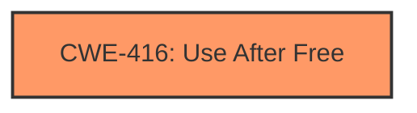

# Analysis Report for CVE-2024-45773

# Vulnerability Analysis Report: CVE-2024-45773

## Description

A **use-after-free vulnerability** involving upgradeToRocket requests can cause the application to crash or potentially result in code execution or other undesirable effects. This issue affects Facebook Thrift prior to v2024.09.09.00.

## Vulnerability Description Key Phrases

- **Rootcause:** use-after-free vulnerability
- **Impact:** ['cause the application to crash', 'code execution']
- **Vector:** upgradeToRocket requests
- **Product:** Facebook Thrift
- **Version:** prior to v2024.09.09.00

## Analysis (with Relationship Data)

# Summary
| CWE ID | CWE Name | Confidence | CWE Abstraction Level | CWE Vulnerability Mapping Label | CWE-Vulnerability Mapping Notes |
|---|---|---|---|---|---|
| CWE-416 | Use After Free | 1.0 | Variant | Allowed | Primary CWE. The vulnerability description explicitly states a **use-after-free vulnerability**. |

## Evidence and Confidence

*   **Confidence Score:** 1.0
*   **Evidence Strength:** HIGH

## Relationship Analysis
The primary relationship influencing the decision is the direct match of the vulnerability description to the definition of CWE-416 **Use After Free**. While other CWEs were considered based on Retriever results, none matched the root cause description as directly as CWE-416.



## Vulnerability Chain
The vulnerability chain consists of a single, clearly identified weakness:

1.  **Root Cause:** CWE-416 **Use After Free**.

## Summary of Analysis
The analysis is based on the explicit description of a **use-after-free vulnerability**. The "Vulnerability Description Key Phrases" and "CVE Reference Links Content Summary" both directly mention "use-after-free". The retriever results also list CWE-416 as the top candidate with the highest score. This direct and consistent evidence leads to a high confidence in assigning CWE-416.

Relevant CWE Information:

# Enhanced Context (25 CWEs)
The following CWEs were identified as potentially relevant to this vulnerability:

## CWE-416: Use After Free
**Abstraction Level**: Variant
**Similarity Score**: 0.65
**Source**: dense

**Description**:
The product reuses or references memory after it has been freed. At some point afterward, the memory may be allocated again and saved in another pointer, while the original pointer references a location somewhere within the new allocation. Any operations using the original pointer are no longer valid because the memory "belongs" to the code that operates on the new pointer.

**Mapping Guidance**:
- Usage: Allowed
- Rationale: This CWE entry is at the Variant level of abstraction, which is a preferred level of abstraction for mapping to the root causes of vulnerabilities.

**Complete CWE Specifications**

CWE-416: Use After Free

The product reuses or references memory after it has been freed. At some point afterward, the memory may be allocated again and saved in another pointer, while the original pointer references a location somewhere within the new allocation. Any operations using the original pointer are no longer valid because the memory "belongs" to the code that operates on the new pointer.


## CWE Relationship Analysis

Current CWEs represent these abstraction levels: .


### Vulnerability Chain Analysis

**Chain starting from CWE-416:**
- 416 (Use After Free) - ROOT


### CWE Relationship Diagram

```mermaid
graph TD
    classDef primary fill:#f96,stroke:#333,stroke-width:2px
    classDef secondary fill:#69f,stroke:#333
    classDef tertiary fill:#9e9,stroke:#333
```


*Report generated on 2025-07-13 16:56:00*
