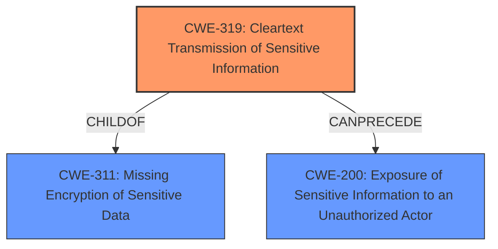

# Analysis Report for CVE-2024-45787

# Vulnerability Analysis Report: CVE-2024-45787

## Description

This vulnerability exists in Reedos aiM-Star version 2.0.1 due to **transmission of sensitive information in plain text** in certain API endpoints. An authenticated remote attacker could exploit this vulnerability by manipulating a parameter through API request URL and intercepting response of the API request leading to exposure of sensitive information belonging to other users.

## Vulnerability Description Key Phrases

- **Weakness:** transmission of sensitive information in plain text
- **Impact:** exposure of sensitive information belonging to other users
- **Vector:** manipulating a parameter through API request URL and intercepting response
- **Attacker:** authenticated remote attacker
- **Product:** Reedos aiM-Star
- **Version:** 2.0.1
- **Component:** certain API endpoints

## Analysis (with Relationship Data)

# Summary
| CWE ID | CWE Name | Confidence | CWE Abstraction Level | CWE Vulnerability Mapping Label | CWE-Vulnerability Mapping Notes |
|---|---|---|---|---|---|
| CWE-319 | Cleartext Transmission of Sensitive Information | 1.0 | Base | Allowed | Primary CWE |
| CWE-200 | Exposure of Sensitive Information to an Unauthorized Actor | 0.7 | Class | Discouraged | Secondary Candidate |

## Evidence and Confidence

*   **Confidence Score:** 0.9
*   **Evidence Strength:** HIGH

## Relationship Analysis
The primary relationship considered was the parent-child relationship between CWE-311 (Missing Encryption of Sensitive Data) and CWE-319 (Cleartext Transmission of Sensitive Information), and the child relationship between CWE-200 (Exposure of Sensitive Information to an Unauthorized Actor) and other CWEs. I opted for CWE-319 because the vulnerability description specifically mentions transmission of sensitive information in plain text, which aligns directly with CWE-319's definition. CWE-200 is a high level class CWE and is discouraged.



## Vulnerability Chain
The vulnerability chain starts with the **transmission of sensitive information in plain text** (CWE-319), which leads to the **exposure of sensitive information belonging to other users** (CWE-200).

## Summary of Analysis
The primary CWE is CWE-319 because the vulnerability description explicitly states "**transmission of sensitive information in plain text**". This aligns directly with the definition of CWE-319. The impact of this weakness is that it leads to exposure of sensitive information, which could be represented by CWE-200. However, CWE-200 is a discouraged mapping because it represents an impact rather than a root cause. The selection is based on the provided evidence and the retriever results. CWE-319 is at the optimal level of specificity (Base).

Relevant CWE Information:

# Enhanced Context (25 CWEs)
The following CWEs were identified as potentially relevant to this vulnerability:

## CWE-319: Cleartext Transmission of Sensitive Information
**Abstraction Level**: Base
**Similarity Score**: 0.77
**Source**: dense

**Description**:
The product transmits sensitive or security-critical data in cleartext in a communication channel that can be sniffed by unauthorized actors.

**Mapping Guidance**:
- Usage: Allowed
- Rationale: This CWE entry is at the Base level of abstraction, which is a preferred level of abstraction for mapping to the root causes of vulnerabilities.

## CWE-200: Exposure of Sensitive Information to an Unauthorized Actor
**Abstraction Level**: Class
**Similarity Score**: 0.74
**Source**: dense

**Description**:
The product exposes sensitive information to an actor that is not explicitly authorized to have access to that information.

**Mapping Guidance**:
- Usage: Discouraged
- Rationale: CWE-200 is commonly misused to represent the loss of confidentiality in a vulnerability, but confidentiality loss is a technical impact - not a root cause error. As of CWE 4.9, over 400 CWE entries can lead to a loss of confidentiality. Other options are often available. [REF-1287].

**CWE-319**: Cleartext Transmission of Sensitive Information
*   **How the vulnerability's details match the CWE's characteristics:** The vulnerability description explicitly mentions "**transmission of sensitive information in plain text**", which directly aligns with CWE-319.
*   **The security implications and potential impact:** An attacker can intercept the transmitted data and gain access to sensitive information.
*   **Any parent-child relationships or chain patterns that influenced your mapping:** CWE-319 is a child of CWE-311 (Missing Encryption of Sensitive Data).
*   **Whether the weakness is primary or secondary in the vulnerability:** Primary.
*   **How the official MITRE mapping guidance influenced your decision:** The MITRE mapping guidance allows the use of CWE-319 because it is at the Base level of abstraction.

**CWE-200**: Exposure of Sensitive Information to an Unauthorized Actor
*   **How the vulnerability's details match the CWE's characteristics:** The impact of the vulnerability is the exposure of sensitive information.
*   **The security implications and potential impact:** Unauthorized access to sensitive data.
*   **Any parent-child relationships or chain patterns that influenced your mapping:** CWE-200 is a class-level CWE.
*   **Whether the weakness is primary or secondary in the vulnerability:** Secondary (impact).
*   **How the official MITRE mapping guidance influenced your decision:** The MITRE mapping guidance discourages the use of CWE-200 as it represents an impact rather than a root cause.

Other CWEs considered but not used:

*   CWE-532 (Insertion of Sensitive Information into Log File): While sensitive information is exposed, the vulnerability description doesn't indicate that the information is being written to a log file.
*   CWE-256 (Plaintext Storage of a Password): This is specific to passwords, and the vulnerability description doesn't indicate that passwords are the only type of sensitive information being transmitted.
*   CWE-522 (Insufficiently Protected Credentials): Similar to CWE-256, this is specific to credentials, and the vulnerability description is broader.
*   CWE-89 (Improper Neutralization of Special Elements used in an SQL Command ('SQL Injection')): There is no mention of SQL injection in the description.
*   CWE-639 (Authorization Bypass Through User-Controlled Key): The description does not specifically mention bypassing authorization through a user-controlled key.
*   CWE-201 (Insertion of Sensitive Information Into Sent Data): This is related to the information being sent.
*   CWE-941 (Incorrectly Specified Destination in a Communication Channel): The vulnerability is about sending sensitive information in cleartext, not about specifying the wrong destination.
*   CWE-1272 (Sensitive Information Uncleared Before Debug/Power State Transition): This is not relevant to the vulnerability description.


## CWE Relationship Analysis

Current CWEs represent these abstraction levels: .


### Vulnerability Chain Analysis

**Chain starting from CWE-89:**
- 89 (Improper Neutralization of Special Elements used in an SQL Command ('SQL Injection')) - ROOT


**Chain starting from CWE-1272:**
- 1272 (Sensitive Information Uncleared Before Debug/Power State Transition) - ROOT


### CWE Relationship Diagram

```mermaid
graph TD
    classDef primary fill:#f96,stroke:#333,stroke-width:2px
    classDef secondary fill:#69f,stroke:#333
    classDef tertiary fill:#9e9,stroke:#333
```


*Report generated on 2025-07-13 16:58:18*
