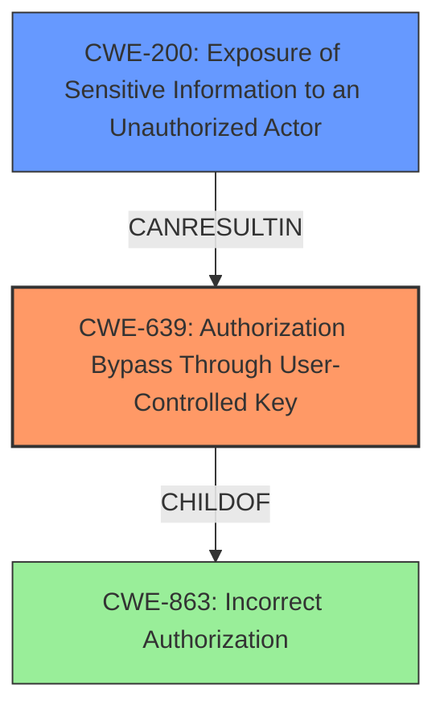

# Raw Analyzer Response for CVE-2024-45792

# Summary
| CWE ID | CWE Name | Confidence | CWE Abstraction Level | CWE Vulnerability Mapping Label | CWE-Vulnerability Mapping Notes |
|---|---|---|---|---|---|
| CWE-639 | Authorization Bypass Through User-Controlled Key | 0.9 | Base | Allowed | Primary CWE. The application allows an unprivileged user to access another user's profile by manipulating the `profile_id` parameter, indicating a direct bypass of authorization. |
| CWE-200 | Exposure of Sensitive Information to an Unauthorized Actor | 0.7 | Class | Discouraged | Secondary candidate. The vulnerability results in the exposure of sensitive user profile information, but this is a consequence of the authorization bypass. |

## Evidence and Confidence

*   **Confidence Score:** 0.9
*   **Evidence Strength:** HIGH

## Relationship Analysis
The primary relationship that influenced the decision was the hierarchical relationship. CWE-639 is a Base level CWE, which is preferred for mapping to root causes. CWE-200 is a class level CWE, representing a broader category of information exposure. The vulnerability description indicates that the exposure is a result of the authorization bypass, making CWE-639 the more specific and accurate root cause.

## Vulnerability Chain
The vulnerability chain starts with the **missing authorization** check, which allows the **bypass of authorization** through a user-controlled key (`profile_id`). This leads to the **exposure of sensitive information** to an unauthorized actor.

1.  **Root Cause:** CWE-639 (**Authorization Bypass Through User-Controlled Key**) - The application fails to properly validate the `profile_id` parameter, allowing unauthorized access.
2.  **Impact:** CWE-200 (**Exposure of Sensitive Information to an Unauthorized Actor**) - As a result of the authorization bypass, sensitive user profile information is exposed.

## Summary of Analysis
The initial analysis considered several CWEs, including CWE-639, CWE-863, and CWE-200. However, after a thorough review of the vulnerability description and the relationships between the CWEs, it was determined that CWE-639 (**Authorization Bypass Through User-Controlled Key**) is the most accurate representation of the root cause. The evidence from the CVE Reference Links Content Summary explicitly states that the vulnerability is caused by a **lack of proper authorization checks** and the ability to manipulate the `profile_id` parameter to access other user's profiles.

The graph relationships further support this decision, as CWE-639 is a more specific Base level CWE compared to the Class level CWE-863 (**Incorrect Authorization**). The exposure of sensitive information (CWE-200) is a direct result of the authorization bypass, making it a secondary impact rather than the primary weakness.

The selected CWEs are at the optimal level of specificity, as they accurately reflect the root cause and the resulting impact of the vulnerability. CWE-639 captures the essence of the authorization bypass, while CWE-200 highlights the information exposure.

Relevant CWE Information:

# Enhanced Context (25 CWEs)
The following CWEs were identified as potentially relevant to this vulnerability:

## CWE-639: Authorization Bypass Through User-Controlled Key
**Abstraction Level**: Base
**Similarity Score**: 0.74
**Source**: dense

**Description**:
The system's authorization functionality does not prevent one user from gaining access to another user's data or record by modifying the key value identifying the data.

**Mapping Guidance**:
- Usage: Allowed
- Rationale: This CWE entry is at the Base level of abstraction, which is a preferred level of abstraction for mapping to the root causes of vulnerabilities.

**Justification:** This CWE directly aligns with the vulnerability where an unprivileged user can access other user's profiles by manipulating the `profile_id` parameter.

## CWE-359: Exposure of Private Personal Information to an Unauthorized Actor
**Abstraction Level**: Base
**Similarity Score**: 0.74
**Source**: dense

**Description**:
The product does not properly prevent a person's private, personal information from being accessed by actors who either (1) are not explicitly authorized to access the information or (2) do not have the implicit consent of the person about whom the information is collected.

**Mapping Guidance**:
- Usage: Allowed
- Rationale: This CWE entry is at the Base level of abstraction, which is a preferred level of abstraction for mapping to the root causes of vulnerabilities.

**Justification:** This CWE describes the impact of the vulnerability, but it is a consequence of the authorization bypass (CWE-639).

## CWE-201: Insertion of Sensitive Information Into Sent Data
**Abstraction Level**: Base
**Similarity Score**: 0.73
**Source**: dense

**Description**:
The code transmits data to another actor, but a portion of the data includes sensitive information that should not be accessible to that actor.

**Mapping Guidance**:
- Usage: Allowed
- Rationale: This CWE entry is at the Base level of abstraction, which is a preferred level of abstraction for mapping to the root causes of vulnerabilities.

**Justification:** This CWE is not directly relevant, as the sensitive information is not being inserted into sent data but rather accessed due to an authorization issue.

## CWE-267: Privilege Defined With Unsafe Actions
**Abstraction Level**: Base
**Similarity Score**: 0.72
**Source**: dense

**Description**:
A particular privilege, role, capability, or right can be used to perform unsafe actions that were not intended, even when it is assigned to the correct entity.

**Justification:** This CWE does not directly apply, as the issue is not with the definition of privileges but with the lack of proper authorization checks.

## CWE-472: External Control of Assumed-Immutable Web Parameter
**Abstraction Level**: Base
**Similarity Score**: 0.72
**Source**: dense

**Description**:
The web application does not sufficiently verify inputs that are assumed to be immutable but are actually externally controllable, such as hidden form fields.

**Justification:** While the `profile_id` is externally controllable, the core issue is the authorization bypass rather than the immutability of the parameter.

## CWE-497: Exposure of Sensitive System Information to an Unauthorized Control Sphere
**Abstraction Level**: Base
**Similarity Score**: 0.72
**Source**: dense

**Description**:
The product does not properly prevent sensitive system-level information from being accessed by unauthorized actors who do not have the same level of access to the underlying system as the product does.

**Justification:** The information exposed is user-specific profile data, not system-level information.

## CWE-863: Incorrect Authorization
**Abstraction Level**: Class
**Similarity Score**: 0.71
**Source**: dense

**Description**:
The product performs an authorization check when an actor attempts to access a resource or perform an action, but it does not correctly perform the check.

**Mapping Guidance**:
- Usage: Allowed-with-Review
- Rationale: This CWE entry is a Class and might have Base-level children that would be more appropriate

**Justification:** This CWE is too general. CWE-639 provides a more specific description of the authorization issue.

## CWE-303: Incorrect Implementation of Authentication Algorithm
**Abstraction Level**: Base
**Similarity Score**: 0.71
**Source**: dense

**Description**:
The requirements for the product dictate the use of an established authentication algorithm, but the implementation of the algorithm is incorrect.

**Justification:** This CWE is not applicable, as the issue is with authorization, not authentication.

## CWE-212: Improper Removal of Sensitive Information Before Storage or Transfer
**Abstraction Level**: Base
**Similarity Score**: 0.71
**Source**: dense

**Description**:
The product stores, transfers, or shares a resource that contains sensitive information, but it does not properly remove that information before the product makes the resource available to unauthorized actors.

**Justification:** This CWE is not relevant, as the issue is not with the removal of sensitive information but with the authorization to access it.

## CWE-425: Direct Request ('Forced Browsing')
**Abstraction Level**: Base
**Similarity Score**: 0.71
**Source**: dense

**Description**:
The web application does not adequately enforce appropriate authorization on all restricted URLs, scripts, or files.

**Justification:** Similar to CWE-863, this CWE is related but less specific than CWE-639.

## CWE-306: Missing Authentication for Critical Function
**Abstraction Level**: