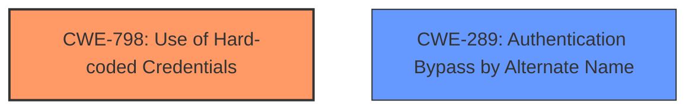

# Raw Analyzer Response for CVE-2024-45823

# Summary
| CWE ID | CWE Name | Confidence | CWE Abstraction Level | CWE Vulnerability Mapping Label | CWE-Vulnerability Mapping Notes |
|---|---|---|---|---|---|
| CWE-798 | Use of Hard-coded Credentials | 0.8 | Base | Allowed | Primary CWE |
| CWE-289 | Authentication Bypass by Alternate Name | 0.6 | Base | Allowed | Secondary Candidate |

## Evidence and Confidence

*   **Confidence Score:** 0.7
*   **Evidence Strength:** MEDIUM

## Relationship Analysis
The primary CWE, CWE-798, is related to the use of hard-coded credentials. While the vulnerability description mentions "shared secrets across accounts" rather than explicitly "hard-coded credentials," the underlying issue is that these secrets are not unique per account, effectively functioning similarly to hard-coded credentials. The secondary CWE, CWE-289, Authentication Bypass by Alternate Name, is related to bypassing authentication.

## Vulnerability Chain
The vulnerability chain starts with the **shared secrets across accounts** (CWE-798). This leads to an authentication bypass (CWE-289) because an attacker can impersonate a user if they obtain the shared secret and other required authentication information.

## Summary of Analysis
The initial assessment focused on identifying the root cause of the vulnerability. The description highlights "**shared secrets across accounts**" as the key factor. Although the term "hard-coded" isn't explicitly used, the functionality equates to using the same secret for multiple accounts.

The selection of CWE-798 is based on the evidence that the **shared secrets across accounts** are acting as hard-coded credentials. The authentication bypass (CWE-289) is a consequence of this **weakness**.

Relevant CWE Information:

# Enhanced Context (25 CWEs)
The following CWEs were identified as potentially relevant to this vulnerability:

## CWE-1391: Use of Weak Credentials
**Abstraction Level**: Class
**Similarity Score**: 0.76
**Source**: dense

**Description**:
The product uses weak credentials (such as a default key or hard-coded password) that can be calculated, derived, reused, or guessed by an attacker.

**Mapping Guidance**:
- Usage: Allowed-with-Review
- Rationale: This CWE entry is a Class and might have Base-level children that would be more appropriate

## CWE-798: Use of Hard-coded Credentials
**Abstraction Level**: Base
**Similarity Score**: 0.74
**Source**: dense

**Description**:
The product contains hard-coded credentials, such as a password or cryptographic key.

**Mapping Guidance**:
- Usage: Allowed
- Rationale: This CWE entry is at the Base level of abstraction, which is a preferred level of abstraction for mapping to the root causes of vulnerabilities.

CWE-798 is at the Base level of abstraction, which is a preferred level of abstraction for mapping to the root causes of vulnerabilities.

## CWE-321: Use of Hard-coded Cryptographic Key
**Abstraction Level**: variant
**Similarity Score**: 4.01
**Source**: graph

**Description**:
CWE-321: Use of Hard-coded Cryptographic Key

**Mapping Guidance**:
- Usage: Allowed
- Rationale: This CWE entry is at the Variant level of abstraction, which is a preferred level of abstraction for mapping to the root causes of vulnerabilities.

**Relationships**:
- CANFOLLOW -> CWE-656
- CHILDOF -> CWE-798
- CHILDOF -> CWE-798
- CHILDOF -> CWE-798
- PARENTOF -> CWE-321

## CWE-259: Use of Hard-coded Password
**Abstraction Level**: variant
**Similarity Score**: 4.01
**Source**: graph

**Description**:
CWE-259: Use of Hard-coded Password

**Mapping Guidance**:
- Usage: Allowed
- Rationale: This CWE entry is at the Variant level of abstraction, which is a preferred level of abstraction for mapping to the root causes of vulnerabilities.

**Relationships**:
- CANFOLLOW -> CWE-656
- PEEROF -> CWE-257
- PEEROF -> CWE-321
- CHILDOF -> CWE-798
- CHILDOF -> CWE-798

## CWE-289: Authentication Bypass by Alternate Name
**Abstraction Level**: base
**Similarity Score**: 2.47
**Source**: graph

**Description**:
CWE-289: Authentication Bypass by Alternate Name

**Mapping Guidance**:
- Usage: Allowed
- Rationale: This CWE entry is at the Base level of abstraction, which is a preferred level of abstraction for mapping to the root causes of vulnerabilities.

**Relationships**:
- CANFOLLOW -> CWE-52
- CANFOLLOW -> CWE-46
- CANFOLLOW -> CWE-178
- CANFOLLOW -> CWE-173
- CHILDOF -> CWE-1390

CWE-798 is selected because of the "**shared secrets across accounts**" which is similar to the description "The product contains hard-coded credentials, such as a password or cryptographic key."
CWE-289 is selected as an authentication bypass can result from the **shared secrets** vulnerability.
CWE-321 and CWE-259 were considered as more specific versions of CWE-798, but they were not selected because the **shared secrets** were not explicitly passwords or cryptographic keys.
CWE-1391 was not selected because it is a Class level CWE, and CWE-798 is a more specific Base level CWE.