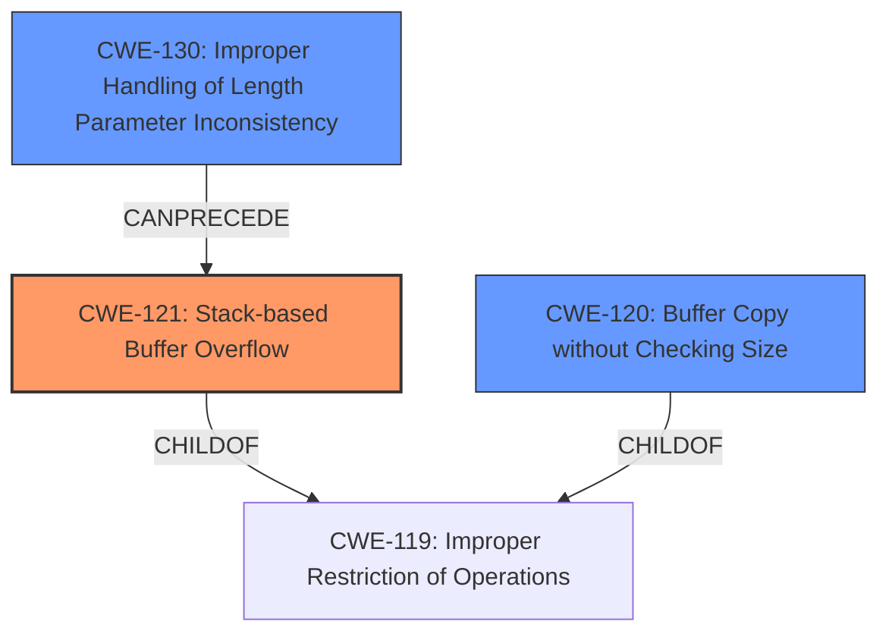

# Enhanced Analysis for CVE-2024-45971

# Summary
| CWE ID | CWE Name | Confidence | CWE Abstraction Level | CWE Vulnerability Mapping Label | CWE-Vulnerability Mapping Notes |
|---|---|---|---|---|---|
| CWE-121 | Stack-based Buffer Overflow | 1 | Variant |  Primary | Allowed |
| CWE-120 | Buffer Copy without Checking Size of Input ('Classic Buffer Overflow') | 0.7 | Base | Secondary | Allowed-with-Review |
| CWE-130 | Improper Handling of Length Parameter Inconsistency | 0.6 | Base | Secondary | Allowed |

## Evidence and Confidence

*   **Confidence Score:** 0.8
*   **Evidence Strength:** HIGH

## Relationship Analysis
The primary CWE is CWE-121, which is a variant of CWE-119 (Improper Restriction of Operations within the Bounds of a Memory Buffer). CWE-120 is a related CWE that describes a classic buffer overflow, which can lead to stack-based buffer overflows. CWE-130 highlights a potential cause where length parameters are mishandled, contributing to the overflow. Choosing the specific **stack-based buffer overflow** as the primary weakness.



## Vulnerability Chain
The vulnerability chain starts with the **improper handling of the MMS IdentifyResponse message**, leading to a **stack-based buffer overflow**. This is possibly due to **improper handling of length parameters** or using **dangerous functions** without proper size checks. The final impact is a **buffer overflow** that can be exploited by a **malicious server**.

## Summary of Analysis
The analysis is primarily based on the provided vulnerability description, which explicitly mentions "**multiple buffer overflows**" and "**stack-based buffer overflow**." The key phrases clearly point to buffer overflow vulnerabilities. The selection of CWE-121 is based on the explicit mention of "stack-based," making it the most specific and accurate representation of the weakness. The relationship graph highlights how the different CWEs relate to each other, with CWE-121 being a specific type of buffer overflow. The retriever scores and mapping guidance support this decision.

Relevant CWE Information:

# Enhanced Context (25 CWEs)
The following CWEs were identified as potentially relevant to this vulnerability:

## CWE-130: Improper Handling of Length Parameter Inconsistency
**Abstraction Level**: Base
**Similarity Score**: 0.73
**Source**: dense

**Description**:
The product parses a formatted message or structure, but it does not handle or incorrectly handles a length field that is inconsistent with the actual length of the associated data.

**Mapping Guidance**:
- Usage: Allowed
- Rationale: This CWE entry is at the Base level of abstraction, which is a preferred level of abstraction for mapping to the root causes of vulnerabilities.

## CWE-121: Stack-based Buffer Overflow
**CWE-121 Stack-based Buffer Overflow** is chosen as the primary because the vulnerability description mentions "**stack-based buffer overflow**".

**CWE-120 Buffer Copy without Checking Size of Input ('Classic Buffer Overflow')** is considered as a general case of buffer overflow.

**CWE-130 Improper Handling of Length Parameter Inconsistency** is considered because the **buffer overflow** could be caused by the length inconsistency.


## CWE Relationship Analysis

Current CWEs represent these abstraction levels: .


### Vulnerability Chain Analysis

**Chain starting from CWE-130:**
- 130 (Improper Handling of Length Parameter Inconsistency) - ROOT


**Chain starting from CWE-119:**
- 119 (Improper Restriction of Operations within the Bounds of a Memory Buffer) - ROOT


### CWE Relationship Diagram

```mermaid
graph TD
    classDef primary fill:#f96,stroke:#333,stroke-width:2px
    classDef secondary fill:#69f,stroke:#333
    classDef tertiary fill:#9e9,stroke:#333
```