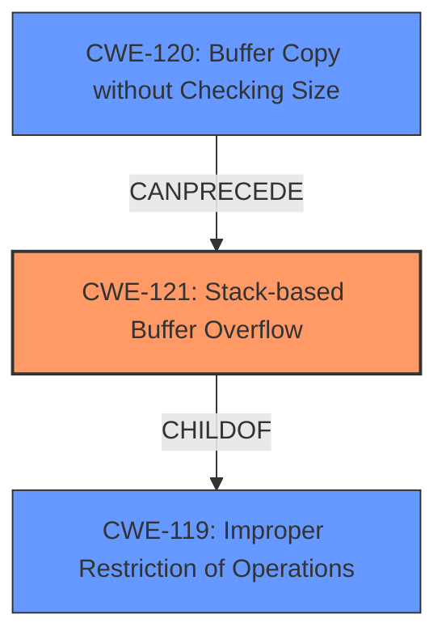

# Raw Analyzer Response for CVE-2024-46045

# Summary

| CWE ID  | CWE Name                                                                 | Confidence | CWE Abstraction Level | CWE Vulnerability Mapping Label | CWE-Vulnerability Mapping Notes |
| :------- | :----------------------------------------------------------------------- | :--------- | :-------------------- | :------------------------------ | :------------------------------ |
| CWE-121 | Stack-based Buffer Overflow                                                | 1.0        | Variant               | Primary                         | Allowed                       |
| CWE-120 | Buffer Copy without Checking Size of Input ('Classic Buffer Overflow') | 0.7        | Base                  | Secondary                       | Allowed-with-Review           |

## Evidence and Confidence

*   **Confidence Score:** 0.9
*   **Evidence Strength:** HIGH

## Relationship Analysis

The primary relationship is that CWE-121 **Stack-based Buffer Overflow** is a variant of the more general CWE-119 **Improper Restriction of Operations within the Bounds of a Memory Buffer**. CWE-120 **Buffer Copy without Checking Size of Input ('Classic Buffer Overflow')** can be a cause of stack-based buffer overflows. The choice of CWE-121 is favored because the description specifies "stack overflow" making it a more specific and accurate classification than its parent CWE-119.

## Vulnerability Chain

The vulnerability chain starts with an **improper** use of `sprintf` without proper bounds checking, leading to a **stack overflow**. This can result in a denial-of-service or arbitrary code execution.

## Summary of Analysis

The analysis is based on the provided vulnerability description and the CVE reference link content summary. The vulnerability description explicitly mentions "**stack overflow**" in the `frmL7PlotForm` function. The CVE reference link content summary confirms this and states: "A stack buffer overflow vulnerability exists within the `frmL7PlotForm` function". It also identifies the vulnerable statement: `v1 = sprintf(s, "im.asp?page=%s", v6);` and confirms that the size of the buffer `s` is insufficient to handle the user-supplied input `page` in the POST request. The retriever results also strongly suggest CWE-121 as the primary candidate. The evidence clearly supports classifying this vulnerability as CWE-121 **Stack-based Buffer Overflow**.
CWE-120 is included as a possible secondary weakness because the `sprintf` function copies the data without checking the size.

Relevant CWE Information:

# Enhanced Context (25 CWEs)
The following CWEs were identified as potentially relevant to this vulnerability:

## CWE-121: Stack-based Buffer Overflow
**Abstraction Level**: Variant
**Similarity Score**: 0.73
**Source**: dense

**Description**:
A stack-based buffer overflow condition is a condition where the buffer being overwritten is allocated on the stack (i.e., is a local variable or, rarely, a parameter to a function).

**Mapping Guidance**:
- Usage: Allowed
- Rationale: This CWE entry is at the Variant level of abstraction, which is a preferred level of abstraction for mapping to the root causes of vulnerabilities.

**Technical Explanation for CWE-121:**

The vulnerability is a **stack overflow**, which occurs when data is written beyond the boundaries of a buffer located on the stack. In this case, the `sprintf` function writes data into a stack-allocated buffer `s` without properly checking if the size of the input `page` will exceed the buffer's capacity.

*   **How the vulnerability's details match the CWE's characteristics:** The vulnerability description states a **stack overflow** exists in the `frmL7PlotForm` function. The `sprintf` function copies data into a buffer on the stack without checking bounds.
*   **The security implications and potential impact:** A successful exploit can cause a denial-of-service (DoS) or allow arbitrary code execution, leading to complete system compromise.
*   **Any parent-child relationships or chain patterns that influenced your mapping:** CWE-121 is a variant of CWE-119 **Improper Restriction of Operations within the Bounds of a Memory Buffer**. It can be caused by CWE-120 **Buffer Copy without Checking Size of Input ('Classic Buffer Overflow')**.
*   **Whether the weakness is primary or secondary in the vulnerability:** Primary.
*   **How the official MITRE mapping guidance influenced your decision:** CWE-121 is at the Variant level, which is preferred. The usage is ALLOWED.

**Technical Explanation for CWE-120:**

The vulnerability is also related to CWE-120, as the `sprintf` function copies data from the `page` parameter without checking the size of the input. This **lack of size checking** is the root cause that allows the **stack overflow** to occur.

*   **How the vulnerability's details match the CWE's characteristics:** The `sprintf` function copies data into the stack-allocated buffer `s` without checking if the size of the input `page` will exceed the buffer's capacity.
*   **The security implications and potential impact:** A successful exploit can cause a denial-of-service (DoS) or allow arbitrary code execution, leading to complete system compromise.
*   **Any parent-child relationships or chain patterns that influenced your mapping:** CWE-120 is a base weakness that can lead to buffer overflows, including stack overflows (CWE-121).
*   **Whether the weakness is primary or secondary in the vulnerability:** Secondary, as it directly leads to the stack overflow, but the explicit mention of "stack overflow" makes CWE-121 the primary weakness.
*   **How the official MITRE mapping guidance influenced your decision:** CWE-120 is at the Base level. The usage is ALLOWED-WITH-REVIEW.

**CWEs Considered But Not Used:**

*   CWE-190 **Integer Overflow or Wraparound**: This CWE is not directly related to the vulnerability, as there is no evidence of integer overflow.
*   CWE-674 **Uncontrolled Recursion**: There is no indication of uncontrolled recursion in the provided description.
*   CWE-789 **Memory Allocation with Excessive Size Value**: While memory allocation is involved implicitly, the core issue is the **lack of bounds checking** during the `sprintf` operation, not the size of the memory allocation itself.
*   CWE-125 **Out-of-bounds Read**: The vulnerability is an out-of-bounds write (overflow), not a read.
*   CWE-122 **Heap-based Buffer Overflow**: The description specifies that the overflow occurs on the stack, not the heap.
*   CWE-124 **Buffer Underwrite ('Buffer Underflow')**: The vulnerability is an overflow, not an underflow.
*   CWE-401 **Missing Release of Memory after Effective Lifetime**: There is no mention of memory leaks or resource management issues.
*   CWE-128 **Wrap-around Error**: Similar to CWE-190, there is no evidence of wrap-around errors.
*   CWE-134 **Use of Externally-Controlled Format String**: This CWE is not applicable because the format string is not directly controlled by an external source.
*   CWE-131 **Incorrect Calculation of Buffer Size**: While there might be an implicit incorrect calculation of the required buffer size, the primary issue is the **lack of any size checking** before the `sprintf` operation.
*   CWE-755 **Improper Handling of Exceptional Conditions** and CWE-252 **Unchecked Return Value**: There's no evidence suggesting that the program detects the error condition and then proceeds without taking proper action.
*   CWE-425 **Direct Request ('Forced Browsing')** and CWE-912 **Hidden Functionality**, CWE-78 **Improper Neutralization of Special Elements used in an OS Command ('OS Command Injection')**, CWE-790 **Improper Filtering of Special Elements**, CWE-1285 **Improper Validation of Specified Index, Position, or Offset in Input**, CWE-1284 **Improper Validation of Specified Quantity in Input**, CWE-390 **Detection of Error Condition Without Action**: There is no evidence of these vulnerabilities based on the vulnerability description.