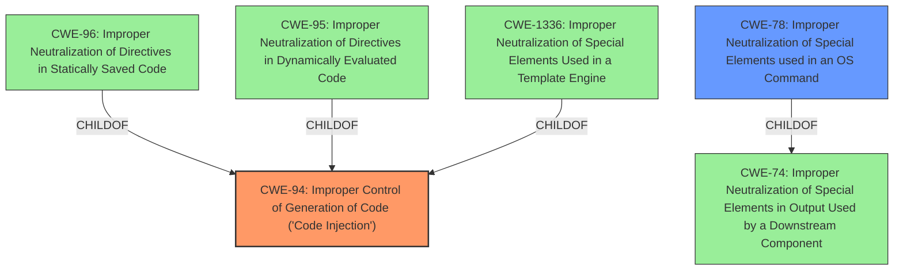

# Enhanced Analysis for CVE-2024-46089

# Summary
| CWE ID | CWE Name | Confidence | CWE Abstraction Level | CWE Vulnerability Mapping Label | CWE-Vulnerability Mapping Notes |
|---|---|---|---|---|---|
| CWE-94 | Improper Control of Generation of Code ('Code Injection') | 0.75 | Base | Allowed-with-Review | Primary CWE |
| CWE-78 | Improper Neutralization of Special Elements used in an OS Command ('OS Command Injection') | 0.5 | Base | Allowed | Secondary Candidate |

## Evidence and Confidence

*   **Confidence Score:** 0.7
*   **Evidence Strength:** LOW

## Relationship Analysis
The primary relationship is that CWE-94 [Base] can be a parent of CWE-96 [Base] (Improper Neutralization of Directives in Statically Saved Code ('Static Code Injection')), CWE-95 [Variant] (Improper Neutralization of Directives in Dynamically Evaluated Code ('Eval Injection')), and CWE-1336 [Base] (Improper Neutralization of Special Elements Used in a Template Engine). CWE-78 [Base] is a child of CWE-74 [Class] (Improper Neutralization of Special Elements in Output Used by a Downstream Component ('Injection')). Since the description specifies remote code execution, CWE-94 is more appropriate than its parent, CWE-74.



## Vulnerability Chain
The vulnerability chain starts with **improper control of code generation** (CWE-94), potentially leading to the execution of arbitrary code on the system, resulting in remote code execution (RCE).

## Summary of Analysis
The vulnerability description indicates that 74cms <=3.33 is vulnerable to remote code execution (RCE) in the background interface apiadmin. The key phrase is "remote code execution."
The retriever results suggest CWE-434, CWE-78, CWE-96, CWE-1336, CWE-88, CWE-95, CWE-285, CWE-790, CWE-94, and CWE-183 as possible candidates.
Given the limited information, the primary weakness is CWE-94 [Base] (Improper Control of Generation of Code ('Code Injection')). The product does not neutralize or incorrectly neutralizes special elements that could modify the syntax or behavior of the intended code segment. This aligns with the RCE impact, as code injection can lead to arbitrary code execution.
CWE-78 [Base] (Improper Neutralization of Special Elements used in an OS Command ('OS Command Injection')) is a secondary candidate. If the code injection leads to the execution of OS commands, this CWE would also be relevant.
I am overriding the retriever results because although CWE-94 has a lower score, the vulnerability description explicitly mentions "remote code execution", which is a direct consequence of code injection. The other CWEs are less directly related to the stated impact.
Evidence is lacking, as the CVE Reference Links Content Summary is "UNRELATED". My confidence is thus lower.

Relevant CWE Information:

# Enhanced Context (25 CWEs)
The following CWEs were identified as potentially relevant to this vulnerability:

## CWE-434: Unrestricted Upload of File with Dangerous Type
**Abstraction Level**: Base
**Similarity Score**: 0.79
**Source**: dense

**Description**:
The product allows the upload or transfer of dangerous file types that are automatically processed within its environment.

**Mapping Guidance**:
- Usage: Allowed
- Rationale: This CWE entry is at the Base level of abstraction, which is a preferred level of abstraction for mapping to the root causes of vulnerabilities.

**Why Not Used:** This CWE doesn't match the vulnerability description, which indicates RCE in the background interface apiadmin, rather than file upload.

## CWE-96: Improper Neutralization of Directives in Statically Saved Code ('Static Code Injection')
**Abstraction Level**: Base
**Similarity Score**: 0.77
**Source**: dense

**Description**:
The product receives input from an upstream component, but it does not neutralize or incorrectly neutralizes code syntax before inserting the input into an executable resource, such as a library, configuration file, or template.

**Mapping Guidance**:
- Usage: Allowed
- Rationale: This CWE entry is at the Base level of abstraction, which is a preferred level of abstraction for mapping to the root causes of vulnerabilities.

**Why Not Used:** While this is related to code injection, the description doesn't specify whether the code is statically saved. CWE-94 is more general and thus more appropriate.

## CWE-425: Direct Request ('Forced Browsing')
**Abstraction Level**: Base
**Similarity Score**: 0.77
**Source**: dense

**Description**:
The web application does not adequately enforce appropriate authorization on all restricted URLs, scripts, or files.

**Mapping Guidance**:
- Usage: Allowed
- Rationale: This CWE entry is at the Base level of abstraction, which is a preferred level of abstraction for mapping to the root causes of vulnerabilities.

**Why Not Used:** The vulnerability description does not mention authorization issues.

## CWE-472: External Control of Assumed-Immutable Web Parameter
**Abstraction Level**: Base
**Similarity Score**: 0.76
**Source**: dense

**Description**:
The web application does not sufficiently verify inputs that are assumed to be immutable but are actually externally controllable, such as hidden form fields.

**Mapping Guidance**:
- Usage: Allowed
- Rationale: This CWE entry is at the Base level of abstraction, which is a preferred level of abstraction for mapping to the root causes of vulnerabilities.

**Why Not Used:** This is not relevant to the provided vulnerability description.

## CWE-95: Improper Neutralization of Directives in Dynamically Evaluated Code ('Eval Injection')
**Abstraction Level**: Variant
**Similarity Score**: 0.76
**Source**: dense

**Description**:
The product receives input from an upstream component, but it does not neutralize or incorrectly neutralizes code syntax before using the input in a dynamic evaluation call (e.g. "eval").

**Mapping Guidance**:
- Usage: Allowed
- Rationale: This CWE entry is at the Variant level of abstraction, which is a preferred level of abstraction for mapping to the root causes of vulnerabilities.

**Why Not Used:** Similar to CWE-96, this is a specific type of code injection, but the description doesn't specify dynamic evaluation.

## CWE-80: Improper Neutralization of Script-Related HTML Tags in a Web Page (Basic XSS)
**Abstraction Level**: Variant
**Similarity Score**: 0.76
**Source**: dense

**Description**:
The product receives input from an upstream component, but it does not neutralize or incorrectly neutralizes special characters such as "<", ">", and "&" that could be interpreted as web-scripting elements when they are sent to a downstream component that processes web pages.

**Why Not Used:** This is related to XSS, not RCE.

## CWE-74: Improper Neutralization of Special Elements in Output Used by a Downstream Component ('Injection')
**Abstraction Level**: Class
**Similarity Score**: 0.76
**Source**: dense

**Description**:
The product constructs all or part of a command, data structure, or record using externally-influenced input from an upstream component, but it does not neutralize or incorrectly neutralizes special elements that could modify how it is parsed or interpreted when it is sent to a downstream component.

**Mapping Guidance**:
- Usage: Discouraged
- Rationale: CWE-74 is high-level and often misused when lower-level weaknesses are more appropriate.

**Why Not Used:** This is a higher-level class, and CWE-94 is more specific.

## CWE-790: Improper Filtering of Special Elements
**Abstraction Level**: Class
**Similarity Score**: 0.76
**Source**: dense

**Description**:
The product receives data from an upstream component, but does not filter or incorrectly


## CWE Relationship Analysis

Current CWEs represent these abstraction levels: .


### Vulnerability Chain Analysis

**Chain starting from CWE-183:**
- 183 (Permissive List of Allowed Inputs) - ROOT


**Chain starting from CWE-94:**
- 94 (Improper Control of Generation of Code ('Code Injection')) - ROOT


### CWE Relationship Diagram

```mermaid
graph TD
    classDef primary fill:#f96,stroke:#333,stroke-width:2px
    classDef secondary fill:#69f,stroke:#333
    classDef tertiary fill:#9e9,stroke:#333
```