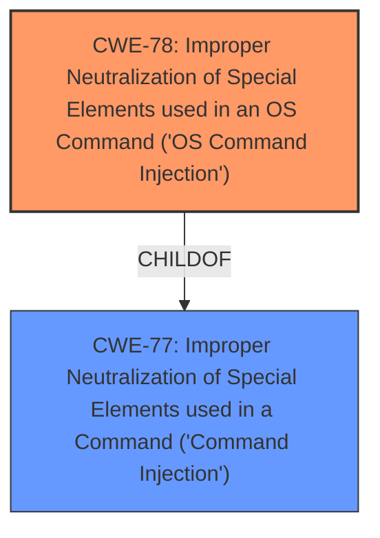

# Analysis for CVE-2024-46256

# Summary
| CWE ID | CWE Name | Confidence | CWE Abstraction Level | CWE Vulnerability Mapping Label | CWE-Vulnerability Mapping Notes |
|---|---|---|---|---|---|
| CWE-78 | Improper Neutralization of Special Elements used in an OS Command ('OS Command Injection') | 1.0 | Base | Allowed | Primary CWE. The application constructs an OS command using externally-influenced input, but it does not neutralize or incorrectly neutralizes special elements. |
| CWE-77 | Improper Neutralization of Special Elements used in a Command ('Command Injection') | 0.7 | Class | Allowed-with-Review | Secondary candidate. This is a higher-level class of CWE-78. |

## Evidence and Confidence

*   **Confidence Score:** 1.0
*   **Evidence Strength:** HIGH

## Relationship Analysis
The primary CWE is CWE-78 (Improper Neutralization of Special Elements used in an OS Command ('OS Command Injection')), which is a base-level CWE. CWE-77 (Improper Neutralization of Special Elements used in a Command ('Command Injection')) is a class-level CWE and a parent of CWE-78. Since the vulnerability description and CVE reference summary clearly indicate that the vulnerability is due to **command injection**, specifically related to constructing OS commands, CWE-78 is the more appropriate and specific choice.

## Vulnerability Chain
The vulnerability chain starts with **improper neutralization** of special elements in user-supplied input, leading to **OS command injection**, and ultimately resulting in **remote code execution (RCE)**.

## Summary of Analysis
The vulnerability is a classic case of **OS command injection**, where user-provided input is not properly sanitized before being used to construct an OS command. This allows an attacker to inject arbitrary commands that will be executed by the system. The CVE reference summary confirms this, stating that the application was vulnerable to **command injection** because it was using user-supplied input without proper sanitization. The resolution involved using built-in Node.js functions instead of shell commands, further supporting the classification of **CWE-78**.

The selection of CWE-78 is based on the specific evidence that the vulnerability involves the construction of OS commands using unsanitized input, leading to command injection. This is a more specific classification than the broader CWE-77, which covers command injection in general.

CWEs considered but not used:

*   CWE-77: While related as a parent, it is a more general case of command injection.
*   CWE-74, CWE-89, CWE-93, CWE-79, CWE-917, CWE-918, CWE-116, CWE-425, CWE-178, CWE-1336, CWE-138, CWE-1236, CWE-88: These CWEs represent other types of injection or improper handling of input, but they do not directly relate to the specific vulnerability of OS command injection.
*   CWE-117: Improper Output Neutralization for Logs. This is related to logging, but the vulnerability is specifically about command injection, not logging.
*   CWE-790: Improper Filtering of Special Elements: This is a more general case than command injection.
*   CWE-96: Improper Neutralization of Directives in Statically Saved Code ('Static Code Injection'): This is related to static code, but the vulnerability is about runtime command injection.
*   CWE-95: Improper Neutralization of Directives in Dynamically Evaluated Code ('Eval Injection'): This is about eval injection, not command injection.
*   CWE-113: Improper Neutralization of CRLF Sequences in HTTP Headers ('HTTP Request/Response Splitting'): This is about HTTP headers, not command injection.