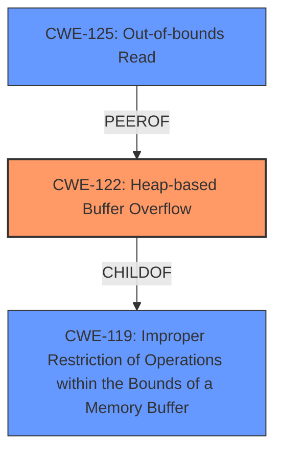

# Analysis Report for CVE-2024-46259

# Vulnerability Analysis Report: CVE-2024-46259

## Description

cute_png v1.05 was discovered to contain a **heap buffer overflow** via the cp_unfilter() function at cute_png.h.

## Vulnerability Description Key Phrases

- **Weakness:** heap buffer overflow
- **Product:** cute_png
- **Version:** v1.05
- **Component:** cp_unfilter() function at cute_png.h

## Analysis (with Relationship Data)

# Summary
| CWE ID | CWE Name | Confidence | CWE Abstraction Level | CWE Vulnerability Mapping Label | CWE-Vulnerability Mapping Notes |
|---|---|---|---|---|---|
| CWE-122 | Heap-based Buffer Overflow | 1.0 | Variant | Allowed | Primary CWE. The vulnerability description explicitly states a heap buffer overflow. |
| CWE-125 | Out-of-bounds Read | 0.7 | Base | Allowed | Secondary CWE. The CVE Reference Links Content Summary mentions a read access out of bounds in the `cp_unfilter` function. |

## Evidence and Confidence

*   **Confidence Score:** 0.9
*   **Evidence Strength:** HIGH

## Relationship Analysis
The primary CWE is CWE-122, a Variant of CWE-119. The vulnerability involves a heap-based buffer overflow, which implies writing beyond the allocated memory region. CWE-125 is added as a secondary weakness because the CVE description describes an out-of-bounds read. The abstraction levels guided the selection of the most specific CWEs possible.



## Vulnerability Chain
The vulnerability chain starts with a **heap buffer overflow** (CWE-122) due to **improper restriction of operations within the bounds of a memory buffer** (CWE-119) in the `cp_unfilter` function, which leads to an **out-of-bounds read** (CWE-125). The final impact is a crash due to memory corruption, and potentially arbitrary code execution.

## Summary of Analysis
The primary weakness is CWE-122, Heap-based Buffer Overflow, as the vulnerability description explicitly mentions "**heap buffer overflow**". The evidence from "CVE Reference Links Content Summary" confirms that "**A heap-buffer-overflow occurs due to a read access out of bounds in the `cp_unfilter` function**". This confirms the heap overflow and the out-of-bounds read.
The retriever results also list CWE-122 as a relevant CWE.

CWE-125, Out-of-bounds Read, is included as a secondary weakness because the "CVE Reference Links Content Summary" states that the heap-buffer-overflow occurs due to "a read access out of bounds".

CWE-119, Improper Restriction of Operations within the Bounds of a Memory Buffer, was considered but not selected as the primary CWE because CWE-122 is a more specific variant that accurately describes the vulnerability.

All CWEs are at the optimal level of specificity, and the mapping is based on the provided evidence.
# Enhanced Context (25 CWEs)
The following CWEs were identified as potentially relevant to this vulnerability:

## CWE-129: Improper Validation of Array Index
**Abstraction Level**: Variant
**Similarity Score**: 0.68
**Source**: dense

**Description**:
The product uses untrusted input when calculating or using an array index, but the product does not validate or incorrectly validates the index to ensure the index references a valid position within the array.

**Mapping Guidance**:
- Usage: Allowed
- Rationale: This CWE entry is at the Variant level of abstraction, which is a preferred level of abstraction for mapping to the root causes of vulnerabilities.

*Not Used:* While array indexing might be involved, the core issue is a heap buffer overflow, not specifically an array index validation issue.

## CWE-789: Memory Allocation with Excessive Size Value
**Abstraction Level**: Variant
**Similarity Score**: 0.68
**Source**: dense

**Description**:
The product allocates memory based on an untrusted, large size value, but it does not ensure that the size is within expected limits, allowing arbitrary amounts of memory to be allocated.

**Mapping Guidance**:
- Usage: Allowed
- Rationale: This CWE entry is at the Variant level of abstraction, which is a preferred level of abstraction for mapping to the root causes of vulnerabilities.

*Not Used:* The vulnerability is a heap buffer overflow during the unfiltering process, not necessarily related to excessive memory allocation.

## CWE-125: Out-of-bounds Read
**Abstraction Level**: Base
**Similarity Score**: 0.67
**Source**: dense

**Description**:
The product reads data past the end, or before the beginning, of the intended buffer.

**Mapping Guidance**:
- Usage: Allowed
- Rationale: This CWE entry is at the Base level of abstraction, which is a preferred level of abstraction for mapping to the root causes of vulnerabilities.

*Used:* Included as a secondary CWE because the "CVE Reference Links Content Summary" states that the heap-buffer-overflow occurs due to "a read access out of bounds".

## CWE-131: Incorrect Calculation of Buffer Size
**Abstraction Level**: Base
**Similarity Score**: 0.67
**Source**: dense

**Description**:
The product does not correctly calculate the size to be used when allocating a buffer, which could lead to a buffer overflow.

**Mapping Guidance**:
- Usage: Allowed
- Rationale: This CWE entry is at the Base level of abstraction, which is a preferred level of abstraction for mapping to the root causes of vulnerabilities.

*Not Used:* While incorrect buffer size calculation could be a contributing factor, the description explicitly mentions a heap buffer overflow, making CWE-122 a better fit.

## CWE-193: Off-by-one Error
**Abstraction Level**: Base
**Similarity Score**: 0.67
**Source**: dense

**Description**:
A product calculates or uses an incorrect maximum or minimum value that is 1 more, or 1 less, than the correct value.

**Mapping Guidance**:
- Usage: Allowed
- Rationale: This CWE entry is at the Base level of abstraction, which is a preferred level of abstraction for mapping to the root causes of vulnerabilities.

*Not Used:* An off-by-one error could contribute to a buffer overflow, but the primary issue is the heap buffer overflow itself.

## CWE-126: Buffer Over-read
**Abstraction Level**: Variant
**Similarity Score**: 0.66
**Source**: dense

**Description**:
The product reads from a buffer using buffer access mechanisms such as indexes or pointers that reference memory locations after the targeted buffer.

**Mapping Guidance**:
- Usage: Allowed
- Rationale: This CWE entry is at the Variant level of abstraction, which is a preferred level of abstraction for mapping to the root causes of vulnerabilities.

*Not Used:* CWE-125 is a more general term for out-of-bounds read, which is more appropriate here.

## CWE-122: Heap-based Buffer Overflow
**Abstraction Level**: Variant
**Similarity Score**: 0.66
**Source**: dense

**Description**:
A heap overflow condition is a buffer overflow, where the buffer that can be overwritten is allocated in the heap portion of memory, generally meaning that the buffer was allocated using a routine such as malloc().

**Mapping Guidance**:
- Usage: Allowed
- Rationale: This CWE entry is at the Variant level of abstraction, which is a preferred level of abstraction for mapping to the root causes of vulnerabilities.

*Used:* Selected as primary CWE.

## CWE-190: Integer Overflow or Wraparound
**Abstraction Level**: Base
**Similarity Score**: 0.66
**Source**: dense

**Description**:
The product performs a calculation that can
         produce an integer overflow or wraparound when the logic
         assumes that the resulting value will always be larger than
         the original value. This occurs when an integer value is
         incremented to a value that is too large to store in the
         associated representation. When this occurs, the value may
         become a very small or negative number.

**Mapping Guidance**:
- Usage: Allowed
- Rationale: This CWE entry is at the Base level of abstraction, which is a preferred level of abstraction for mapping to the root causes of vulnerabilities.

*Not Used:* Integer overflow is not explicitly mentioned in the vulnerability description or reference links.

## CWE-252: Unchecked Return Value
**Abstraction Level**: Base
**Similarity Score**: 0.66
**Source**: dense

**Description**:
The product does not check the return value from a method or function, which can prevent it from detecting unexpected states and conditions.

**Mapping Guidance**:
- Usage: Allowed
- Rationale: This CWE entry is at the Base level of abstraction, which is a preferred level of abstraction for mapping to the root causes of vulnerabilities.

*Not Used:* Unchecked return value is not explicitly mentioned in the vulnerability description or reference links.

## CWE


## CWE Relationship Analysis

Current CWEs represent these abstraction levels: .


### Vulnerability Chain Analysis

**Chain starting from CWE-125:**
- 125 (Out-of-bounds Read) - ROOT


**Chain starting from CWE-131:**
- 131 (Incorrect Calculation of Buffer Size) - ROOT


### CWE Relationship Diagram

```mermaid
graph TD
    classDef primary fill:#f96,stroke:#333,stroke-width:2px
    classDef secondary fill:#69f,stroke:#333
    classDef tertiary fill:#9e9,stroke:#333
```


*Report generated on 2025-07-13 17:22:10*
