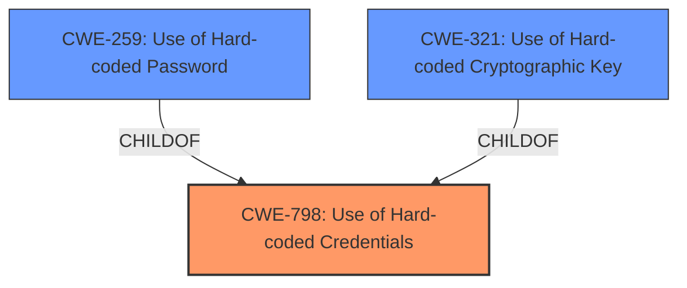

# Analysis for CVE-2024-46328

# Summary
| CWE ID | CWE Name | Confidence | CWE Abstraction Level | CWE Vulnerability Mapping Label | CWE-Vulnerability Mapping Notes |
|---|---|---|---|---|---|
| CWE-798 | Use of Hard-coded Credentials | 1.0 | Base | Primary | Allowed |
| CWE-259 | Use of Hard-coded Password | 0.9 | Variant | Secondary Candidate | Allowed |
| CWE-321 | Use of Hard-coded Cryptographic Key | 0.7 | Variant | Secondary Candidate | Allowed |

## Evidence and Confidence

*   **Confidence Score:** 0.9
*   **Evidence Strength:** HIGH

## Relationship Analysis
The primary CWE selected is CWE-798 (**Use of Hard-coded Credentials**), a Base level CWE. CWE-259 (**Use of Hard-coded Password**) and CWE-321 (**Use of Hard-coded Cryptographic Key**) are children of CWE-798 and represent more specific cases of hardcoded credentials. While the description specifies "hardcoded credentials," it also mentions privileged accounts and root access, suggesting that the credentials could be passwords. Therefore, CWE-259 is a strong secondary candidate. The possibility of hardcoded cryptographic keys exists but is less explicit in the description, making CWE-321 a weaker secondary candidate.

## Vulnerability Chain
The vulnerability chain starts with the **hardcoded credentials** (CWE-798). This leads to an authentication bypass, allowing an attacker to gain administrative control of the device.

## Summary of Analysis
The initial analysis identified CWE-798 as the most appropriate primary CWE, representing the **root cause** of the vulnerability which is the presence of **hardcoded credentials**. The description explicitly states that the VONETS VAP11G-300 device contains **hardcoded credentials** for privileged accounts. The "CVE Reference Links Content Summary" confirms this, stating, "Hardcoded credentials in the main settings binary of the VONETS VAP11G-300 router" and "Hardcoded plaintext credentials within the `Http_handle` object of the settings binary."

CWE-259 and CWE-321 were considered as more specific variants of CWE-798. Given that the vulnerability description mentions "passwords" for privileged accounts, CWE-259 is a strong secondary candidate. The evidence doesn't explicitly mention cryptographic keys, making CWE-321 a less confident mapping.

The relationship graph shows CWE-259 and CWE-321 as children of CWE-798, supporting the decision to consider them as secondary candidates. The final decision favors CWE-798 as the primary CWE because it directly addresses the core issue of **hardcoded credentials**, while CWE-259 and CWE-321 represent specific types of credentials that may or may not be present.

Relevant CWE Information:
- CWE-798: Use of Hard-coded Credentials
- CWE-259: Use of Hard-coded Password
- CWE-321: Use of Hard-coded Cryptographic Key