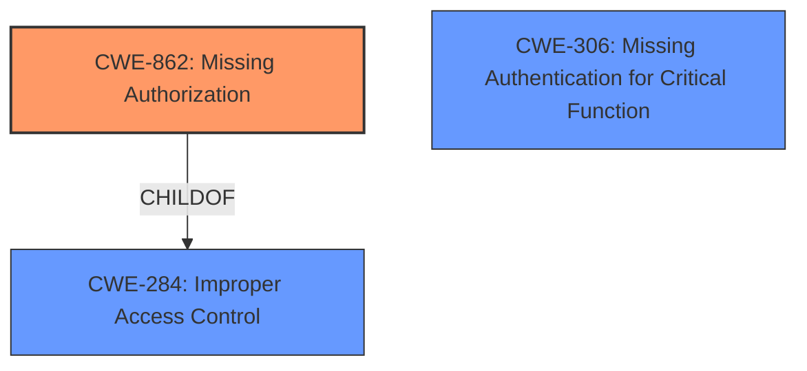

# Analysis Report for CVE-2024-46432

# Vulnerability Analysis Report: CVE-2024-46432

## Description

Tenda W18E V16.01.0.8(1625) is vulnerable to **Incorrect Access Control**. An attacker can send a specially crafted HTTP POST request to the setQuickCfgWifiAndLogin function, which allows unauthorized changes to WiFi configuration settings and administrative credentials.

## Vulnerability Description Key Phrases

- **Rootcause:** Incorrect Access Control
- **Impact:** unauthorized changes to WiFi configuration settings and administrative credentials
- **Vector:** specially crafted HTTP POST request
- **Product:** Tenda W18E
- **Version:** V16.01.0.8(1625)
- **Component:** setQuickCfgWifiAndLogin function

## Analysis (with Relationship Data)

# Summary
| CWE ID | CWE Name | Confidence | CWE Abstraction Level | CWE Vulnerability Mapping Label | CWE-Vulnerability Mapping Notes |
|---|---|---|---|---|---|
| CWE-862 | Missing Authorization | 0.8 | Base | Allowed | Primary CWE: The application lacks authorization checks, allowing unauthorized access to functionality. |
| CWE-306 | Missing Authentication for Critical Function | 0.6 | Base | Allowed | Secondary Candidate: Could be relevant if there's no authentication at all for the vulnerable function. |

## Evidence and Confidence

*   **Confidence Score:** 0.7
*   **Evidence Strength:** MEDIUM

## Relationship Analysis
The primary relationship influencing the decision is the differentiation between authentication (CWE-306) and authorization (CWE-862). Given the description states "**Incorrect Access Control**" that allows unauthorized changes, the vulnerability leans towards missing authorization checks rather than a complete lack of authentication. CWE-862 (Missing Authorization) is a child of CWE-284 (Improper Access Control) and is more specific, hence a better fit. CWE-306 could be a contributing factor if the function lacked authentication entirely, but the evidence is not strong enough to support this.



## Vulnerability Chain
The vulnerability chain starts with the **Incorrect Access Control**, specifically the **missing authorization** check in the `setQuickCfgWifiAndLogin` function (CWE-862). This allows an attacker to send a crafted HTTP POST request, leading to the impact of unauthorized changes to WiFi configuration and administrative credentials.

## Summary of Analysis
Initially, the description indicates "**Incorrect Access Control**" which could point to a variety of CWEs. However, the details of the vulnerability suggest a lack of authorization checks in the `setQuickCfgWifiAndLogin` function. This is supported by the ability to make unauthorized changes to WiFi settings and administrative credentials. The primary assessment is based on the vulnerability description key phrase "**Incorrect Access Control**" and the impact description "unauthorized changes to WiFi configuration settings and administrative credentials".

CWE-862 (Missing Authorization) is chosen because it specifically addresses the scenario where an application does not check if the user is authorized to perform an action. The description does not explicitly mention a bypassed authentication, but a missing authorization.

Other CWEs considered but not used:

*   CWE-284: Improper Access Control - This is a high-level category and less specific than CWE-862.
*   CWE-306: Missing Authentication for Critical Function - Could be relevant if there was absolutely no authentication, but the description points more towards missing authorization.
*   CWE-863: Incorrect Authorization - This would apply if there was an authorization check, but it was flawed.
*   CWE-425: Direct Request ('Forced Browsing') - Although a crafted HTTP POST request is mentioned, the core issue is the lack of authorization, not just direct access to a resource.
*   CWE-472: External Control of Assumed-Immutable Web Parameter - Not applicable because the issue isn't about manipulating immutable parameters.
*   CWE-639: Authorization Bypass Through User-Controlled Key - This is not applicable because the vulnerability description doesn't mention keys.

The selected CWE is at the optimal level of specificity because it directly addresses the root cause which is the missing authorization check.


## CWE Relationship Analysis

Current CWEs represent these abstraction levels: .


### Vulnerability Chain Analysis

**Chain starting from CWE-863:**
- 863 (Incorrect Authorization) - ROOT


**Chain starting from CWE-862:**
- 862 (Missing Authorization) - ROOT


### CWE Relationship Diagram

```mermaid
graph TD
    classDef primary fill:#f96,stroke:#333,stroke-width:2px
    classDef secondary fill:#69f,stroke:#333
    classDef tertiary fill:#9e9,stroke:#333
```


*Report generated on 2025-07-13 17:27:05*
