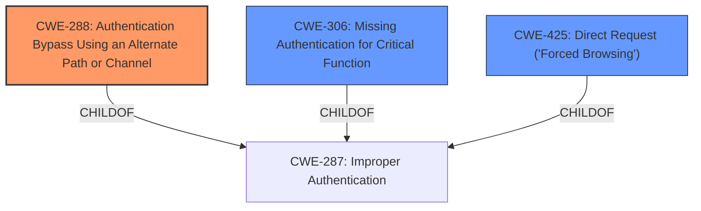

# Analysis for CVE-2024-46434

# Summary
| CWE ID | CWE Name | Confidence | CWE Abstraction Level | CWE Vulnerability Mapping Label | CWE-Vulnerability Mapping Notes |
|---|---|---|---|---|---|
| CWE-288 | Authentication Bypass Using an Alternate Path or Channel | 0.9 | Base | Allowed | Primary CWE |
| CWE-306 | Missing Authentication for Critical Function | 0.7 | Base | Allowed | Secondary Candidate |
| CWE-425 | Direct Request ('Forced Browsing') | 0.6 | Base | Allowed | Secondary Candidate |

## Evidence and Confidence

*   **Confidence Score:** 0.8
*   **Evidence Strength:** MEDIUM

## Relationship Analysis
The primary CWE selected is CWE-288, which is a Base level CWE. It is related to other authentication bypass CWEs such as CWE-306 (Missing Authentication for Critical Function) and CWE-425 (Direct Request ('Forced Browsing')). While CWE-306 represents a complete lack of authentication, CWE-288 indicates that there is an alternate path or channel that bypasses the intended authentication mechanism. CWE-425 represents a failure to enforce authorization on restricted URLs.

## Vulnerability Chain
The vulnerability chain starts with an **improper authentication** mechanism. The attacker crafts a specific HTTP request to bypass the authentication. This leads to gaining administrative access.

Root Cause: **Improper Authentication** (CWE-288)
Impact: Gain administrative access.

## Summary of Analysis
The vulnerability description indicates an **authentication bypass** in the web management portal of Tenda W18E. An unauthorized remote attacker can gain administrative access by sending a specially crafted HTTP request.

The primary CWE is CWE-288 (Authentication Bypass Using an Alternate Path or Channel) because the vulnerability description explicitly mentions that the attacker is able to bypass authentication using a specially crafted HTTP request, implying that there's an alternate, unintended path that lacks proper authentication. This aligns well with the definition of CWE-288.

CWE-306 (Missing Authentication for Critical Function) was considered, but it is more appropriate when there is a complete lack of authentication. In this case, the attacker is bypassing the existing authentication mechanism, suggesting that some form of authentication is present but flawed.

CWE-425 (Direct Request ('Forced Browsing')) was also considered, but it focuses more on authorization bypass by directly accessing restricted URLs without proper checks. While the attacker ultimately gains administrative access, the initial **weakness** lies in bypassing the authentication process, making CWE-288 a more fitting choice.

The final selection of CWE-288 is based on the evidence from the vulnerability description of the **authentication bypass** using a specially crafted HTTP request. The retriever results also support this selection, as CWE-288 has a high score. The relationships between the CWEs further solidify this choice, as CWE-288 is a specific type of **improper authentication**.

Relevant CWE Information:

# Enhanced Context (25 CWEs)
The following CWEs were identified as potentially relevant to this vulnerability:

## CWE-288: Authentication Bypass Using an Alternate Path or Channel
**Abstraction Level**: Base
**Similarity Score**: 0.76
**Source**: dense

**Description**:
The product requires authentication, but the product has an alternate path or channel that does not require authentication.

**Mapping Guidance**:
- Usage: Allowed
- Rationale: This CWE entry is at the Base level of abstraction, which is a preferred level of abstraction for mapping to the root causes of vulnerabilities.

CWE-306: Missing Authentication for Critical Function
**Abstraction Level**: Base
**Similarity Score**: 1159.65
**Source**: sparse

**Description**:
The product does not perform any authentication for functionality that requires a provable user identity or consumes a significant amount of resources.

**Mapping Guidance**:
- Usage: Allowed
- Rationale: This CWE entry is at the Base level of abstraction, which is a preferred level of abstraction for mapping to the root causes of vulnerabilities.

CWE-425: Direct Request ('Forced Browsing')
**Abstraction Level**: Base
**Similarity Score**: 1170.59
**Source**: sparse

**Description**:
The web application does not adequately enforce appropriate authorization on all restricted URLs, scripts, or files.

**Mapping Guidance**:
- Usage: Allowed
- Rationale: This CWE entry is at the Base level of abstraction, which is a preferred level of abstraction for mapping to the root causes of vulnerabilities.