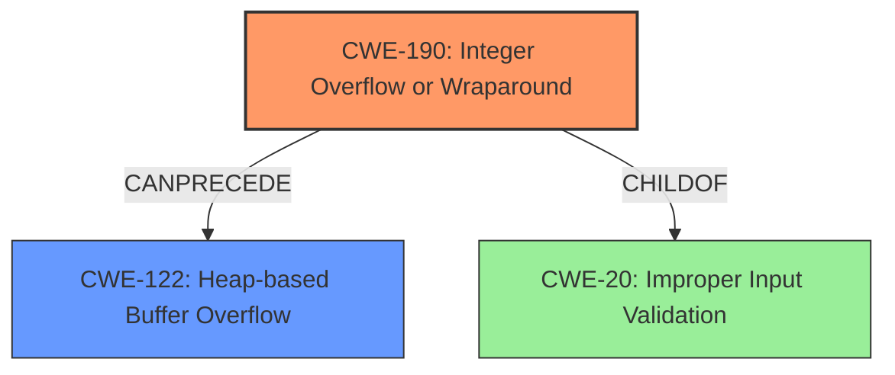

# Raw Analyzer Response for CVE-2024-46483

# Summary

| CWE ID    | CWE Name                                                              | Confidence | CWE Abstraction Level | CWE Vulnerability Mapping Label | CWE-Vulnerability Mapping Notes |
| :---------- | :-------------------------------------------------------------------- | :--------- | :---------------------- | :------------------------------ | :-------------------------------- |
| CWE-190     | Integer Overflow or Wraparound                                        | 0.9        | Base                    | Primary                         | Allowed                           |
| CWE-122     | Heap-based Buffer Overflow                                            | 0.8        | Base                    | Secondary                       | Allowed                           |

## Evidence and Confidence

*   **Confidence Score:** 0.85
*   **Evidence Strength:** HIGH

## Relationship Analysis

The primary relationship is that **CWE-190** [Integer Overflow or Wraparound] can precede **CWE-122** [Heap-based Buffer Overflow]. The integer overflow can lead to an incorrectly calculated buffer size, which then leads to a heap overflow when data is written using the **attacker-controlled content**. **CWE-190** [Integer Overflow or Wraparound] is a child of **CWE-20** [Improper Input Validation], reflecting that the overflow occurs due to **insufficient** input validation.

## Vulnerability Chain

The vulnerability chain starts with an **integer overflow** (**CWE-190** [Integer Overflow or Wraparound]) in the packet parsing logic of the SFTP server. This **integer overflow** leads to a **heap overflow** (**CWE-122** [Heap-based Buffer Overflow]) when **attacker-controlled content** is processed. The root cause is the **integer overflow** because it's the initial flaw that triggers the subsequent vulnerability.

## Summary of Analysis

The analysis is based on the provided vulnerability description and key phrases. The primary weakness is the **integer overflow** (**CWE-190** [Integer Overflow or Wraparound]) which leads to the **heap overflow** (**CWE-122** [Heap-based Buffer Overflow]).

The evidence for **CWE-190** [Integer Overflow or Wraparound] is derived from the phrase "**integer overflow** vulnerability in the packet parsing logic." The evidence for **CWE-122** [Heap-based Buffer Overflow] is the phrase "**heap overflow** with attacker-controlled content."

The relationship graph shows how **CWE-190** [Integer Overflow or Wraparound] can precede **CWE-122** [Heap-based Buffer Overflow], which aligns with the vulnerability description.

The selected CWEs are at the optimal level of specificity because they directly represent the root cause (**integer overflow**) and the resulting impact (**heap overflow**).