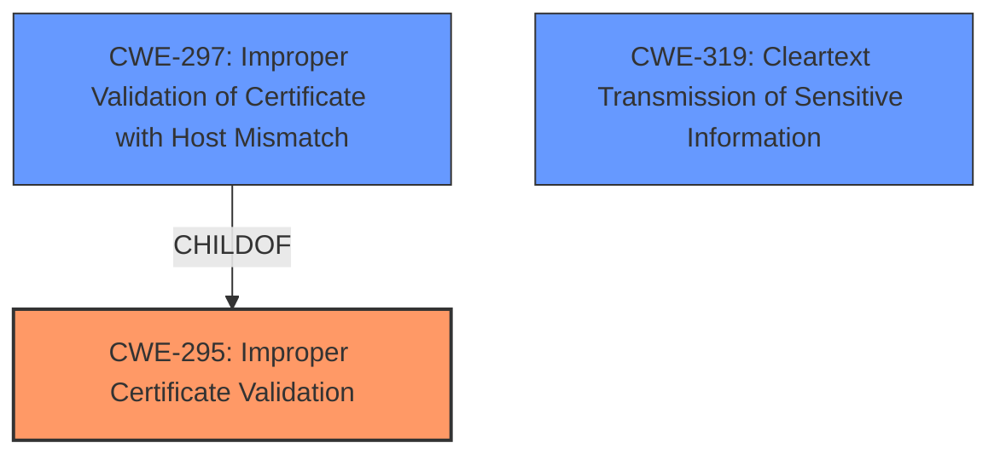

# Enhanced Analysis for CVE-2024-46548

# Summary
| CWE ID | CWE Name | Confidence | CWE Abstraction Level | CWE Vulnerability Mapping Label | CWE-Vulnerability Mapping Notes |
|---|---|---|---|---|---|
| CWE-295 | Improper Certificate Validation | 1.0 | Base | Primary | Allowed |
| CWE-297 | Improper Validation of Certificate with Host Mismatch | 0.7 | Variant | Secondary Candidate | Allowed |
| CWE-319 | Cleartext Transmission of Sensitive Information | 0.5 | Base | Secondary Candidate | Allowed |

## Evidence and Confidence

*   **Confidence Score:** 1.0
*   **Evidence Strength:** HIGH

## Relationship Analysis
The primary relationship that influenced my decision was the parent-child relationship between CWE-295 (Improper Certificate Validation) and CWE-297 (Improper Validation of Certificate with Host Mismatch). CWE-297 is a more specific variant of CWE-295. Also, considered was the potential for CWE-319 (Cleartext Transmission of Sensitive Information) due to the potential for eavesdropping. However, given the description focuses on the certificate validation issue, it's likely a prerequisite for the eavesdropping rather than a direct consequence. The abstraction levels guided me to select the most specific base or variant CWE.



## Vulnerability Chain
The vulnerability chain starts with **improper certificate validation** (CWE-295), potentially leading to a man-in-the-middle attack, which results in eavesdropping on communications and access to sensitive information.

## Summary of Analysis
The primary focus of the vulnerability description is the **improper validation of certificates**. The key phrase "**improperly validate certificates**" strongly suggests CWE-295 (Improper Certificate Validation) as the root cause. The description also mentions that this allows attackers to eavesdrop on communications and access sensitive information via a man-in-the-middle attack.

The retriever results also support CWE-295 as the top candidate. CWE-297 (Improper Validation of Certificate with Host Mismatch) is a more specific variant of CWE-295 and could be considered if there were specific evidence pointing towards host mismatch issues, but the description lacks that level of detail. CWE-319 (Cleartext Transmission of Sensitive Information) is possible, but likely a consequence of the man-in-the-middle attack enabled by the certificate validation issue.

Based on the provided evidence, CWE-295 is the most appropriate primary CWE at the base level of abstraction.

CWE-297 was considered because it is a child of CWE-295 and more specific but was not selected as the primary because there was no evidence in the description to support it.

CWE-319 was considered because the impact of the vulnerability included eavesdropping on communications, which could lead to transmission of sensitive information in cleartext. However, it was not selected as the primary CWE because the root cause is the **improper certificate validation**.


## CWE Relationship Analysis

Current CWEs represent these abstraction levels: .


### Vulnerability Chain Analysis

**Chain starting from CWE-319:**
- 319 (Cleartext Transmission of Sensitive Information) - ROOT


**Chain starting from CWE-295:**
- 295 (Improper Certificate Validation) - ROOT


### CWE Relationship Diagram

```mermaid
graph TD
    classDef primary fill:#f96,stroke:#333,stroke-width:2px
    classDef secondary fill:#69f,stroke:#333
    classDef tertiary fill:#9e9,stroke:#333
```