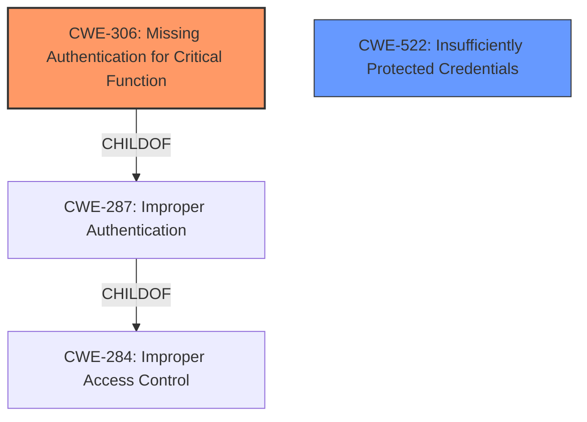

# Enhanced Analysis for CVE-2024-46609

# Summary

| CWE ID  | CWE Name                                            | Confidence | CWE Abstraction Level | CWE Vulnerability Mapping Label | CWE-Vulnerability Mapping Notes |
| :-------- | :-------------------------------------------------- | :--------- | :-------------------- | :------------------------------ | :------------------------------ |
| CWE-306 | Missing Authentication for Critical Function        | 1.0       | Base                  | Primary                         | Allowed                         |
| CWE-522 | Insufficiently Protected Credentials | 0.7       | Class                  | Secondary                         | Allowed-with-Review                         |

## Evidence and Confidence

*   **Confidence Score:** 0.9
*   **Evidence Strength:** HIGH

## Relationship Analysis

The primary relationship that influenced the decision was the parent-child relationship between CWE-287 (Improper Authentication), CWE-284 (Improper Access Control) and CWE-306 (Missing Authentication for Critical Function). Since the function completely lacks authentication, CWE-306 is more appropriate than its parents. The relationship of CWE-522 (Insufficiently Protected Credentials) isn't as strong, however the fact that user passwords are exposed makes it a candidate CWE.



## Vulnerability Chain

The vulnerability chain starts with the **missing authentication** on the `CheckVip` function (CWE-306). This leads to **unauthorized access** to user data, including passwords. The **insufficiently protected credentials** (CWE-522) are a result of this lack of authentication, enabling complete account takeover.

## Summary of Analysis

The initial analysis of the vulnerability description identified a clear **access control issue** due to **missing authentication**. The retriever results and enhanced context strongly suggested CWE-306 (Missing Authentication for Critical Function) as the primary CWE. The final decision was heavily influenced by the evidence in the CVE description and POC which clearly shows that the `/getUserList/{page}/{limit}` endpoint does not require any authentication. The selection of CWE-306 is at the optimal level of specificity as it is a Base level CWE, accurately capturing the root cause. The weakness chain then exposes passwords which aren't sufficiently protected.

Relevant CWE Information:

# Enhanced Context (25 CWEs)
The following CWEs were identified as potentially relevant to this vulnerability:

## CWE-306: Missing Authentication for Critical Function
**Abstraction Level**: Base
**Similarity Score**: 1596.00
**Source**: sparse

**Description**:
The product does not perform any authentication for functionality that requires a provable user identity or consumes a significant amount of resources.

**Mapping Guidance**:
- Usage: Allowed
- Rationale: This CWE entry is at the Base level of abstraction, which is a preferred level of abstraction for mapping to the root causes of vulnerabilities.

## CWE-522: Insufficiently Protected Credentials
**Abstraction Level**: Class
**Similarity Score**: 0.179
**Source**: sparse

**Description**:
The product stores authentication credentials, but it provides insufficient protection against unauthorized disclosure or modification.

**Mapping Guidance**:
- Usage: Allowed-with-Review
- Rationale: This CWE entry is a Class and might have Base-level children that would be more appropriate

---

**CWE-306: Missing Authentication for Critical Function**

*   **How the vulnerability's details match the CWE's characteristics:** The `CheckVip` function in `UserController.java` lacks any authentication checks, allowing unauthenticated attackers to access it.
*   **The security implications and potential impact:** Unauthenticated attackers can access all user information, including passwords.
*   **Any parent-child relationships or chain patterns that influenced your mapping:** CWE-306 is a child of CWE-287 (Improper Authentication), which is a child of CWE-284 (Improper Access Control). This hierarchical relationship helped confirm that CWE-306 is the most specific and appropriate choice.
*   **Whether the weakness is primary or secondary in the vulnerability:** Primary.
*   **How the official MITRE mapping guidance influenced your decision:** The MITRE mapping guidance for CWE-306 states that it should be used when no identity validation is enforced for sensitive functionality. This aligns perfectly with the vulnerability description.

**CWE-522: Insufficiently Protected Credentials**

*   **How the vulnerability's details match the CWE's characteristics:** User passwords are being disclosed.
*   **The security implications and potential impact:** Attackers can gain unauthorized access to sensitive user data.
*   **Any parent-child relationships or chain patterns that influenced your mapping:** This is a consequence of the missing authentication.
*   **Whether the weakness is primary or secondary in the vulnerability:** Secondary.
*   **How the official MITRE mapping guidance influenced your decision:** The MITRE mapping guidance for CWE-522 states that it should be used when authentication credentials are not sufficiently protected against unauthorized disclosure. This aligns with the vulnerability description.

CWEs Considered but Not Used:

*   CWE-284 (Improper Access Control): This is a high-level category, and CWE-306 provides a more specific root cause.
*   CWE-287 (Improper Authentication): While related, CWE-306 is more precise because it explicitly states that authentication is missing entirely.
*   CWE-862 (Missing Authorization): In this case, authentication is completely missing, so authorization checks are irrelevant.


## CWE Relationship Analysis

Current CWEs represent these abstraction levels: .


### Vulnerability Chain Analysis

**Chain starting from CWE-862:**
- 862 (Missing Authorization) - ROOT


**Chain starting from CWE-306:**
- 306 (Missing Authentication for Critical Function) - ROOT


### CWE Relationship Diagram

```mermaid
graph TD
    classDef primary fill:#f96,stroke:#333,stroke-width:2px
    classDef secondary fill:#69f,stroke:#333
    classDef tertiary fill:#9e9,stroke:#333
```