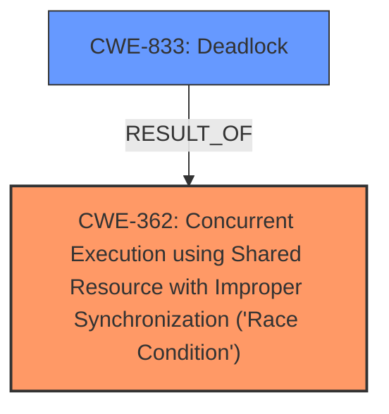

# Analysis for CVE-2024-46797

# Summary
| CWE ID | CWE Name | Confidence | CWE Abstraction Level | CWE Vulnerability Mapping Label | CWE-Vulnerability Mapping Notes |
|---|---|---|---|---|---|
| CWE-362 | Concurrent Execution using Shared Resource with Improper Synchronization ('Race Condition') | 0.95 | Class | Allowed-with-Review | Primary CWE: This captures the root cause of the vulnerability, which is a race condition. |
| CWE-833 | Deadlock | 0.85 | Base | Allowed | Secondary CWE: This is the resulting impact of the race condition. |

## Evidence and Confidence

*   **Confidence Score:** 0.90
*   **Evidence Strength:** HIGH

## Relationship Analysis
The primary relationship that influenced the CWE selection is the causal relationship between a race condition and a deadlock. **CWE-362** Concurrent Execution using Shared Resource with Improper Synchronization ('Race Condition') is the root cause, leading to the impact of **CWE-833** Deadlock. **CWE-362** is a Class, while **CWE-833** is a Base. A more specific Base or Variant under **CWE-362** might be more precise, but **CWE-362** itself adequately captures the core issue based on the evidence.

## Vulnerability Chain
The vulnerability chain starts with a **race condition** (CWE-362) due to the lack of proper synchronization. This leads to **stale lock values** and **incorrect next pointer** assignment, eventually resulting in a **deadlock** (CWE-833).

## Summary of Analysis
The analysis concludes that the primary weakness is **CWE-362** Concurrent Execution using Shared Resource with Improper Synchronization ('Race Condition') which directly leads to the secondary weakness **CWE-833** Deadlock.

The vulnerability description explicitly mentions a **race condition** in `queued_spin_lock_slowpath()`: "A **race condition** in queued_spin_lock_slowpath() leads to a deadlock. Specifically, an interrupt occurring after incrementing qnodesp->count but before initializing node->lock can cause another CPU to read stale lock values from get_tail_qnode()." The CVE Reference Links Content Summary reinforces this: "Race Condition: The core issue lies in the timing window between incrementing the queue counter and initializing the lock field in the MCS queue node. An interrupt during this window can lead to inconsistent state."

The deadlock is mentioned as the impact: "This causes a **deadlock** as the former CPU, once it becomes the head of the MCS queue, will spin indefinitely until its next pointer is set by its successor in the queue." and "The vulnerability results in a system **deadlock**. The affected CPU becomes unresponsive, leading to a hard lockup."

The relationship between the **race condition** and the **deadlock** is clear: the **race condition** is the root cause, and the **deadlock** is the impact. The retriever results support this, with **CWE-362** and **CWE-833** being highly relevant.

The selected CWEs are at an appropriate level of specificity, with **CWE-362** being a Class that accurately describes the synchronization issue, and **CWE-833** being a Base that clearly defines the resulting deadlock.

Relevant CWE Information:

# Enhanced Context (25 CWEs)
The following CWEs were identified as potentially relevant to this vulnerability:

## CWE-667: Improper Locking
**Abstraction Level**: Class
**Similarity Score**: 0.81
**Source**: dense

**Description**:
The product does not properly acquire or release a lock on a resource, leading to unexpected resource state changes and behaviors.

**Mapping Guidance**:
- Usage: Allowed-with-Review
- Rationale: This CWE entry is a Class and might have Base-level children that would be more appropriate

## CWE-833: Deadlock
**Abstraction Level**: Base
**Similarity Score**: 0.80
**Source**: dense

**Description**:
The product contains multiple threads or executable segments that are waiting for each other to release a necessary lock, resulting in deadlock.

**Mapping Guidance**:
- Usage: Allowed
- Rationale: This CWE entry is at the Base level of abstraction, which is a preferred level of abstraction for mapping to the root causes of vulnerabilities.

## CWE-362: Concurrent Execution using Shared Resource with Improper Synchronization ('Race Condition')
**Abstraction Level**: Class
**Similarity Score**: 0.77
**Source**: dense

**Description**:
The product contains a concurrent code sequence that requires temporary, exclusive access to a shared resource, but a timing window exists in which the shared resource can be modified by another code sequence operating concurrently.

**Mapping Guidance**:
- Usage: Allowed-with-Review
- Rationale: This CWE entry is a Class and might have Base-level children that would be more appropriate

## CWE-367: Time-of-check Time-of-use (TOCTOU) Race Condition
**Abstraction Level**: Base
**Similarity Score**: 0.76
**Source**: dense

**Description**:
The product checks the state of a resource before using that resource, but the resource's state can change between the check and the use in a way that invalidates the results of the check. This can cause the product to perform invalid actions when the resource is in an unexpected state.

**Mapping Guidance**:
- Usage: Allowed
- Rationale: This CWE entry is at the Base level of abstraction, which is a preferred level of abstraction for mapping to the root causes of vulnerabilities.

## CWE-755: Improper Handling of Exceptional Conditions
**Abstraction Level**: Class
**Similarity Score**: 0.75
**Source**: dense

**Description**:
The product does not handle or incorrectly handles an exceptional condition.

**Mapping Guidance**:
- Usage: Discouraged
- Rationale: This CWE entry is a level-1 Class (i.e., a child of a Pillar). It might have lower-level children that would be more appropriate

## CWE-366: Race Condition within a Thread
**Abstraction Level**: Base
**Similarity Score**: 0.74
**Source**: dense

**Description**:
If two threads of execution use a resource simultaneously, there exists the possibility that resources may be used while invalid, in turn making the state of execution undefined.

**Mapping Guidance**:
- Usage: Allowed
- Rationale: This CWE entry is at the Base level of abstraction, which is a preferred level of abstraction for mapping to the root causes of vulnerabilities.

## CWE-413: Improper Resource Locking
**Abstraction Level**: Base
**Similarity Score**: 0.74
**Source**: dense

**Description**:
The product does not lock or does not correctly lock a resource when the product must have exclusive access to the resource.

**Mapping Guidance**:
- Usage: Allowed
- Rationale: This CWE entry is at the Base level of abstraction, which is a preferred level of abstraction for mapping to the root causes of vulnerabilities.

## CWE-1285: Improper Validation of Specified Index, Position, or Offset in Input
**Abstraction Level**: Base
**Similarity Score**: 0.74
**Source**: dense

**Description**:
The product receives input that is expected to specify an index, position, or offset into an indexable resource such as a buffer or file, but it does not validate or incorrectly validates that the specified index/position/offset has the required properties.

**Mapping Guidance**:
- Usage: Allowed
- Rationale: This CWE entry is at the Base level of abstraction, which is a preferred level of abstraction for mapping to the root causes of vulnerabilities.

## CWE-407: Inefficient Algorithmic Complexity
**Abstraction Level**: Class
**Similarity Score**: 0.74
**Source**: dense

**Description**:
An algorithm in a product has an inefficient worst-case computational complexity that may be detrimental to system performance and can be triggered by an attacker, typically using crafted manipulations that ensure that the worst case is being reached.

**Mapping Guidance**:
- Usage: Allowed-with-Review
- Rationale: This CWE entry is a Class and might have Base-level children that would be more appropriate

## CWE-824: Access of Uninitialized Pointer
**Abstraction Level**: Base
**Similarity Score**: 0.73
**Source**: dense

**Description**:
The product accesses or uses a pointer that has not been initialized.

**Mapping Guidance**:
- Usage: Allowed
- Rationale: This CWE entry is at the Base level of abstraction, which is a preferred level of abstraction for mapping to the root causes of vulnerabilities.

## CWE-667: Improper Locking
**Abstraction Level**: Class
**Similarity Score**: 1556.32
**Source