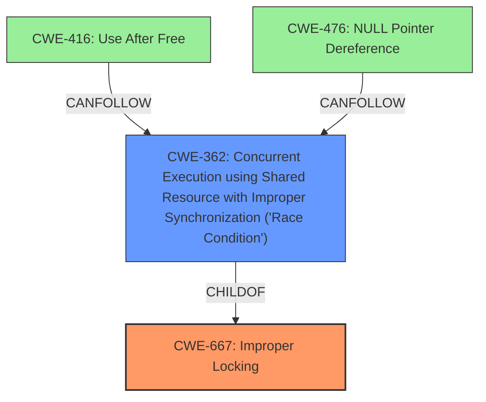

# Analysis for CVE-2024-46866

# Summary

| CWE ID | CWE Name | Confidence | CWE Abstraction Level | CWE Vulnerability Mapping Label | CWE-Vulnerability Mapping Notes |
|---|---|---|---|---|---|
| CWE-667 | Improper Locking | 0.9 | Class | Primary | Allowed-with-Review |
| CWE-362 | Concurrent Execution using Shared Resource with Improper Synchronization ('Race Condition') | 0.7 | Class | Secondary | Allowed-with-Review |
| CWE-416 | Use After Free | 0.7 | Variant | Secondary | Allowed |
| CWE-476 | NULL Pointer Dereference | 0.7 | Base | Secondary | Allowed |

## Evidence and Confidence

*   **Confidence Score:** 0.8
*   **Evidence Strength:** HIGH

## Relationship Analysis
The primary weakness is the **Improper Locking (CWE-667)** which is a class-level CWE. It can lead to race conditions (**CWE-362**), which in turn can cause **Use-After-Free (CWE-416)** or **NULL Pointer Dereference (CWE-476)**. The relationship is hierarchical, with the class CWE-667 being a broader category that encompasses more specific concurrency issues, and the base CWEs representing concrete failure conditions that can occur due to the locking issue.

## Vulnerability Chain
The vulnerability chain starts with the **missing bo locking**. This **root cause** leads to a **race condition** where the buffer object's state can be changed while being inspected. This **race condition** can then result in a **use-after-free** or **null pointer dereference**.

Missing Lock -> Race Condition -> Use-After-Free / Null Pointer Dereference

## Summary of Analysis
The analysis is based on the vulnerability description and the provided CVE reference links content summary. The key phrase "missing bo locking in show_meminfo() bo_meminfo() ... if the bo lock is not held" clearly indicates a locking issue. The CVE reference summary confirms this by stating, "This state can change at any time, leading to potential use-after-free (UAF) or null pointer dereference (NPD) issues if the bo lock is not held while accessing it." This strongly supports the selection of CWE-667 as the primary weakness. The subsequent race condition (CWE-362) and potential UAF (CWE-416) or NPD (CWE-476) are impacts of the **improper locking**.

The selection of CWE-667 at the class level is appropriate because the vulnerability description focuses on the general issue of **missing locking**, rather than a specific locking mechanism. While more specific base-level CWEs related to locking might exist, the information provided does not allow for a more precise mapping.

**CWE-667: Improper Locking**
*   **Technical Explanation:** The code is missing necessary locking mechanisms when accessing shared buffer object state. This allows for concurrent modifications, leading to inconsistent or invalid data access.
*   **Security Implications:** Missing locks can lead to race conditions and data corruption, potentially resulting in crashes, unexpected behavior, or even exploitable vulnerabilities like UAF or NPD.
*   **Relationship:** This is the primary weakness and the root cause of the vulnerability. It is a class-level CWE.
*   **Mapping Guidance Influence:** The guidance allows for CWE-667 but suggests reviewing for more specific base-level children. Since details are lacking to go to a more specific lock error, using the Class level is acceptable.

**CWE-362: Concurrent Execution using Shared Resource with Improper Synchronization ('Race Condition')**
*   **Technical Explanation:** The vulnerability allows concurrent execution of code sequences that access and modify a shared resource (buffer object state) without proper synchronization, leading to a race condition.
*   **Security Implications:** A race condition can lead to unpredictable behavior, data corruption, and exploitable vulnerabilities like UAF.
*   **Relationship:** This is a consequence of the missing locking and a prerequisite for UAF or NPD.
*   **Mapping Guidance Influence:** The guidance allows for CWE-362 but suggests reviewing for more specific base-level children. Since details are lacking to go to a more specific race condition, using the Class level is acceptable.

**CWE-416: Use After Free**
*   **Technical Explanation:** Due to the missing locking, a buffer object can be freed while still being accessed, leading to a use-after-free condition.
*   **Security Implications:** UAF vulnerabilities are often exploitable and can lead to arbitrary code execution.
*   **Relationship:** This is a potential impact of the race condition caused by the missing locking.
*   **Mapping Guidance Influence:** This is a Variant level and is appropriate.

**CWE-476: NULL Pointer Dereference**
*   **Technical Explanation:** Due to the missing locking, a buffer object can be freed, and a pointer to it becomes a dangling pointer. Dereferencing this dangling pointer results in a null pointer dereference.
*   **Security Implications:** NPD typically leads to crashes, but it can potentially be exploited.
*   **Relationship:** This is a potential impact of the race condition caused by the missing locking.
*   **Mapping Guidance Influence:** This is a Base level and is appropriate.

Other CWEs Considered but Not Used:

*   CWE-833 (Deadlock): While locking is involved, there is no evidence of a deadlock condition in the description.
*   CWE-764 (Multiple Locks of a Critical Resource): The issue is the lack of locking, not multiple locks.
*   CWE-909 (Missing Initialization of Resource): This doesn't fit the vulnerability as it's about the lack of locking a resource that is already initialized.
*   CWE-413 (Improper Resource Locking): Similar to CWE-764, the core issue is the missing lock rather than improper locking.