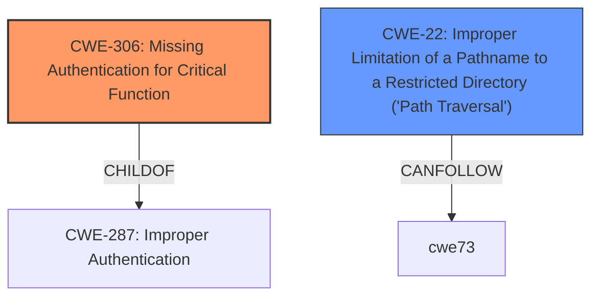

# Analysis Report for CVE-2024-46938

# Vulnerability Analysis Report: CVE-2024-46938

## Description

An issue was discovered in Sitecore Experience Platform (XP), Experience Manager (XM), and Experience Commerce (XC) 8.0 Initial Release through 10.4 Initial Release. An unauthenticated attacker can read arbitrary files.

## Vulnerability Description Key Phrases

- **Impact:** read arbitrary files
- **Attacker:** unauthenticated attacker
- **Product:** ['Sitecore Experience Platform', 'Experience Manager', 'Experience Commerce']
- **Version:** 8.0 Initial Release through 10.4 Initial Release

## Analysis (with Relationship Data)

# Summary
| CWE ID | CWE Name | Confidence | CWE Abstraction Level | CWE Vulnerability Mapping Label | CWE-Vulnerability Mapping Notes |
|---|---|---|---|---|---|
| CWE-306 | Missing Authentication for Critical Function | 0.7 | Base | Allowed | Primary CWE: The vulnerability exists because an unauthenticated attacker can read arbitrary files, indicating a lack of authentication for a critical function. |
| CWE-22 | Improper Limitation of a Pathname to a Restricted Directory ('Path Traversal') | 0.5 | Base | Allowed | Secondary Candidate: The ability to read arbitrary files might involve path traversal, but it's not explicitly stated. |

## Evidence and Confidence

*   **Confidence Score:** 0.7
*   **Evidence Strength:** LOW

## Relationship Analysis
The primary relationship impacting the decision is the hierarchical relationship between CWE-306 and its parent and child CWEs. CWE-306 is a child of CWE-287 (Improper Authentication) and has children like CWE-322 (Obsolete Authentication Technique). While CWE-287 is a broader category, CWE-306 specifically addresses the **missing authentication** aspect, which aligns with the vulnerability description. CWE-22 is considered as a secondary candidate because the arbitrary file reading could involve path traversal, but there isn't enough direct evidence.



## Vulnerability Chain
The vulnerability chain starts with the **missing authentication** (CWE-306), allowing an unauthenticated attacker to perform a critical function (reading arbitrary files). The impact is unauthorized access to files.

## Summary of Analysis
The initial analysis focused on identifying the root cause that allows an unauthenticated attacker to read arbitrary files. The primary CWE, CWE-306 (Missing Authentication for Critical Function), directly addresses this root cause. The vulnerability description clearly states that an "unauthenticated attacker can read arbitrary files," indicating a **lack of authentication** for a critical function. The retriever results also list CWE-306 as a potentially relevant CWE.

The secondary candidate, CWE-22 (Improper Limitation of a Pathname to a Restricted Directory ('Path Traversal')), was considered because the act of reading arbitrary files might involve path traversal. However, there is no explicit mention of path traversal in the provided vulnerability description. Therefore, CWE-306 is the more appropriate primary CWE due to the direct evidence of **missing authentication**.

The confidence level is 0.7 due to the limited information in the provided vulnerability description. A more detailed description might reveal other contributing factors or a different root cause.


## CWE Relationship Analysis

Current CWEs represent these abstraction levels: .


### Vulnerability Chain Analysis

**Chain starting from CWE-306:**
- 306 (Missing Authentication for Critical Function) - ROOT


**Chain starting from CWE-287:**
- 287 (Improper Authentication) - ROOT


### CWE Relationship Diagram

```mermaid
graph TD
    classDef primary fill:#f96,stroke:#333,stroke-width:2px
    classDef secondary fill:#69f,stroke:#333
    classDef tertiary fill:#9e9,stroke:#333
```


*Report generated on 2025-07-13 17:44:12*
