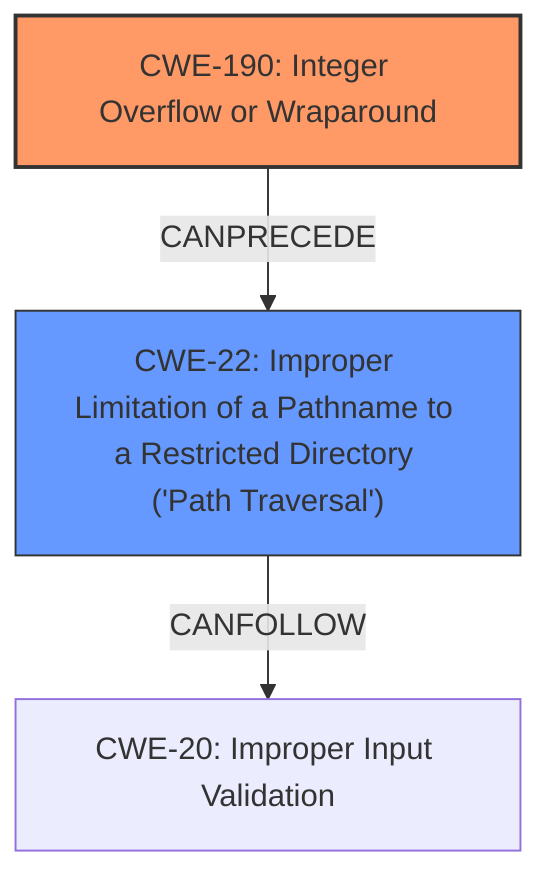

# Analysis for CVE-2024-46953

# Summary
| CWE ID    | CWE Name                                                                 | Confidence | CWE Abstraction Level | CWE Vulnerability Mapping Label | CWE-Vulnerability Mapping Notes |
| --------- | ------------------------------------------------------------------------ | ---------- | --------------------- | ------------------------------- | ------------------------------- |
| CWE-190   | Integer Overflow or Wraparound                                            | 0.9        | Base                  | Primary                         | Allowed                        |
| CWE-22    | Improper Limitation of a Pathname to a Restricted Directory ('Path Traversal') | 0.8        | Base                  | Secondary                       | Allowed                        |

## Evidence and Confidence

*   **Confidence Score:** 0.85
*   **Evidence Strength:** HIGH

## Relationship Analysis
The primary weakness is an **integer overflow** (CWE-190) that leads to **path truncation** and subsequent **path traversal** (CWE-22). CWE-190 is a Base level CWE. CWE-22 is also a Base level CWE. The relationship between CWE-190 and CWE-22 is that an integer overflow can lead to path traversal if the overflowed value is used in the construction of a file path without proper validation.

## Vulnerability Chain
The vulnerability chain starts with **integer overflow** (CWE-190), which leads to **path truncation**, which can then cause **path traversal** (CWE-22), and finally allows for code execution.

## Summary of Analysis
The vulnerability description clearly states an **integer overflow** leading to **path truncation**, **path traversal**, and code execution.
- The primary weakness is the **integer overflow** (CWE-190) when parsing the filename format string. The description explicitly mentions this.
- A secondary weakness is the resulting **path traversal** (CWE-22) due to the **path truncation** caused by the **integer overflow**.

The retriever results strongly suggest CWE-190 for **integer overflow** and CWE-22 for **path traversal**. The relationships between these CWEs support the idea that an integer overflow can lead to path traversal.

The selected CWEs are at the optimal level of specificity (Base). More general CWEs like CWE-20 (Improper Input Validation) would not capture the specific nature of the vulnerability.

Relevant CWE Information:

*   **CWE-190 Integer Overflow or Wraparound**: The vulnerability description explicitly mentions an **integer overflow** when parsing the filename format string.
*   **CWE-22 Improper Limitation of a Pathname to a Restricted Directory ('Path Traversal')**: The vulnerability description explicitly mentions **path truncation**, and possible **path traversal** and code execution due to the **integer overflow**.

CWEs considered but not used:
* CWE-122 Heap-based Buffer Overflow: Although the vulnerability description mentions code execution, there is no explicit mention of a buffer overflow in the description.
* CWE-681 Incorrect Conversion between Numeric Types and CWE-197 Numeric Truncation Error: These are related to numeric issues but the description highlights an **integer overflow** which is more precisely captured by CWE-190.
* CWE-36 Absolute Path Traversal and CWE-23 Relative Path Traversal: While **path traversal** is mentioned, CWE-22 is a more general form of **path traversal**, and the description does not indicate absolute or relative traversal specifically.
* CWE-41 Improper Resolution of Path Equivalence: This could be a factor, but the core issue is the **integer overflow** leading to **path truncation** and **path traversal**.