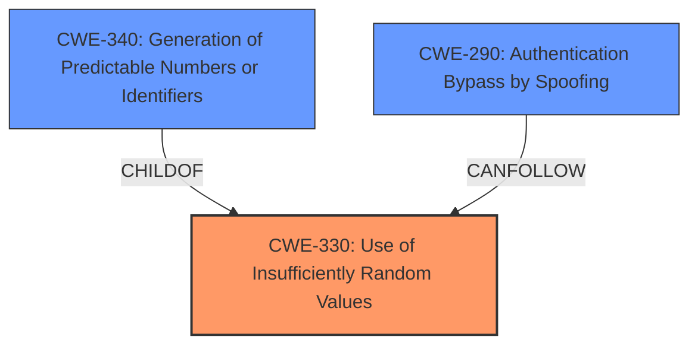

# Analysis Report for CVE-2024-46957

# Vulnerability Analysis Report: CVE-2024-46957

## Description

Mellium mellium.im/xmpp 0.0.1 through 0.21.4 allows **response spoofing** if the implementation uses **predictable IDs** because the stanza type is not checked. This is fixed in 0.22.0.

## Vulnerability Description Key Phrases

- **Rootcause:** predictable IDs
- **Weakness:** response spoofing
- **Product:** Mellium mellium.im/xmpp
- **Version:** 0.0.1 through 0.21.4

## Analysis (with Relationship Data)

# Summary
| CWE ID  | CWE Name | Confidence | CWE Abstraction Level | CWE Vulnerability Mapping Label | CWE-Vulnerability Mapping Notes |
|----------------|------------------------------------------------------------------|----------------|-------------------------|------------------------------------|----------------------------------------------------------------------------------------------------------------------------------------------------------------------------------------------------|
| CWE-330 | Use of Insufficiently Random Values | 0.9 | Class | Allowed-with-Review | The vulnerability stems from the use of **predictable IDs**, which can be seen as a form of insufficiently random values. While a more specific CWE might exist, this is a reasonable starting point. |
| CWE-290 | Authentication Bypass by Spoofing | 0.7 | Base | Allowed | An attacker can **spoof** a valid response, bypassing authentication or other checks. This suggests that the vulnerability can lead to authentication bypass through spoofing. |
| CWE-340 | Generation of Predictable Numbers or Identifiers | 0.6 | Class | Allowed-with-Review | The vulnerability stems from the use of **predictable IDs** during stanza generation. A predictable ID directly enables the described **response spoofing** attack. |

## Evidence and Confidence

*   **Confidence Score:** 0.8
*   **Evidence Strength:** HIGH

## Relationship Analysis
The primary weakness is the generation of predictable identifiers. This can lead to vulnerabilities like authentication bypass via response spoofing. CWE-330 is a more general class that encompasses the issue of predictable IDs, while CWE-340 is more specific to identifier generation. CWE-290 describes the authentication bypass as a result of spoofing, enabled by the predictable IDs. The abstraction levels guided the selection of CWE-330 as the primary, because while the vulnerability description specifies predictable IDs, it does not specify the method of ID generation itself.



## Vulnerability Chain
1.  **Root Cause:** CWE-330 Use of Insufficiently Random Values (specifically, **predictable IDs**).
2.  **Weakness:** Incomplete Stanza Type Checking.
3.  **Impact:** CWE-290 Authentication Bypass by Spoofing (a malicious actor can **spoof** a valid response, bypassing authentication or other checks).

## Summary of Analysis
The initial analysis focused on identifying the root cause and resulting weaknesses based on the provided description. The key aspect was the presence of **predictable IDs** which allows **response spoofing**. This pointed towards CWE-330 (Use of Insufficiently Random Values) as a potential primary CWE, since the vulnerability hinges on the lack of randomness in ID generation. Other CWEs like CWE-290 (Authentication Bypass by Spoofing) were considered as secondary because they represent the impact of the vulnerability, rather than the root cause. The relationship analysis helped solidify the understanding of how these weaknesses are connected, with CWE-330 as the root cause enabling the spoofing attack. The final selection of CWEs reflects the evidence provided in the vulnerability description and the identified relationships between the weaknesses. The selected CWEs are at the optimal level of specificity, accurately representing the vulnerability while avoiding over-generalization. I am basing the assessment primarily on the "Vulnerability Description Key Phrases" which states "rootcause: **predictable IDs**" and "weakness: **response spoofing**", as well as the "CVE Reference Links Content Summary" which highlights the issue of matching "IQ (Info/Query) and other stanza responses based solely on their ID, without verifying the stanza type."

Relevant CWE Information:

# Enhanced Context (25 CWEs)
The following CWEs were identified as potentially relevant to this vulnerability:

## CWE-330: Use of Insufficiently Random Values
**Abstraction Level**: Class
**Similarity Score**: 0.73
**Source**: dense

**Description**:
The product uses insufficiently random numbers or values in a security context that depends on unpredictable numbers.

**Mapping Guidance**:
- Usage: Discouraged
- Rationale: This CWE entry is a level-1 Class (i.e., a child of a Pillar). It might have lower-level children that would be more appropriate


## CWE-294: Authentication Bypass by Capture-replay
**Abstraction Level**: Base
**Similarity Score**: 0.72
**Source**: dense

**Description**:
A capture-replay flaw exists when the design of the product makes it possible for a malicious user to sniff network traffic and bypass authentication by replaying it to the server in question to the same effect as the original message (or with minor changes).

**Mapping Guidance**:
- Usage: Allowed
- Rationale: This CWE entry is at the Base level of abstraction, which is a preferred level of abstraction for mapping to the root causes of vulnerabilities.


## CWE-346: Origin Validation Error
**Abstraction Level**: Class
**Similarity Score**: 0.72
**Source**: dense

**Description**:
The product does not properly verify that the source of data or communication is valid.

**Mapping Guidance**:
- Usage: Allowed-with-Review
- Rationale: This CWE entry is a Class and might have Base-level children that would be more appropriate


## CWE-1391: Use of Weak Credentials
**Abstraction Level**: Class
**Similarity Score**: 0.72
**Source**: dense

**Description**:
The product uses weak credentials (such as a default key or hard-coded password) that can be calculated, derived, reused, or guessed by an attacker.

**Mapping Guidance**:
- Usage: Allowed-with-Review
- Rationale: This CWE entry is a Class and might have Base-level children that would be more appropriate


## CWE-204: Observable Response Discrepancy
**Abstraction Level**: Base
**Similarity Score**: 0.71
**Source**: dense

**Description**:
The product provides different responses to incoming requests in a way that reveals internal state information to an unauthorized actor outside of the intended control sphere.

**Mapping Guidance**:
- Usage: Allowed
- Rationale: This CWE entry is at the Base level of abstraction, which is a preferred level of abstraction for mapping to the root causes of vulnerabilities.


## CWE-290: Authentication Bypass by Spoofing
**Abstraction Level**: Base
**Similarity Score**: 0.71
**Source**: dense

**Description**:
This attack-focused weakness is caused by incorrectly implemented authentication schemes that are subject to spoofing attacks.

**Mapping Guidance**:
- Usage: Allowed
- Rationale: This CWE entry is at the Base level of abstraction, which is a preferred level of abstraction for mapping to the root causes of vulnerabilities.


## CWE-319: Cleartext Transmission of Sensitive Information
**Abstraction Level**: Base
**Similarity Score**: 0.71
**Source**: dense

**Description**:
The product transmits sensitive or security-critical data in cleartext in a communication channel that can be sniffed by unauthorized actors.

**Mapping Guidance**:
- Usage: Allowed
- Rationale: This CWE entry is at the Base level of abstraction, which is a preferred level of abstraction for mapping to the root causes of vulnerabilities.


## CWE-941: Incorrectly Specified Destination in a Communication Channel
**Abstraction Level**: Base
**Similarity Score**: 0.70
**Source**: dense

**Description**:
The product creates a communication channel to initiate an outgoing request to an actor, but it does not correctly specify the intended destination for that actor.

**Mapping Guidance**:
- Usage: Allowed
- Rationale: This CWE entry is at the Base level of abstraction, which is a preferred level of abstraction for mapping to the root causes of vulnerabilities.


## CWE-303: Incorrect Implementation of Authentication Algorithm
**Abstraction Level**: Base
**Similarity Score**: 0.70
**Source**: dense

**Description**:
The requirements for the product dictate the use of an established authentication algorithm, but the implementation of the algorithm is incorrect.

**Mapping Guidance**:
- Usage: Allowed
- Rationale: This CWE entry is at the Base level of abstraction, which is a preferred level of abstraction for mapping to the root causes of vulnerabilities.


## CWE-918: Server-Side Request Forgery (SSRF)
**Abstraction Level**: Base
**Similarity Score**: 0.70
**Source**: dense

**Description**:
The web server receives a URL or similar request from an upstream component and retrieves the contents of this URL, but it does not sufficiently ensure that the request is being sent to the expected destination.

**Mapping Guidance**:
- Usage: Allowed
- Rationale: This CWE entry is at the Base level of abstraction, which is a preferred level of abstraction for mapping to the root causes of vulnerabilities.


## CWE-


## CWE Relationship Analysis

Current CWEs represent these abstraction levels: .


### Vulnerability Chain Analysis

**Chain starting from CWE-340:**
- 340 (Generation of Predictable Numbers or Identifiers) - ROOT


**Chain starting from CWE-290:**
- 290 (Authentication Bypass by Spoofing) - ROOT


### CWE Relationship Diagram

```mermaid
graph TD
    classDef primary fill:#f96,stroke:#333,stroke-width:2px
    classDef secondary fill:#69f,stroke:#333
    classDef tertiary fill:#9e9,stroke:#333
```


*Report generated on 2025-07-13 17:45:51*
