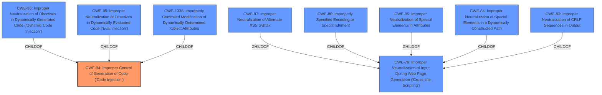

# Raw Analyzer Response for CVE-2024-46963

# Summary
| CWE ID | CWE Name | Confidence | CWE Abstraction Level | CWE Vulnerability Mapping Label | CWE-Vulnerability Mapping Notes |
|---|---|---|---|---|---|
| CWE-94 | Improper Control of Generation of Code ('Code Injection') | 1 | Base | Allowed-with-Review | Primary CWE |
| CWE-79 | Improper Neutralization of Input During Web Page Generation ('Cross-site Scripting') | 0.7 | Base | Allowed | Secondary Candidate |

## Evidence and Confidence

*   **Confidence Score:** 0.85
*   **Evidence Strength:** HIGH

## Relationship Analysis
The primary CWE is CWE-94, which is a base CWE. CWE-94 has child relationships with CWE-96, CWE-95, and CWE-1336. CWE-79 is a base CWE, and it has child relationships with CWE-87, CWE-86, CWE-85, CWE-84 and CWE-83. CWE-79 can be a consequence of the **improper neutralization of input** before code is generated, which is relevant since JavaScript code is being executed.

## Vulnerability Chain
The vulnerability chain begins with the **improper handling of user-supplied input**, leading to **code injection** and ultimately resulting in **arbitrary JavaScript code execution**.

## Summary of Analysis
The primary weakness is **code injection**, as the application allows an attacker to execute arbitrary JavaScript code. The root cause is the **improper handling of user-supplied input**.

CWE-94 (Improper Control of Generation of Code ('Code Injection')) is the most appropriate primary CWE because the application **fails to properly sanitize or validate input** before using it to generate or execute code, allowing for arbitrary JavaScript code execution. The "CVE Reference Links Content Summary" states: "The vulnerability stems from the **improper handling of user-supplied input** within the `com.bluesky.browser.ui.BrowserMainActivity` component of the `com.superfast.video.downloader` Android application. This leads to a **code injection vulnerability**." This aligns directly with the description of CWE-94.

CWE-79 (Improper Neutralization of Input During Web Page Generation ('Cross-site Scripting')) is considered as a secondary candidate CWE because the application does not neutralize or incorrectly neutralizes user-controllable input before it is placed in output that is used as a web page that is served to other users. However, CWE-94 is a better fit as it directly describes the **code injection** aspect of the vulnerability.

The retriever results also suggest other CWEs such as CWE-88, CWE-321, CWE-290, CWE-200, CWE-116, CWE-926, CWE-918, CWE-190, CWE-1021, and CWE-79, but these are either less specific or do not accurately reflect the root cause of the vulnerability. The most relevant of these is CWE-79.

The final decision is based on the evidence that the application's **improper handling of user-supplied input** leads to the **execution of arbitrary JavaScript code**, making CWE-94 the most accurate and specific classification.