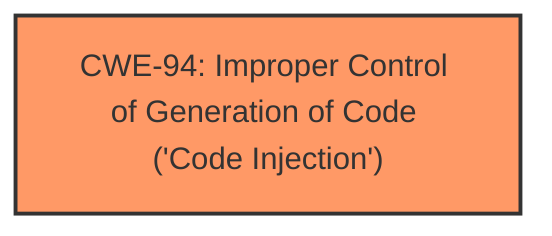

# Enhanced Analysis for CVE-2024-46966

# Summary
| CWE ID | CWE Name | Confidence | CWE Abstraction Level | CWE Vulnerability Mapping Label | CWE-Vulnerability Mapping Notes |
|---|---|---|---|---|---|
| CWE-94 | Improper Control of Generation of Code ('Code Injection') | 1.0 | Base | Primary | Allowed-with-Review |

## Evidence and Confidence

*   **Confidence Score:** 1.0
*   **Evidence Strength:** HIGH

## Relationship Analysis
The primary CWE selected is CWE-94, which is a Base level CWE, the preferred level of abstraction. There are no parent or child relationships considered that would affect this decision.



## Vulnerability Chain
The application **improperly handles user-provided input** when generating code. This leads directly to **code injection** and allows an attacker to **execute arbitrary JavaScript code**. The root cause is the **lack of input sanitization or validation**, resulting in the impact of arbitrary code execution.
  - **Root Cause:** Improper handling of user-provided input.
  - **Weakness:** CWE-94: Improper Control of Generation of Code ('Code Injection')
  - **Impact:** Arbitrary JavaScript code execution.

## Summary of Analysis
The analysis is based on the provided evidence from the CVE description, which clearly states the vulnerability is due to the application **failing to sanitize or validate input**, leading to the ability to inject and execute arbitrary JavaScript code. The **CVE Reference Links Content Summary** section explicitly mentions **CWE-94: Improper Control of Generation of Code (Code Injection)** as a key weakness. The Retriever Results also list CWE-94.

The selection of CWE-94 is at the optimal level of specificity because it directly describes the root cause of the vulnerability: the application's failure to properly control the generation of code, allowing for code injection.

Relevant CWE Information:

# Enhanced Context (25 CWEs)
The following CWEs were identified as potentially relevant to this vulnerability:

## CWE-1021: Improper Restriction of Rendered UI Layers or Frames
**Abstraction Level**: Base
**Similarity Score**: 0.75

## CWE-451: User Interface (UI) Misrepresentation of Critical Information
**Abstraction Level**: Class
**Similarity Score**: 0.75

## CWE-116: Improper Encoding or Escaping of Output
**Abstraction Level**: Class
**Similarity Score**: 0.74

## CWE-203: Observable Discrepancy
**Abstraction Level**: Base
**Similarity Score**: 0.73

## CWE-941: Incorrectly Specified Destination in a Communication Channel
**Abstraction Level**: Base
**Similarity Score**: 0.72

## CWE-248: Uncaught Exception
**Abstraction Level**: Base
**Similarity Score**: 0.71

## CWE-345: Insufficient Verification of Data Authenticity
**Abstraction Level**: Class
**Similarity Score**: 0.71

## CWE-20: Improper Input Validation
**Abstraction Level**: Class
**Similarity Score**: 0.70

## CWE-754: Improper Check for Unusual or Exceptional Conditions
**Abstraction Level**: Class
**Similarity Score**: 0.70

## CWE-356: Product UI does not Warn User of Unsafe Actions
**Abstraction Level**: Base
**Similarity Score**: 0.70

## CWE-116: Improper Encoding or Escaping of Output
**Abstraction Level**: Class
**Similarity Score**: 810.41

## CWE-79: Improper Neutralization of Input During Web Page Generation ('Cross-site Scripting')
**Abstraction Level**: Base
**Similarity Score**: 781.65

## CWE-190: Integer Overflow or Wraparound
**Abstraction Level**: Base
**Similarity Score**: 739.91

## CWE-93: Improper Neutralization of CRLF Sequences ('CRLF Injection')
**Abstraction Level**: Base
**Similarity Score**: 726.34

## CWE-89: Improper Neutralization of Special Elements used in an SQL Command ('SQL Injection')
**Abstraction Level**: Base
**Similarity Score**: 725.76

## CWE-190: Integer Overflow or Wraparound
**Abstraction Level**: base
**Similarity Score**: 4.39

## CWE-128: Wrap-around Error
**Abstraction Level**: base
**Similarity Score**: 4.39

## CWE-79: Improper Neutralization of Input During Web Page Generation ('Cross-site Scripting')
**Abstraction Level**: base
**Similarity Score**: 3.14

## CWE-89: Improper Neutralization of Special Elements used in an SQL Command ('SQL Injection')
**Abstraction Level**: base
**Similarity Score**: 3.07

## CWE-117: Improper Output Neutralization for Logs
**Abstraction Level**: base
**Similarity Score**: 2.87

## CWE-113: Improper Neutralization of CRLF Sequences in HTTP Headers ('HTTP Request/Response Splitting')
**Abstraction Level**: variant
**Similarity Score**: 2.68

## CWE-88: Improper Neutralization of Argument Delimiters in a Command ('Argument Injection')
**Abstraction Level**: base
**Similarity Score**: 2.61

## CWE-78: Improper Neutralization of Special Elements used in an OS Command ('OS Command Injection')
**Abstraction Level**: base
**Similarity Score**: 2.47

## CWE-93: Improper Neutralization of CRLF Sequences ('CRLF Injection')
**Abstraction Level**: base
**Similarity Score**: 2.40

## CWE-918: Server-Side Request Forgery (SSRF)
**Abstraction Level**: base
**Similarity Score**: 2.33

CWEs Considered but Not Used:

*   CWE-79 (Improper Neutralization of Input During Web Page Generation ('Cross-site Scripting')): While related to the impact of executing JavaScript, this CWE focuses on XSS, which is a specific type of code injection. CWE-94 is more general and accurately captures the root cause of the vulnerability.
*   CWE-20 (Improper Input Validation): This is a broad class of weakness. CWE-94 is more specific to code injection.


## CWE Relationship Analysis

Current CWEs represent these abstraction levels: .


### Vulnerability Chain Analysis

**Chain starting from CWE-94:**
- 94 (Improper Control of Generation of Code ('Code Injection')) - ROOT


**Chain starting from CWE-345:**
- 345 (Insufficient Verification of Data Authenticity) - ROOT


### CWE Relationship Diagram

```mermaid
graph TD
    classDef primary fill:#f96,stroke:#333,stroke-width:2px
    classDef secondary fill:#69f,stroke:#333
    classDef tertiary fill:#9e9,stroke:#333
```