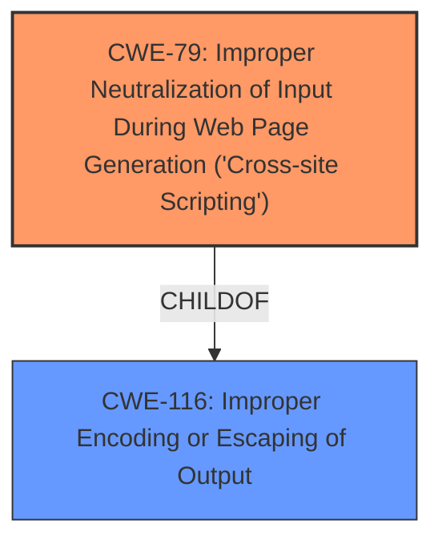

# Raw Analyzer Response for CVE-2024-46976

# Summary
| CWE ID | CWE Name | Confidence | CWE Abstraction Level | CWE Vulnerability Mapping Label | CWE-Vulnerability Mapping Notes |
|---|---|---|---|---|---|
| CWE-79 | Improper Neutralization of Input During Web Page Generation ('Cross-site Scripting') | 1.0 | Base | Primary | Allowed |
| CWE-116 | Improper Encoding or Escaping of Output | 0.7 | Class | Secondary Candidate | Allowed-with-Review |

## Evidence and Confidence

*   **Confidence Score:** 0.9
*   **Evidence Strength:** HIGH

## Relationship Analysis
The primary weakness is CWE-79, which is at the Base level. CWE-79 has several parent and child relationships, but none seem to fit the vulnerability description better. CWE-116 is a Class-level CWE and a parent of CWE-79, but CWE-79 is more specific, making it a better fit.

## Vulnerability Chain
The vulnerability chain starts with the attacker gaining control of TechDocs storage buckets. This leads to the injection of malicious scripts into the TechDocs content. When a victim browses the documentation, the script is executed, resulting in a Cross-Site Scripting (XSS) vulnerability.

## Summary of Analysis
The analysis is based on the provided evidence, which indicates a stored XSS vulnerability. The **root cause** is the **lack of proper sanitization or escaping of user-controlled content**. This allows an attacker to inject malicious scripts, which are then executed when a user views the documentation. The selection of CWE-79 is optimal because it directly addresses the improper neutralization of input during web page generation, leading to XSS.

Relevant CWE Information:

# Enhanced Context (25 CWEs)

## CWE-79: Improper Neutralization of Input During Web Page Generation ('Cross-site Scripting')
**CWE-79** is selected as the primary CWE because the **root cause** of this vulnerability is the **improper neutralization of user-controllable input** before it is placed in the output used as a web page, which leads to Cross-Site Scripting (XSS).
*   **Vulnerability Description Key Phrases**: impact: execute scripts
*   **CVE Reference Links Content Summary**: The vulnerability stems from a lack of proper sanitization or escaping of user-controlled content within the `@backstage/plugin-techdocs-backend` package when rendering documentation. This allows an attacker to inject executable scripts into TechDocs content.
*   **Retriever Results**: High similarity score and Allowed usage.

## CWE-116: Improper Encoding or Escaping of Output
**CWE-116** is considered as a secondary CWE because the **lack of proper sanitization or escaping** is a form of improper encoding or escaping of output. However, CWE-79 is more specific to XSS.
*   **CVE Reference Links Content Summary**: The vulnerability stems from a **lack of proper sanitization or escaping** of user-controlled content within the `@backstage/plugin-techdocs-backend` package when rendering documentation. This allows an attacker to inject executable scripts into TechDocs content.
*   **Retriever Results**: High similarity score but Allowed-with-Review usage, suggesting a more specific CWE might be appropriate.

### Other CWEs Considered but Not Used

*   CWE-74: Improper Neutralization of Special Elements in Output Used by a Downstream Component ('Injection'): While injection is a broad category, XSS (CWE-79) is a more specific type of injection that directly applies to this vulnerability.
*   CWE-22: Improper Limitation of a Pathname to a Restricted Directory ('Path Traversal'): This CWE is not relevant because the vulnerability is not related to path manipulation.
*   CWE-94: Improper Control of Generation of Code ('Code Injection'): Code Injection is too broad; the specific issue is XSS.
*   CWE-1336: Improper Neutralization of Special Elements Used in a Template Engine: Potentially relevant if a template engine was involved, but the description doesn't explicitly state this.
*   CWE-494: Download of Code Without Integrity Check: This is not relevant as the vulnerability is not related to downloading code.
*   CWE-78: Improper Neutralization of Special Elements used in an OS Command ('OS Command Injection'): This is not relevant as there is no OS command injection.
*   CWE-73: External Control of File Name or Path: This is not relevant as the vulnerability is not related to file names or paths.
*   CWE-917: Improper Neutralization of Special Elements used in an Expression Language Statement ('Expression Language Injection'): Not relevant because there is no evidence of expression language injection.