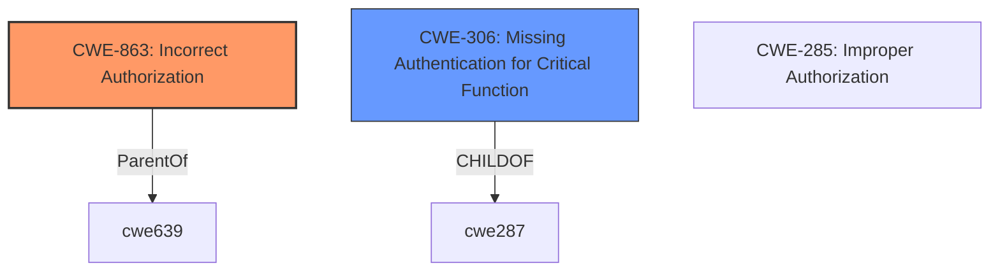

# Analysis Report for CVE-2024-46999

# Vulnerability Analysis Report: CVE-2024-46999

## Description

Zitadel is an open source identity management platform. **ZITADELs user grants deactivation mechanism did not work correctly**. Deactivated user grants were still provided in token, which could lead to unauthorized access to applications and resources. Additionally, the management and auth API always returned the state as active or did not provide any information about the state. Versions 2.62.1, 2.61.1, 2.60.2, 2.59.3, 2.58.5, 2.57.5, 2.56.6, 2.55.8, and 2.54.10 have been released which address this issue. Users are advised to upgrade. Users unable to upgrade may explicitly remove the user grants to make sure the user does not get access anymore.

## Vulnerability Description Key Phrases

- **Rootcause:** ZITADELs user grants deactivation mechanism did not work correctly
- **Impact:** unauthorized access to applications and resources
- **Vector:** Deactivated user grants were still provided in token
- **Product:** Zitadel
- **Version:** 2.62.1, 2.61.1, 2.60.2, 2.59.3, 2.58.5, 2.57.5, 2.56.6, 2.55.8, and 2.54.10

## Analysis (with Relationship Data)

# Summary
| CWE ID | CWE Name | Confidence | CWE Abstraction Level | CWE Vulnerability Mapping Label | CWE-Vulnerability Mapping Notes |
|---|---|---|---|---|---|
| CWE-863 | Incorrect Authorization | 0.9 | Class | Primary | Allowed-with-Review |
| CWE-306 | Missing Authentication for Critical Function | 0.7 | Base | Secondary | Allowed |

## Evidence and Confidence

*   **Confidence Score:** 0.8
*   **Evidence Strength:** MEDIUM

## Relationship Analysis
The primary relationship influencing the CWE selection is the hierarchical one. CWE-863 (Incorrect Authorization) is a class-level CWE, while CWE-306 (Missing Authentication for Critical Function) is a base-level CWE. While a more specific CWE is generally preferred, CWE-863 captures the overall authorization failure more accurately as the core issue. CWE-306 is a potential contributing factor, as the **failure** to properly deactivate user grants effectively leads to a form of **missing** authentication for those grants.



## Vulnerability Chain
The vulnerability chain starts with the **incorrectly implemented user grant deactivation mechanism**, leading to deactivated user grants being included in tokens. This, in turn, results in unauthorized access to applications and resources.

Incorrect User Grant Deactivation Mechanism -> Deactivated User Grants in Tokens -> Unauthorized Access

## Summary of Analysis
The primary weakness is that the deactivation mechanism for user grants did not work correctly. The system continued to issue tokens with permissions that should have been revoked. This is primarily an **authorization** issue (CWE-863). While authentication might seem relevant, the core problem is that the system **failed to properly authorize** access based on the deactivation status.

Evidence:
- "**ZITADELs user grants deactivation mechanism did not work correctly**"
- "Deactivated user grants were still provided in token, which could lead to unauthorized access to applications and resources."

CWE-863 (Incorrect Authorization) is the most appropriate because it directly addresses the **failure** to correctly perform the authorization check, leading to unauthorized access.

CWE-306 (Missing Authentication for Critical Function) is considered a secondary weakness because the **failure** to properly deactivate grants effectively means that authentication wasn't being properly enforced for those deactivated grants.

Other CWEs Considered:

*   CWE-285 (Improper Authorization): This is a higher-level class and less specific than CWE-863. It's also discouraged.
*   CWE-639 (Authorization Bypass Through User-Controlled Key): This is not applicable because the vulnerability does not involve user-controlled keys.
*   CWE-288 (Authentication Bypass Using an Alternate Path or Channel): This is not applicable because there isn't an alternate path or channel being exploited.
*   CWE-201 (Insertion of Sensitive Information Into Sent Data): This is not applicable because the vulnerability isn't directly about inserting sensitive information, but rather about **incorrectly** providing access.

Relevant CWE Information:

# Enhanced Context (25 CWEs)
The following CWEs were identified as potentially relevant to this vulnerability:

## CWE-267: Privilege Defined With Unsafe Actions
**Abstraction Level**: Base
**Similarity Score**: 0.75
**Source**: dense

**Description**:
A particular privilege, role, capability, or right can be used to perform unsafe actions that were not intended, even when it is assigned to the correct entity.

**Mapping Guidance**:
- Usage: Allowed
- Rationale: This CWE entry is at the Base level of abstraction, which is a preferred level of abstraction for mapping to the root causes of vulnerabilities.


## CWE-303: Incorrect Implementation of Authentication Algorithm
**Abstraction Level**: Base
**Similarity Score**: 0.73
**Source**: dense

**Description**:
The requirements for the product dictate the use of an established authentication algorithm, but the implementation of the algorithm is incorrect.

**Mapping Guidance**:
- Usage: Allowed
- Rationale: This CWE entry is at the Base level of abstraction, which is a preferred level of abstraction for mapping to the root causes of vulnerabilities.


## CWE-639: Authorization Bypass Through User-Controlled Key
**Abstraction Level**: Base
**Similarity Score**: 0.73
**Source**: dense

**Description**:
The system's authorization functionality does not prevent one user from gaining access to another user's data or record by modifying the key value identifying the data.

**Mapping Guidance**:
- Usage: Allowed
- Rationale: This CWE entry is at the Base level of abstraction, which is a preferred level of abstraction for mapping to the root causes of vulnerabilities.


## CWE-1390: Weak Authentication
**Abstraction Level**: Class
**Similarity Score**: 0.73
**Source**: dense

**Description**:
The product uses an authentication mechanism to restrict access to specific users or identities, but the mechanism does not sufficiently prove that the claimed identity is correct.

**Mapping Guidance**:
- Usage: Allowed-with-Review
- Rationale: This CWE entry is a Class and might have Base-level children that would be more appropriate


## CWE-497: Exposure of Sensitive System Information to an Unauthorized Control Sphere
**Abstraction Level**: Base
**Similarity Score**: 0.73
**Source**: dense

**Description**:
The product does not properly prevent sensitive system-level information from being accessed by unauthorized actors who do not have the same level of access to the underlying system as the product does.

**Mapping Guidance**:
- Usage: Allowed
- Rationale: This CWE entry is at the Base level of abstraction, which is a preferred level of abstraction for mapping to the root causes of vulnerabilities.


## CWE-288: Authentication Bypass Using an Alternate Path or Channel
**Abstraction Level**: Base
**Similarity Score**: 0.72
**Source**: dense

**Description**:
The product requires authentication, but the product has an alternate path or channel that does not require authentication.

**Mapping Guidance**:
- Usage: Allowed
- Rationale: This CWE entry is at the Base level of abstraction, which is a preferred level of abstraction for mapping to the root causes of vulnerabilities.


## CWE-266: Incorrect Privilege Assignment
**Abstraction Level**: Base
**Similarity Score**: 0.72
**Source**: dense

**Description**:
A product incorrectly assigns a privilege to a particular actor, creating an unintended sphere of control for that actor.

**Mapping Guidance**:
- Usage: Allowed
- Rationale: This CWE entry is at the Base level of abstraction, which is a preferred level of abstraction for mapping to the root causes of vulnerabilities.


## CWE-201: Insertion of Sensitive Information Into Sent Data
**Abstraction Level**: Base
**Similarity Score**: 0.72
**Source**: dense

**Description**:
The code transmits data to another actor, but a portion of the data includes sensitive information that should not be accessible to that actor.

**Mapping Guidance**:
- Usage: Allowed
- Rationale: This CWE entry is at the Base level of abstraction, which is a preferred level of abstraction for mapping to the root causes of vulnerabilities.


## CWE-306: Missing Authentication for Critical Function
**Abstraction Level**: Base
**Similarity Score**: 0.72
**Source**: dense

**Description**:
The product does not perform any authentication for functionality that requires a provable user identity or consumes a significant amount of resources.

**Mapping Guidance**:
- Usage: Allowed
- Rationale: This CWE entry is at the Base level of abstraction, which is a preferred level of abstraction for mapping to the root causes of vulnerabilities.


## CWE-1391: Use of Weak Credentials
**Abstraction Level**: Class
**Similarity Score**: 0.72
**Source**: dense

**Description**:
The product uses weak credentials (such as a default key or hard-coded password) that can be calculated, derived, reused, or guessed by an attacker.

**Mapping Guidance**:
- Usage: Allowed-with-Review
- Rationale: This CWE entry is a Class and might have Base-level children that would be more appropriate


## CWE-863: Incorrect Authorization
**Abstraction Level**: Class
**Similarity Score**: 742.42
**Source**: sparse

**Description**:
The product performs an authorization check when an actor attempts to access a resource or perform an action, but it does not correctly perform the check.

**Mapping Guidance**:
- Usage: Allowed-with-Review
- Rationale: This CWE entry is a Class and might have Base-level children that would be more appropriate


## CWE-285: Improper Authorization
**


## CWE Relationship Analysis

Current CWEs represent these abstraction levels: .


### Vulnerability Chain Analysis

**Chain starting from CWE-288:**
- 288 (Authentication Bypass Using an Alternate Path or Channel) - ROOT


**Chain starting from CWE-863:**
- 863 (Incorrect Authorization) - ROOT


### CWE Relationship Diagram

```mermaid
graph TD
    classDef primary fill:#f96,stroke:#333,stroke-width:2px
    classDef secondary fill:#69f,stroke:#333
    classDef tertiary fill:#9e9,stroke:#333
```


*Report generated on 2025-07-13 17:52:25*
