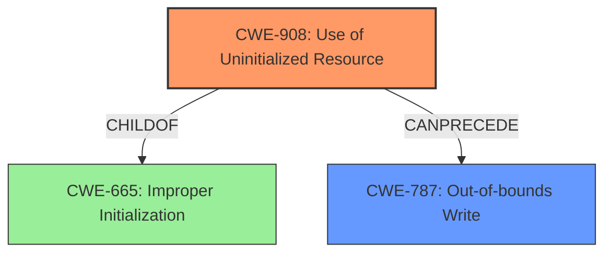

# Analysis Report for CVE-2024-47013

# Vulnerability Analysis Report: CVE-2024-47013

## Description

In pmucal_rae_handle_seq_int of flexpmu_cal_rae.c, there is a possible arbitrary write due to **uninitialized data**. This could lead to local escalation of privilege with no additional execution privileges needed. User interaction is not needed for exploitation.

## Vulnerability Description Key Phrases

- **Rootcause:** uninitialized data
- **Impact:** ['arbitrary write', 'local escalation of privilege']
- **Component:** pmucal_rae_handle_seq_int of flexpmu_cal_rae.c

## Analysis (with Relationship Data)

# Summary
| CWE ID | CWE Name | Confidence | CWE Abstraction Level | CWE Vulnerability Mapping Label | CWE-Vulnerability Mapping Notes |
|---|---|---|---|---|---|
| CWE-908 | Use of Uninitialized Resource | 0.9 | Base | Allowed | Primary CWE |
| CWE-787 | Out-of-bounds Write | 0.6 | Base | Allowed | Secondary Candidate |

## Evidence and Confidence

*   **Confidence Score:** 0.75
*   **Evidence Strength:** MEDIUM

## Relationship Analysis
The primary relationship influencing the decision is the ChildOf relationship. CWE-908 (Use of Uninitialized Resource) is a child of CWE-665 (Improper Initialization). Since the description focuses on the *use* of uninitialized data, CWE-908 is more specific and appropriate. Furthermore, the arbitrary write is a potential consequence of using uninitialized data, so CWE-787 (Out-of-bounds Write) may follow CWE-908. Abstraction levels are considered, selecting the most specific Base level CWE where possible.



## Vulnerability Chain
The vulnerability chain starts with the **uninitialized data** (CWE-908). This leads to an arbitrary write (potentially CWE-787), which in turn results in local escalation of privilege. The root cause is the use of uninitialized data, which then leads to other weaknesses and finally the impact.

## Summary of Analysis
The initial analysis identified CWE-908 as the primary weakness due to the explicit mention of **uninitialized data**. The retriever results supported this with a high score. The relationship analysis further solidified this decision, as CWE-908 is a more specific child of CWE-665. The arbitrary write and local escalation of privilege are impacts of this weakness.

The decision is heavily based on the provided evidence, specifically the phrase "**uninitialized data**" in the vulnerability description.

# Complete CWE Specifications

CWE-908: Use of Uninitialized Resource

CWE-665: Improper Initialization

CWE-667: Improper Locking

CWE-862: Missing Authorization

CWE-362: Concurrent Execution using Shared Resource with Improper Synchronization ('Race Condition')

CWE-909: Missing Initialization of Resource

CWE-131: Incorrect Calculation of Buffer Size

CWE-1021: Improper Restriction of Rendered UI Layers or Frames

CWE-1260: Improper Handling of Overlap Between Protected Memory Ranges

CWE-476: NULL Pointer Dereference

**CWE-908: Use of Uninitialized Resource**
*   **Technical Explanation:** The vulnerability description explicitly mentions "**uninitialized data**". CWE-908 directly addresses the use of a resource that has not been initialized. This aligns perfectly with the provided information.
*   **Security Implications:** Using uninitialized data can lead to unpredictable behavior, data corruption, and security vulnerabilities, as the data may contain sensitive information or point to arbitrary memory locations.
*   **Relationship Analysis:** CWE-908 is a child of CWE-665 (Improper Initialization). The vulnerability description focuses on the use of the uninitialized data, making CWE-908 the more specific choice.
*   **Mapping Guidance Influence:** The allowed usage and base level abstraction align with best practices.
*   **Whether the weakness is primary or secondary in the vulnerability:** Primary.

**CWE-787: Out-of-bounds Write**
*   **Technical Explanation:** The vulnerability description mentions a possible arbitrary write. An arbitrary write often involves writing beyond the intended boundaries of a buffer or memory region.
*   **Security Implications:** Out-of-bounds writes can overwrite critical data, leading to crashes, privilege escalation, or arbitrary code execution.
*   **Relationship Analysis:** CWE-787 is related to buffer overflows and memory corruption issues. It can be a consequence of using uninitialized data, as the uninitialized data might lead to an incorrect size calculation or memory access.
*   **Mapping Guidance Influence:** The allowed usage and base level abstraction align with best practices.
*   **Whether the weakness is primary or secondary in the vulnerability:** Secondary; a potential consequence of CWE-908.

**CWEs Considered But Not Used:**

*   **CWE-665: Improper Initialization:** Considered as a parent of CWE-908 but less specific as the vulnerability highlights the *use* of the uninitialized data, not just the lack of initialization.
*   **CWE-667: Improper Locking:** The description doesn't mention any locking or concurrency issues.
*   **CWE-862: Missing Authorization:** The description doesn't indicate any missing authorization checks.
*   **CWE-362: Concurrent Execution using Shared Resource with Improper Synchronization ('Race Condition'):** No indication of concurrency issues.
*   **CWE-909: Missing Initialization of Resource:** Similar to CWE-665, it focuses on the lack of initialization rather than the use of the uninitialized data.
*   **CWE-131: Incorrect Calculation of Buffer Size:** While a possible outcome of using uninitialized data, it is not directly mentioned in the description.
*   **CWE-1021: Improper Restriction of Rendered UI Layers or Frames:** Not relevant to the vulnerability description.
*   **CWE-1260: Improper Handling of Overlap Between Protected Memory Ranges:** Not relevant to the vulnerability description.
*   **CWE-476: NULL Pointer Dereference:** Not directly indicated in the vulnerability description.


## CWE Relationship Analysis

Current CWEs represent these abstraction levels: .


### Vulnerability Chain Analysis

**Chain starting from CWE-476:**
- 476 (NULL Pointer Dereference) - ROOT


**Chain starting from CWE-862:**
- 862 (Missing Authorization) - ROOT


### CWE Relationship Diagram

```mermaid
graph TD
    classDef primary fill:#f96,stroke:#333,stroke-width:2px
    classDef secondary fill:#69f,stroke:#333
    classDef tertiary fill:#9e9,stroke:#333
```


*Report generated on 2025-07-13 17:53:54*
