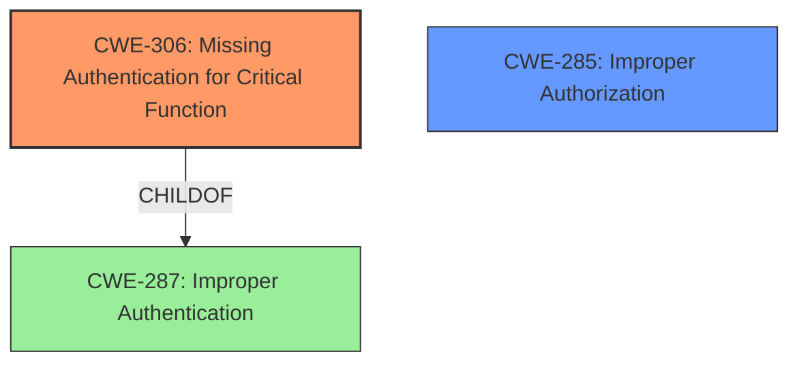

# Raw Analyzer Response for CVE-2024-47078

# Summary
| CWE ID | CWE Name | Confidence | CWE Abstraction Level | CWE Vulnerability Mapping Label | CWE-Vulnerability Mapping Notes |
|---|---|---|---|---|---|
| CWE-306 | Missing Authentication for Critical Function | 1.0 | Base | Primary | Allowed |
| CWE-285 | Improper Authorization | 0.8 | Base | Secondary | Allowed |

## Evidence and Confidence

*   **Confidence Score:** 0.9
*   **Evidence Strength:** HIGH

## Relationship Analysis
The analysis indicates that **missing authentication** (CWE-306) is the primary **root cause**, which can then lead to **improper authorization** (CWE-285). Both CWE-306 and CWE-285 are Base level, providing specific classifications. CWE-306 is a child of CWE-287 (Improper Authentication), indicating a hierarchical relationship where missing authentication is a specific type of improper authentication.

## Vulnerability Chain
The vulnerability chain starts with **missing authentication** (CWE-306), which allows an attacker to bypass identity verification. This leads to **improper authorization** (CWE-285), where the attacker gains unauthorized access to resources and functionality. The ultimate impact is **unauthorized control** of MQTT-connected nodes.

## Summary of Analysis
The primary weakness is the **missing authentication** (CWE-306) in the MQTT implementation, as it directly enables the subsequent authorization bypass. The vulnerability description explicitly states that the **authentication and authorization bypasses** result in **unauthorized control** of MQTT-connected nodes. This aligns with the description of CWE-306, where the product does not perform any authentication for functionality that requires a provable user identity.

The retriever results also strongly suggest CWE-306, with a high relevance score across multiple keyphrases. The other CWEs were considered, but were deemed less relevant. For example, CWE-287 (Improper Authentication) is a more general case of authentication failure, while CWE-306 specifically addresses the case where authentication is entirely missing. CWE-863 (Incorrect Authorization) assumes that authorization checks are performed, but performed incorrectly, which is not the primary issue here. The absence of authentication is the critical flaw.

CWE-285 (Improper Authorization) is included as a secondary weakness because the **missing authentication** directly leads to the **authorization bypass**. The attacker can access resources without proper authorization checks due to the initial **lack of authentication**.

The selected CWEs are at the optimal level of specificity because they accurately represent the root cause and the immediate consequence of the vulnerability. CWE-306 is a Base level CWE, as recommended by the mapping guidance.

Relevant CWE Information:

**CWE-306: Missing Authentication for Critical Function**
The product does not perform any authentication for functionality that requires a provable user identity or consumes a significant amount of resources.

**CWE-285: Improper Authorization**
The product does not perform or incorrectly performs an authorization check when an actor attempts to access a resource or perform an action.