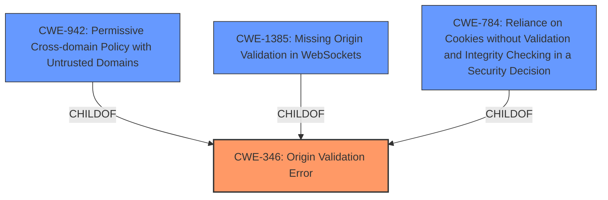

# Analysis for CVE-2024-47084

# Summary

| CWE ID  | CWE Name                                                                        | Confidence | CWE Abstraction Level | CWE Vulnerability Mapping Label | CWE-Vulnerability Mapping Notes |
| :-------- | :------------------------------------------------------------------------------ | :--------- | :-------------------- | :------------------------------ | :------------------------------ |
| CWE-346   | Origin Validation Error                                                         | 0.9        | Class                 | Primary CWE                     | Allowed-with-Review             |
| CWE-942   | Permissive Cross-domain Policy with Untrusted Domains                          | 0.7        | Variant               | Secondary Candidate             | Allowed                         |
| CWE-1385  | Missing Origin Validation in WebSockets                                         | 0.6        | Variant               | Secondary Candidate             | Allowed                         |
| CWE-784   | Reliance on Cookies without Validation and Integrity Checking in a Security Decision | 0.5        | Variant               | Secondary Candidate             | Allowed                         |

## Evidence and Confidence

*   **Confidence Score:** 0.8
*   **Evidence Strength:** HIGH

## Relationship Analysis

The primary CWE is CWE-346, which is a Class-level CWE. Several potential child CWEs such as CWE-942, CWE-1385, and CWE-784 were considered. CWE-942 and CWE-1385 are both variants and are peers, while CWE-784 is more related to cookies specifically. Since the core issue is a general origin validation problem, CWE-346 serves as the best high-level representation.

## Vulnerability Chain

The vulnerability chain starts with the **Gradio server failing to validate the request origin when a cookie is present**. This **missing origin validation** allows attackers to bypass CORS protections. This leads to the impact of attackers being able to upload files, steal authentication tokens, and access user data.

## Summary of Analysis

The primary weakness is that the Gradio server **fails to validate the request origin when a cookie is present**. This is a **CORS origin validation** issue. The vulnerability description and CVE summary both highlight this **missing validation** as the root cause.

CWE-346 (Origin Validation Error) is a Class-level CWE that generally describes the problem.
The vulnerability description states "**Gradio server fails to validate the request origin when a cookie is present**".
CWE-346 description: "The product does not properly verify that the source of data or communication is valid."

CWE-942 (Permissive Cross-domain Policy with Untrusted Domains) is a Variant-level CWE that describes the weakness of having untrusted domains.
The vulnerability description states "attackers website to make unauthorized requests to a local Gradio server".
CWE-942 description: "The product implements a cross-domain policy that is too permissive, allowing untrusted domains to interact with the product in unexpected or dangerous ways."

CWE-1385 (Missing Origin Validation in WebSockets) is a Variant-level CWE.
The vulnerability description states "Gradio server fails to validate the request origin when a cookie is present".
CWE-1385 description: "The web server does not validate the origin of WebSocket requests."

CWE-784 (Reliance on Cookies without Validation and Integrity Checking in a Security Decision) is a Variant-level CWE.
The vulnerability description states "**Gradio server fails to validate the request origin when a cookie is present**".
CWE-784 description: "The product uses the existence of a cookie to make a security decision, but it does not validate or check the integrity of the cookie."

The selection is based on the provided evidence. CWE-346 is the most appropriate because the root cause is related to "**CORS origin validation**, where the **Gradio server fails to validate the request origin when a cookie is present**". The other CWE's are either too specific or do not exactly match the vulnerability description.

Relevant CWE Information:

# Enhanced Context (25 CWEs)
The following CWEs were identified as potentially relevant to this vulnerability:

## CWE-346: Origin Validation Error
**Abstraction Level**: Class
**Similarity Score**: 0.74
**Source**: dense

**Description**:
The product does not properly verify that the source of data or communication is valid.

**Mapping Guidance**:
- Usage: Allowed-with-Review
- Rationale: This CWE entry is a Class and might have Base-level children that would be more appropriate

## CWE-451: User Interface (UI) Misrepresentation of Critical Information
**Abstraction Level**: Class
**Similarity Score**: 0.74
**Source**: dense

**Description**:
The user interface (UI) does not properly represent critical information to the user, allowing the information - or its source - to be obscured or spoofed. This is often a component in phishing attacks.

**Mapping Guidance**:
- Usage: Allowed-with-Review
- Rationale: This CWE entry is a Class and might have Base-level children that would be more appropriate

## CWE-472: External Control of Assumed-Immutable Web Parameter
**Abstraction Level**: Base
**Similarity Score**: 0.74
**Source**: dense

**Description**:
The web application does not sufficiently verify inputs that are assumed to be immutable but are actually externally controllable, such as hidden form fields.

**Mapping Guidance**:
- Usage: Allowed
- Rationale: This CWE entry is at the Base level of abstraction, which is a preferred level of abstraction for mapping to the root causes of vulnerabilities.

## CWE-941: Incorrectly Specified Destination in a Communication Channel
**Abstraction Level**: Base
**Similarity Score**: 0.74
**Source**: dense

**Description**:
The product creates a communication channel to initiate an outgoing request to an actor, but it does not correctly specify the intended destination for that actor.

**Mapping Guidance**:
- Usage: Allowed
- Rationale: This CWE entry is at the Base level of abstraction, which is a preferred level of abstraction for mapping to the root causes of vulnerabilities.

## CWE-319: Cleartext Transmission of Sensitive Information
**Abstraction Level**: Base
**Similarity Score**: 0.73
**Source**: dense

**Description**:
The product transmits sensitive or security-critical data in cleartext in a communication channel that can be sniffed by unauthorized actors.

**Mapping Guidance**:
- Usage: Allowed
- Rationale: This CWE entry is at the Base level of abstraction, which is a preferred level of abstraction for mapping to the root causes of vulnerabilities.

## CWE-610: Externally Controlled Reference to a Resource in Another Sphere
**Abstraction Level**: Class
**Similarity Score**: 0.73
**Source**: dense

**Description**:
The product uses an externally controlled name or reference that resolves to a resource that is outside of the intended control sphere.

**Mapping Guidance**:
- Usage: Discouraged
- Rationale: This CWE entry is a level-1 Class (i.e., a child of a Pillar). It might have lower-level children that would be more appropriate

## CWE-212: Improper Removal of Sensitive Information Before Storage or Transfer
**Abstraction Level**: Base
**Similarity Score**: 0.73
**Source**: dense

**Description**:
The product stores, transfers, or shares a resource that contains sensitive information, but it does not properly remove that information before the product makes the resource available to unauthorized actors.

**Mapping Guidance**:
- Usage: Allowed
- Rationale: This CWE entry is at the Base level of abstraction, which is a preferred level of abstraction for mapping to the root causes of vulnerabilities.

## CWE-923: Improper Restriction of Communication Channel to Intended Endpoints
**Abstraction Level**: Class
**Similarity Score**: 0.73
**Source**: dense

**Description**:
The product establishes a communication channel to (or from) an endpoint for privileged or protected operations, but it does not properly ensure that it is communicating with the correct endpoint.

**Mapping Guidance**:
- Usage: Allowed-with-Review
- Rationale: This CWE entry is a Class and might have Base-level children that would be more appropriate

## CWE-807: Reliance on Untrusted Inputs in a Security Decision
**Abstraction Level**: Base
**Similarity Score**: 0.73
**Source**: dense

**Description**:
The product uses