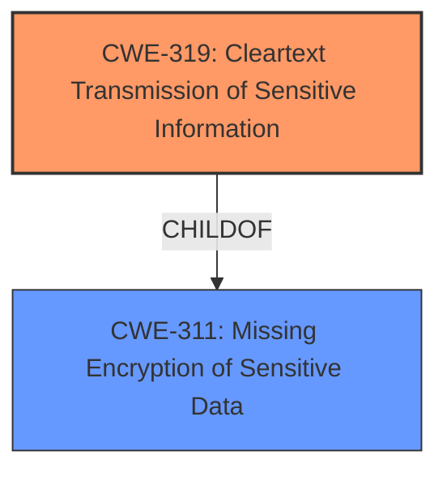

# Analysis for CVE-2024-47128

# Summary
| CWE ID | CWE Name | Confidence | CWE Abstraction Level | CWE Vulnerability Mapping Label | CWE-Vulnerability Mapping Notes |
|---|---|---|---|---|---|
| CWE-319 | Cleartext Transmission of Sensitive Information | 1.0 | Base | Allowed | Primary CWE |

## Evidence and Confidence

*   **Confidence Score:** 1.0
*   **Evidence Strength:** HIGH

## Relationship Analysis
The primary relationship influencing the decision is the direct match of the vulnerability description to CWE-319. While other CWEs like CWE-311 (Missing Encryption of Sensitive Data) are related, CWE-319 is more specific as it explicitly describes the transmission of sensitive information in cleartext. The other CWEs are less specific and therefore less appropriate.

## Vulnerability Chain
The vulnerability chain starts with the **weakness** of sending the encryption key name unencrypted and leads to the impact of an attacker being able to eavesdrop and obtain the key name.

Cleartext Transmission of Encryption Key Name (CWE-319) -> Information Exposure

## Summary of Analysis
The analysis is based on the direct evidence provided in the vulnerability description and the CVE reference content summary. The vulnerability clearly states that the encryption key name is sent unencrypted over RF, which directly aligns with the definition of CWE-319.

The following evidence supports this:

*   "The goTenna Pro App encryption key name is always sent unencrypted when the key is shared over RF through a broadcast message."
*   "**Root Cause:** The goTenna Pro App sends the encryption key name in cleartext when the key is shared over RF via a broadcast message."
*   "**Weakness/Vulnerability:** The encryption key name is sent unencrypted during key sharing over RF broadcast."

CWE-319 is at the Base level of abstraction, which is preferred.

**CWEs Considered But Not Used:**

*   **CWE-311: Missing Encryption of Sensitive Data:** While related, it is a higher-level class and less specific than CWE-319. The vulnerability is not just about missing encryption, but specifically about transmitting data in cleartext.
*   **CWE-312: Cleartext Storage of Sensitive Information:** This CWE is not applicable as the vulnerability involves transmission, not storage.
*   **CWE-321: Use of Hard-coded Cryptographic Key:** This CWE is not applicable as there is no mention of hard-coded keys.
*   **CWE-522: Insufficiently Protected Credentials** This is a class level CWE, while the vulnerability involves specific transmission of data.
*   **CWE-203: Observable Discrepancy** There is no mention about different responses under different circumstances.