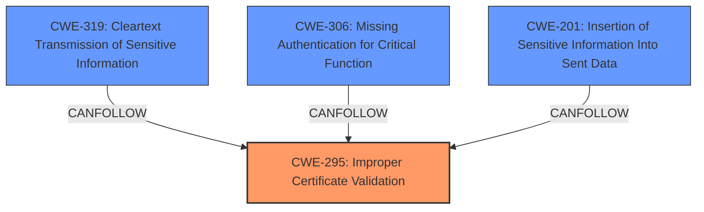

# Analysis Report for CVE-2024-47174

# Vulnerability Analysis Report: CVE-2024-47174

## Description

Nix is a package manager for Linux and other Unix systems. Starting in version 1.11 and prior to versions 2.18.8 and 2.24.8, `` **did not verify TLS certificates on HTTPS connections**. This could lead to connection details such as full URLs or credentials leaking in case of a man-in-the-middle (MITM) attack. `` is also known as the builtin derivation builder `builtinfetchurl`. Its not to be confused with the evaluation-time function `builtins.fetchurl`, which was not affected by this issue. A user may be affected by the risk of leaking credentials if they have a `netrc` file for authentication, or rely on derivations with `impureEnvVars` set to use credentials from the environment. In addition, the commonplace trust-on-first-use (TOFU) technique of updating dependencies by specifying an invalid hash and obtaining it from a remote store was also vulnerable to a MITM injecting arbitrary store objects. This also applied to the impure derivations experimental feature. Note that this may also happen when using Nixpkgs fetchers to obtain new hashes when not using the fake hash method, although that mechanism is not implemented in Nix itself but rather in Nixpkgs using a fixed-output derivation. The behavior was introduced in version 1.11 to make it consistent with the Nixpkgs `pkgs.fetchurl` and to make `` work in the derivation builder sandbox, which back then did not have access to the CA bundles by default. Nowadays, CA bundl

## Vulnerability Description Key Phrases

- **Rootcause:** did not verify TLS certificates on HTTPS connections
- **Impact:** connection details such as full URLs or credentials leaking
- **Vector:** man-in-the-middle (MITM) attack
- **Product:** Nix
- **Version:** 1.11 to 2.18.8 and 2.24.8

## Analysis (with Relationship Data)

# Summary

| CWE ID   | CWE Name                                                                          | Confidence | CWE Abstraction Level | CWE Vulnerability Mapping Label | CWE-Vulnerability Mapping Notes |
| -------- | --------------------------------------------------------------------------------- | ---------- | --------------------- | ------------------------------- | ------------------------------- |
| CWE-295  | Improper Certificate Validation                                                   | 1          | Base                  | Primary                         | Allowed                         |
| CWE-319  | Cleartext Transmission of Sensitive Information                                   | 0.7        | Base                  | Secondary                       | Allowed                         |
| CWE-306 | Missing Authentication for Critical Function                                    | 0.6        | Base                  | Secondary                       | Allowed                         |
| CWE-201  | Insertion of Sensitive Information Into Sent Data                                   | 0.5        | Base                  | Secondary                       | Allowed                         |

## Evidence and Confidence

*   **Confidence Score:** 0.8
*   **Evidence Strength:** HIGH

## Relationship Analysis

The primary CWE is CWE-295, which focuses on the **improper validation of certificates**. The other CWEs considered are related to the consequences of this **improper validation**, such as the transmission of sensitive information in cleartext (CWE-319), missing authentication for critical functions (CWE-306) and insertion of sensitive information into sent data (CWE-201). These are all base-level CWEs, providing a good level of specificity.



## Vulnerability Chain

The vulnerability chain starts with **CWE-295 (Improper Certificate Validation)**, which leads to the possibility of a man-in-the-middle attack. Due to the MITM attack, sensitive information may be transmitted in cleartext (**CWE-319**), authentication may be bypassed (**CWE-306**), and sensitive data may be inserted into the sent data (**CWE-201**).

## Summary of Analysis

Based on the evidence provided, the primary vulnerability is the **failure to validate TLS certificates** in `fetchurl`. This aligns directly with **CWE-295 (Improper Certificate Validation)**, which is a base-level CWE and therefore appropriately specific. The other CWEs considered represent potential consequences of this **missing validation**, such as **leaking credentials** due to transmission over an unencrypted channel (**CWE-319**), or **bypassing authentication** when relying on a secure connection (**CWE-306**). **CWE-201** represents the general case of sending sensitive information.

The evidence supporting **CWE-295** is strong. The "Vulnerability Description Key Phrases" mention "**did not verify TLS certificates on HTTPS connections**" The "CVE Reference Links Content Summary" section explicitly states: "The primary vulnerability is the absence of TLS certificate verification, making connections susceptible to Man-in-the-Middle (MITM) attacks."

Other CWEs, such as CWE-863 (Incorrect Authorization) and CWE-306 (Missing Authentication for Critical Function), were considered but deemed secondary because the primary issue is the **lack of certificate validation**. The guidance also suggests that if you can determine whether identity was checked, assume it’s authorization and consider 862 or 863.

**CWE-923 (Improper Restriction of Communication Channel to Intended Endpoints)** was also considered, but the issue is less about the restriction of the channel and more about the **lack of validation** of the certificate.

Relevant CWE Information:

**CWE-295: Improper Certificate Validation**
The product does not validate, or incorrectly validates, a certificate.

**CWE-319: Cleartext Transmission of Sensitive Information**
The product transmits sensitive information in cleartext over a communication channel that is not protected by encryption. This can expose the information to eavesdropping, which could result in information disclosure, system compromise, or other attacks.

**CWE-306: Missing Authentication for Critical Function**
The product does not perform any authentication for functionality that requires a provable user identity or consumes a significant amount of resources.

**CWE-201: Insertion of Sensitive Information Into Sent Data**
The product includes sensitive information in the data it sends to other components or systems.

---


## CWE Relationship Analysis

Current CWEs represent these abstraction levels: .


### Vulnerability Chain Analysis

**Chain starting from CWE-863:**
- 863 (Incorrect Authorization) - ROOT


**Chain starting from CWE-319:**
- 319 (Cleartext Transmission of Sensitive Information) - ROOT


### CWE Relationship Diagram

```mermaid
graph TD
    classDef primary fill:#f96,stroke:#333,stroke-width:2px
    classDef secondary fill:#69f,stroke:#333
    classDef tertiary fill:#9e9,stroke:#333
```


*Report generated on 2025-07-13 18:02:58*
