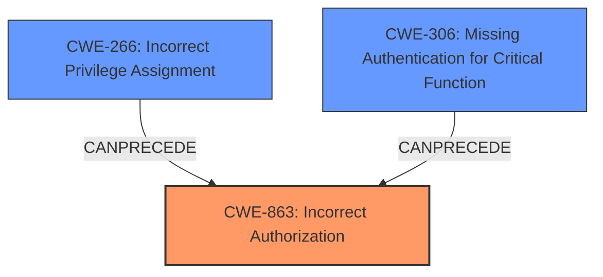

# Analysis for CVE-2024-47183

# Summary
| CWE ID | CWE Name | Confidence | CWE Abstraction Level | CWE Vulnerability Mapping Label | CWE-Vulnerability Mapping Notes |
|---|---|---|---|---|---|
| CWE-863 | Incorrect Authorization | 0.9 | Class | Allowed-with-Review | Primary CWE: The vulnerability stems from the ability to create a user with a custom object ID that starts with `role:`, which can then be used to gain role privileges. |
| CWE-266 | Incorrect Privilege Assignment | 0.7 | Base | Allowed | Secondary Candidate: The attacker acquires privileges of a specific role. |
| CWE-306 | Missing Authentication for Critical Function | 0.6 | Base | Allowed | Secondary Candidate: An attacker that is allowed to create a new user can set a custom object ID for that new user. |

## Evidence and Confidence

*   **Confidence Score:** 0.8
*   **Evidence Strength:** HIGH

## Relationship Analysis
The primary CWE is CWE-863, Incorrect Authorization, because the vulnerability allows an attacker to acquire privileges of a specific role due to a flaw in authorization logic. CWE-266, Incorrect Privilege Assignment, is related because the attacker is effectively being assigned incorrect privileges. CWE-306, Missing Authentication for Critical Function, is also relevant because the attacker is able to create a new user and set a custom object ID, suggesting a potential lack of proper authentication or authorization checks during user creation.

## Vulnerability Chain
1.  **Root Cause:** **allowCustomObjectId true is set** and **Improper input validation of user object IDs.** (from CVE Reference Links Content Summary) allows creation of users with custom object IDs.
2.  **Weakness:** Lack of checks for specific prefixes in object IDs during user creation and session validation.
3.  **Impact:** An attacker can acquire the privileges of a specific role by creating a user with a crafted object ID.

## Summary of Analysis
The primary weakness is **Incorrect Authorization (CWE-863)**, as the attacker gains unauthorized privileges due to the ability to manipulate object IDs. The evidence from the CVE description and the CVE Reference Links Content Summary supports this classification. The **root cause** is the **allowCustomObjectId true is set** option and the **lack of input validation**.

CWE-863 is at the Class level, and while it is preferred to have a Base or Variant level, there is no better match. CWE-266 and CWE-306 are supporting weaknesses.

The relationships between CWEs highlight the importance of considering multiple weaknesses in a vulnerability. The graph illustrates how **missing authentication** and **incorrect privilege assignment** can lead to **incorrect authorization**.

The selection of CWE-863 is based on the fact that the authorization check is performed, but it is not correctly performed because it does not properly validate the object ID.

Relevant CWE Information:
*   CWE-863: Incorrect Authorization
*   CWE-266: Incorrect Privilege Assignment
*   CWE-306: Missing Authentication for Critical Function