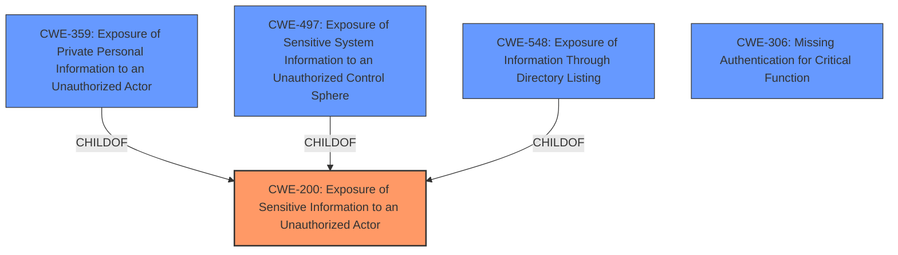

# Enhanced Analysis for CVE-2024-47344

# Summary
| CWE ID | CWE Name | Confidence | CWE Abstraction Level | CWE Vulnerability Mapping Label | CWE-Vulnerability Mapping Notes |
|---|---|---|---|---|---|
| CWE-200 | Exposure of Sensitive Information to an Unauthorized Actor | 0.9 | Class | Primary | Allowed-with-Review |
| CWE-359 | Exposure of Private Personal Information to an Unauthorized Actor | 0.7 | Base | Secondary | Allowed |
| CWE-497 | Exposure of Sensitive System Information to an Unauthorized Control Sphere | 0.7 | Base | Secondary | Allowed |
| CWE-548 | Exposure of Information Through Directory Listing | 0.6 | Variant | Secondary | Allowed |
| CWE-306 | Missing Authentication for Critical Function | 0.5 | Base | Secondary | Allowed |

## Evidence and Confidence

*   **Confidence Score:** 0.8
*   **Evidence Strength:** HIGH

## Relationship Analysis
The primary CWE is CWE-200, which is a class-level CWE. More specific CWEs like CWE-359, CWE-497, and CWE-548 are considered as secondary mappings because they provide more granular descriptions of the exposed sensitive information. CWE-306 is also included as a secondary CWE because **missing authentication** is the underlying root cause allowing the unauthorized exposure.



## Vulnerability Chain
The vulnerability chain begins with **missing authentication (CWE-306)**, which leads to the **exposure of sensitive information (CWE-200)**. This exposure can manifest as **exposure of private personal information (CWE-359)**, **exposure of sensitive system information (CWE-497)**, or **exposure of information through directory listing (CWE-548)**, depending on the specifics of the exposed data.

## Summary of Analysis
The primary weakness identified is **CWE-200 (Exposure of Sensitive Information to an Unauthorized Actor)** because the vulnerability description explicitly states "Exposure of Sensitive Information to an Unauthorized Actor". However, CWE-200 is a Class-level CWE, so more specific Base or Variant level CWEs are also considered.

The CVE Reference Links Content Summary states:
- **Root cause of vulnerability**: The uListing plugin for WordPress is vulnerable to sensitive data exposure.
- **Weaknesses/vulnerabilities present**: The plugin allows unauthenticated users to access sensitive information.
- **Impact of exploitation**: An attacker can view sensitive information that is not normally available to regular users. This information could potentially be used to exploit other vulnerabilities in the system.
- **Attack vectors**: The vulnerability can be exploited by unauthenticated users.
- **Required attacker capabilities/position**: The attacker does not need any special privileges or authentication to exploit this vulnerability. They can be an external, unauthenticated user.

Based on this information, **CWE-306 (Missing Authentication for Critical Function)** is added as a secondary CWE because the plugin **allows unauthenticated users to access sensitive information**.

CWE-359 (Exposure of Private Personal Information to an Unauthorized Actor) and CWE-497 (Exposure of Sensitive System Information to an Unauthorized Control Sphere) are added as secondary CWEs because they are more specific types of information exposure that may be relevant.

CWE-548 (Exposure of Information Through Directory Listing) is also considered because it may be one way the information is being exposed.

The evidence strongly supports the classification of the vulnerability as a type of sensitive information exposure due to **missing authentication**. The selected CWEs are at the optimal level of specificity given the available information, with the primary CWE providing a general classification and the secondary CWEs providing more detailed context.

Relevant CWE Information:
*   CWE-200: Exposure of Sensitive Information to an Unauthorized Actor
*   CWE-359: Exposure of Private Personal Information to an Unauthorized Actor
*   CWE-497: Exposure of Sensitive System Information to an Unauthorized Control Sphere
*   CWE-548: Exposure of Information Through Directory Listing
*   CWE-306: Missing Authentication for Critical Function

CWEs considered but not used:

*   CWE-22: Improper Limitation of a Pathname to a Restricted Directory ('Path Traversal') - This CWE was considered due to the possibility of directory traversal leading to information exposure, but there is no direct evidence to support this.
*   CWE-79: Improper Neutralization of Input During Web Page Generation ('Cross-site Scripting') - This CWE was considered because XSS can sometimes lead to information exposure, but there is no direct evidence to support this.
*   CWE-425: Direct Request ('Forced Browsing') - While related to authorization issues, CWE-425 is more about accessing resources directly without proper authorization checks, while CWE-306 is specifically about missing authentication.
*   CWE-434: Unrestricted Upload of File with Dangerous Type - This CWE is not relevant as the vulnerability is not related to file uploads.
*   CWE-532: Insertion of Sensitive Information into Log File - While logging sensitive information is a common issue, there is no evidence to suggest that this is the case in this specific vulnerability.


## CWE Relationship Analysis

Current CWEs represent these abstraction levels: .


### Vulnerability Chain Analysis

**Chain starting from CWE-359:**
- 359 (Exposure of Private Personal Information to an Unauthorized Actor) - ROOT


**Chain starting from CWE-22:**
- 22 (Improper Limitation of a Pathname to a Restricted Directory ('Path Traversal')) - ROOT


### CWE Relationship Diagram

```mermaid
graph TD
    classDef primary fill:#f96,stroke:#333,stroke-width:2px
    classDef secondary fill:#69f,stroke:#333
    classDef tertiary fill:#9e9,stroke:#333
```