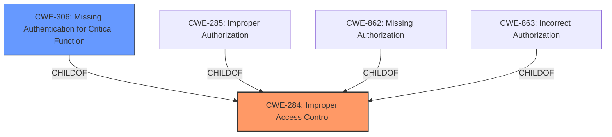

# Raw Analyzer Response for CVE-2024-47481

# Summary
| CWE ID | CWE Name | Confidence | CWE Abstraction Level | CWE Vulnerability Mapping Label | CWE-Vulnerability Mapping Notes |
|---|---|---|---|---|---|
| CWE-284 | Improper Access Control | 0.9 | Pillar | Primary | Discouraged |
| CWE-306 | Missing Authentication for Critical Function | 0.6 | Base | Secondary | Allowed |

## Evidence and Confidence

*   **Confidence Score:** 0.9
*   **Evidence Strength:** HIGH

## Relationship Analysis
The primary CWE selected is CWE-284, which is a high-level category. While it would be preferable to select a more specific CWE, the available information is insufficient to determine whether the **improper access control** is due to missing authentication (CWE-306) or improper authorization (CWE-285, CWE-862, CWE-863). CWE-284 is a parent of several more specific CWEs, including CWE-306, CWE-285, CWE-862, and CWE-863.

## Vulnerability Chain
The vulnerability chain starts with the **improper access control** (CWE-284), which allows an unauthenticated attacker to perform actions that lead to a denial of service. If the issue is specifically a lack of authentication, then the chain would start with CWE-306.

## Summary of Analysis
The vulnerability description clearly states an **Improper Access Control** vulnerability. The primary mapping is CWE-284 (Improper Access Control) because the root cause is explicitly identified as such.

The evidence to support this includes:
*   Vulnerability Description Key Phrases: "rootcause: **Improper Access Control**"
*   CVE Reference Links Content Summary: "The vulnerability is due to an "Improper Access Control" issue" and "Improper Access Control: The software fails to properly restrict access to certain resources or functionalities."

CWE-284 is a high-level Class, and the Mapping Guidance discourages its use when lower-level CWEs are applicable. However, based on the available information, it is not possible to determine whether the issue is due to missing authentication (CWE-306) or improper authorization (CWE-285, CWE-862, CWE-863).
The "Authentication vs Authorization vs Access Control Guidance" explicitly states: "If the access control policy is unclear or inconsistently enforced, but it's not due to missing checks, consider CWE-284."
Because it is known that the attacker is unauthenticated, CWE-306 is being added as a secondary candidate.

CWEs considered but not used:

*   CWE-285 (Improper Authorization), CWE-862 (Missing Authorization), CWE-863 (Incorrect Authorization): These CWEs are related to authorization issues. There isn't enough information to determine if the **improper access control** is specifically due to an authorization failure.
*   CWE-306 (Missing Authentication for Critical Function): It is possible the vulnerability is due to a complete lack of authentication. However, the description focuses on access control, and there's no explicit statement about missing authentication, so CWE-306 is a secondary candidate.
*   CWE-119 (Improper Restriction of Operations within the Bounds of a Memory Buffer): This CWE relates to memory buffer issues, which are not indicated in the vulnerability description.
*   CWE-287 (Improper Authentication): This CWE is about insufficient proof of identity, which is not directly stated in the description.

The confidence in this assessment is high (0.9) because the description explicitly mentions "Improper Access Control" as the root cause of the vulnerability.
The evidence strength is high as there are direct statements about the weakness.