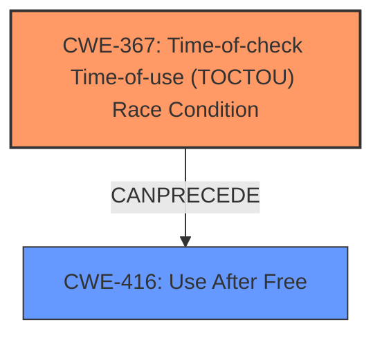

# Enhanced Analysis for CVE-2024-47494

# Summary
| CWE ID | CWE Name | Confidence | CWE Abstraction Level | CWE Vulnerability Mapping Label | CWE-Vulnerability Mapping Notes |
|---|---|---|---|---|---|
| CWE-367 | Time-of-check Time-of-use (TOCTOU) Race Condition | 0.8 | Base | Allowed | Primary CWE. The **TOCTOU race condition** is the root cause that leads to the vulnerability. |
| CWE-416 | Use After Free | 0.6 | Base | Allowed | Secondary CWE. The **memory corruption** that causes the FPC to crash indicates a use-after-free condition, where the sensor is accessed after it has been destroyed. |

## Evidence and Confidence

*   **Confidence Score:** 0.7
*   **Evidence Strength:** MEDIUM

## Relationship Analysis
The primary CWE is CWE-367 (Time-of-check Time-of-use (TOCTOU) Race Condition), which is a Base level CWE. The secondary CWE is CWE-416 (Use After Free), also a Base level CWE.



## Vulnerability Chain
The vulnerability chain starts with a **TOCTOU race condition** (CWE-367), where the AgentD process attempts to reap a sensor. Because the state of resource changes between the check and the use, this leads to accessing an already destroyed sensor, resulting in **memory corruption** and a use-after-free condition (CWE-416). This ultimately causes the FPC to crash, leading to a denial of service.

## Summary of Analysis
The primary weakness is identified as CWE-367 because the vulnerability description explicitly mentions a **TOCTOU race condition**. The **memory corruption** provides evidence for a secondary weakness of CWE-416. The evidence is based on the vulnerability description and supported by the retriever results. The relationship analysis shows that CWE-367 can precede CWE-416. The selection of CWEs is based on the evidence provided.

Relevant CWE Information:

# Enhanced Context (25 CWEs)
The following CWEs were identified as potentially relevant to this vulnerability:

## CWE-696: Incorrect Behavior Order
**Abstraction Level**: Class
**Similarity Score**: 0.76
**Source**: dense

**Description**:
The product performs multiple related behaviors, but the behaviors are performed in the wrong order in ways which may produce resultant weaknesses.

**Mapping Guidance**:
- Usage: Allowed-with-Review
- Rationale: This CWE entry is a Class and might have Base-level children that would be more appropriate

*Not Selected:* This CWE is not selected because it is a more general case of incorrect behavior order and does not specifically address the race condition leading to memory corruption.

## CWE-367: Time-of-check Time-of-use (TOCTOU) Race Condition
**Abstraction Level**: Base
**Similarity Score**: 0.76
**Source**: dense

**Description**:
The product checks the state of a resource before using that resource, but the resource's state can change between the check and the use in a way that invalidates the results of the check. This can cause the product to perform invalid actions when the resource is in an unexpected state.

**Mapping Guidance**:
- Usage: Allowed
- Rationale: This CWE entry is at the Base level of abstraction, which is a preferred level of abstraction for mapping to the root causes of vulnerabilities.

*Selected:* This CWE is selected as the primary weakness because the vulnerability description explicitly states a **TOCTOU race condition**.

## CWE-755: Improper Handling of Exceptional Conditions
**Abstraction Level**: Class
**Similarity Score**: 0.74
**Source**: dense

**Description**:
The product does not handle or incorrectly handles an exceptional condition.

**Mapping Guidance**:
- Usage: Discouraged
- Rationale: This CWE entry is a level-1 Class (i.e., a child of a Pillar). It might have lower-level children that would be more appropriate

*Not Selected:* This is too general and doesn't accurately reflect the specific **TOCTOU race condition**.

## CWE-362: Concurrent Execution using Shared Resource with Improper Synchronization ('Race Condition')
**Abstraction Level**: Class
**Similarity Score**: 0.74
**Source**: dense

**Description**:
The product contains a concurrent code sequence that requires temporary, exclusive access to a shared resource, but a timing window exists in which the shared resource can be modified by another code sequence operating concurrently.

**Mapping Guidance**:
- Usage: Allowed-with-Review
- Rationale: This CWE entry is a Class and might have Base-level children that would be more appropriate

*Not Selected:* While a race condition is present, the more specific CWE-367 is a better fit because it describes the **TOCTOU** aspect.

## CWE-754: Improper Check for Unusual or Exceptional Conditions
**Abstraction Level**: Class
**Similarity Score**: 0.74
**Source**: dense

**Description**:
The product does not check or incorrectly checks for unusual or exceptional conditions that are not expected to occur frequently during day to day operation of the product.

**Mapping Guidance**:
- Usage: Allowed-with-Review
- Rationale: This CWE entry is a Class and might have Base-level children that would be more appropriate

*Not Selected:* This is too general and doesn't accurately reflect the specific **TOCTOU race condition**.

## CWE-1285: Improper Validation of Specified Index, Position, or Offset in Input
**Abstraction Level**: Base
**Similarity Score**: 0.74
**Source**: dense

**Description**:
The product receives input that is expected to specify an index, position, or offset into an indexable resource such as a buffer or file, but it does not validate or incorrectly validates that the specified index/position/offset has the required properties.

*Not Selected:* This CWE doesn't match the vulnerability description. The vulnerability is not directly related to validating an index, position, or offset in input.

## CWE-617: Reachable Assertion
**Abstraction Level**: Base
**Similarity Score**: 0.72
**Source**: dense

**Description**:
The product contains an assert() or similar statement that can be triggered by an attacker, which leads to an application exit or other behavior that is more severe than necessary.

*Not Selected:* There is no evidence of an assertion being triggered.

## CWE-703: Improper Check or Handling of Exceptional Conditions
**Abstraction Level**: Pillar
**Similarity Score**: 0.72
**Source**: dense

**Description**:
The product does not properly anticipate or handle exceptional conditions that rarely occur during normal operation of the product.

*Not Selected:* Too high-level.

## CWE-400: Uncontrolled Resource Consumption
**Abstraction Level**: Class
**Similarity Score**: 0.72
**Source**: dense

**Description**:
The product does not properly control the allocation and maintenance of a limited resource, thereby enabling an actor to influence the amount of resources consumed, eventually leading to the exhaustion of available resources.

*Not Selected:* While the FPC crashes, this is a symptom of the underlying **memory corruption** due to the race condition and use-after-free, rather than a direct uncontrolled resource consumption issue.

## CWE-401: Missing Release of Memory after Effective Lifetime
**Abstraction Level**: Variant
**Similarity Score**: 0.72
**Source**: dense

**Description**:
The product does not sufficiently track and release allocated memory after it has been used, which slowly consumes remaining memory.

*Not Selected:* While related to memory management, it does not directly describe what is happening. The sensor is actively destroyed due to the **TOCTOU race condition** then a subsequent memory operation is attempted which leads to a crash, which is better expressed as a use-after-free.

## CWE-390: Detection of Error Condition Without Action
**Abstraction Level**: base
**Similarity Score**: 4.33
**Source**: graph

**Description**:
CWE-390: Detection of Error Condition Without Action

*Not Selected:* There is no indication that an error is detected but no action is taken.

## CWE-410: Insufficient Resource Pool
**Abstraction Level**: Base
**Similarity Score**: 2.88
**Source**: graph

**Description**:
The product's resource pool is not large enough to handle peak demand, which allows an attacker to prevent others from accessing the resource by using a (relatively) large number of requests for resources.

*Not Selected:* This is not related to the described vulnerability.

## CWE-476: NULL Pointer Dereference
**Abstraction Level**: base
**Similarity Score**: 2.87
**Source**: graph

**Description**:
CWE-4


## CWE Relationship Analysis

Current CWEs represent these abstraction levels: .


### Vulnerability Chain Analysis

**Chain starting from CWE-390:**
- 390 (Detection of Error Condition Without Action) - ROOT


**Chain starting from CWE-416:**
- 416 (Use After Free) - ROOT


### CWE Relationship Diagram

```mermaid
graph TD
    classDef primary fill:#f96,stroke:#333,stroke-width:2px
    classDef secondary fill:#69f,stroke:#333
    classDef tertiary fill:#9e9,stroke:#333
```