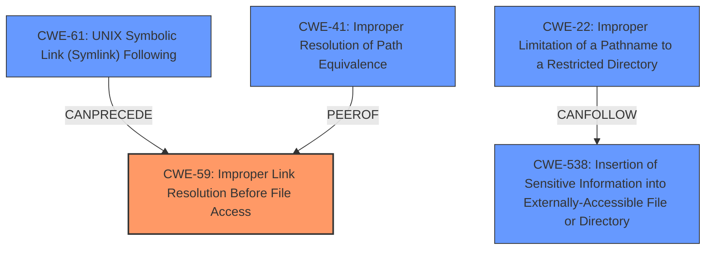

# Enhanced Analysis for CVE-2024-47515

# Summary
| CWE ID | CWE Name | Confidence | CWE Abstraction Level | CWE Vulnerability Mapping Label | CWE-Vulnerability Mapping Notes |
|---|---|---|---|---|---|
| CWE-59 | Improper Link Resolution Before File Access ('Link Following') | 0.9 | Base | Allowed | Primary CWE. The root cause is the improper handling of symbolic links. |
| CWE-61 | UNIX Symbolic Link (Symlink) Following | 0.7 | Compound | Allowed | Secondary Candidate. This is a composite of multiple weaknesses, but it is less specific than CWE-59 for the root cause. |
| CWE-22 | Improper Limitation of a Pathname to a Restricted Directory ('Path Traversal') | 0.6 | Base | Allowed | Secondary Candidate. This could be a factor, but the primary issue is the following of the link, not necessarily traversal outside a restricted directory. |
| CWE-41 | Improper Resolution of Path Equivalence | 0.5 | Base | Allowed | Secondary Candidate. While related, the core issue is the following of symlinks, not just the general problem of path equivalence. |
| CWE-538 | Insertion of Sensitive Information into Externally-Accessible File or Directory | 0.4 | Base | Allowed | Secondary Candidate. This represents impact and could be considered part of the exploit chain. |

## Evidence and Confidence

*   **Confidence Score:** 0.9
*   **Evidence Strength:** HIGH

## Relationship Analysis
The primary weakness is CWE-59 **Improper Link Resolution Before File Access ('Link Following')**, which is a Base level CWE. CWE-61 **UNIX Symbolic Link (Symlink) Following** is a Compound CWE that includes multiple weaknesses, including link following, but is less specific. CWE-22 **Improper Limitation of a Pathname to a Restricted Directory ('Path Traversal')** could be a factor, but the primary issue is following the link, not necessarily traversal outside a restricted directory. CWE-41 **Improper Resolution of Path Equivalence** is related, but the core issue is the following of symlinks, not just the general problem of path equivalence. CWE-538 **Insertion of Sensitive Information into Externally-Accessible File or Directory** represents impact.



## Vulnerability Chain
The vulnerability chain starts with **improper symbolic link handling** (CWE-59), leading to local file disclosure.

CWE-59 -> CWE-538

## Summary of Analysis
The primary weakness is CWE-59 **Improper Link Resolution Before File Access ('Link Following')**, as evidenced by the vulnerability description mentioning **improper symbolic link handling** and the CVE reference links content summary explicitly stating that the `generate_archive()` function incorrectly handles symbolic links. The description field of the CVE also states that "Support of symbolic links during repository archiving of repositories allows the disclosure of local files". This confirms the root cause is related to link following and not validating the target. The other CWEs were considered, but the primary issue is the **improper handling of symbolic links**, making CWE-59 the most appropriate and specific choice.

Relevant CWE Information:
- CWE-59: The product attempts to access a file based on the filename, but it does not properly prevent that filename from identifying a link or shortcut that resolves to an unintended resource.
- CWE-61: The product, when opening a file or directory, does not sufficiently account for when the file is a symbolic link that resolves to a target outside of the intended control sphere. This could allow an attacker to cause the product to operate on unauthorized files.
- CWE-22: The product uses external input to construct a pathname that is intended to identify a file or directory that is located underneath a restricted parent directory, but the product does not properly neutralize special elements within the pathname that can cause the pathname to resolve to a location that is outside of the restricted directory.
- CWE-41: The product is vulnerable to file system contents disclosure through path equivalence. Path equivalence involves the use of special characters in file and directory names. The associated manipulations are intended to generate multiple names for the same object.
- CWE-538: The product places sensitive information into files or directories that are accessible to actors who are allowed to have access to the files, but not to the sensitive information.


## CWE Relationship Analysis

Current CWEs represent these abstraction levels: .


### Vulnerability Chain Analysis

**Chain starting from CWE-22:**
- 22 (Improper Limitation of a Pathname to a Restricted Directory ('Path Traversal')) - ROOT


**Chain starting from CWE-59:**
- 59 (Improper Link Resolution Before File Access ('Link Following')) - ROOT


### CWE Relationship Diagram

```mermaid
graph TD
    classDef primary fill:#f96,stroke:#333,stroke-width:2px
    classDef secondary fill:#69f,stroke:#333
    classDef tertiary fill:#9e9,stroke:#333
```