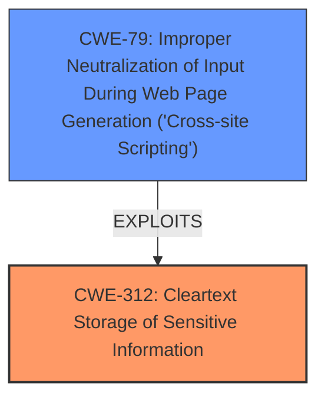

# Analysis Report for CVE-2024-47529

# Vulnerability Analysis Report: CVE-2024-47529

## Description

OpenC3 COSMOS provides the functionality needed to send commands to and receive data from one or more embedded systems. OpenC3 COSMOS stores the password of a user unencrypted in the LocalStorage of a web browser. This makes the user password susceptible to exfiltration via **Cross-site scripting** (see GHSL-2024-128). This vulnerability is fixed in 5.19.0. This only affects Open Source edition, and not OpenC3 COSMOS Enterprise Edition.

## Vulnerability Description Key Phrases

- **Weakness:** ['Cross-site scripting', 'unencrypted storage of sensitive information']
- **Impact:** exfiltration of user password
- **Vector:** cross-site scripting
- **Product:** OpenC3 COSMOS
- **Version:** before 5.19.0
- **Component:** Localstorage

## Analysis (with Relationship Data)

# Summary
| CWE ID  | CWE Name                                                                     | Confidence | CWE Abstraction Level | CWE Vulnerability Mapping Label | CWE-Vulnerability Mapping Notes |
| :-------- | :--------------------------------------------------------------------------- | :--------- | :---------------------- | :------------------------------ | :------------------------------ |
| CWE-312   | Cleartext Storage of Sensitive Information                                 | 0.9        | Base                    | Primary                         | Allowed                       |
| CWE-79    | Improper Neutralization of Input During Web Page Generation ('Cross-site Scripting') | 0.8        | Base                    | Secondary                       | Allowed                       |

## Evidence and Confidence

*   **Confidence Score:** 0.85
*   **Evidence Strength:** MEDIUM

## Relationship Analysis
The primary weakness is **CWE-312: Cleartext Storage of Sensitive Information**, which is a base-level CWE. The secondary weakness is **CWE-79: Improper Neutralization of Input During Web Page Generation ('Cross-site Scripting')**, which allows the exfiltration.
The relationship is that the **Cross-site scripting** vulnerability enables the exfiltration of the **sensitive information stored in cleartext**.



## Vulnerability Chain
The vulnerability chain starts with the **unencrypted storage of the user password** (**CWE-312**). This **sensitive information** is then vulnerable to **exfiltration** via **Cross-site scripting** (**CWE-79**).

## Summary of Analysis
The analysis identifies two CWEs: **CWE-312: Cleartext Storage of Sensitive Information** and **CWE-79: Improper Neutralization of Input During Web Page Generation ('Cross-site Scripting')**.

The primary CWE is **CWE-312**, as the **root cause** is the storage of the password in cleartext. The vulnerability description states: "OpenC3 COSMOS stores the password of a user unencrypted in the LocalStorage of a web browser." This directly matches the definition of **CWE-312**: "The product stores sensitive information in cleartext within a resource that might be accessible to another control sphere."

The secondary CWE is **CWE-79**, as the **Cross-site scripting** vulnerability enables the **exfiltration** of the **sensitive information**. The vulnerability description states: "This makes the user password susceptible to **exfiltration** via **Cross-site scripting** (see GHSL-2024-128)." This matches the definition of **CWE-79**: "The product does not neutralize or incorrectly neutralizes user-controllable input before it is placed in output that is used as a web page that is served to other users."

Other CWEs Considered but Not Used:

*   **CWE-522: Insufficiently Protected Credentials:** This was considered, but **CWE-312** is more specific to the **cleartext storage** issue.
*   **CWE-256: Plaintext Storage of a Password:** This is a more specific variant of **CWE-312**, but **CWE-312** is preferred because it is more general and applies to any **sensitive information**, not just passwords.
*   **CWE-311: Missing Encryption of Sensitive Data:** This CWE is similar to **CWE-312**, but **CWE-312** is more precise because it specifies that the data is stored in **cleartext**, rather than just missing encryption.
*   **CWE-532: Insertion of Sensitive Information into Log File**: Irrelevant because the storage is in LocalStorage, not logs.

The selected CWEs are at the optimal level of specificity because they directly address the **root cause** (**CWE-312**) and the enabling factor (**CWE-79**) of the vulnerability.


## CWE Relationship Analysis

Current CWEs represent these abstraction levels: .


### Vulnerability Chain Analysis

**Chain starting from CWE-79:**
- 79 (Improper Neutralization of Input During Web Page Generation ('Cross-site Scripting')) - ROOT


**Chain starting from CWE-256:**
- 256 (Plaintext Storage of a Password) - ROOT


### CWE Relationship Diagram

```mermaid
graph TD
    classDef primary fill:#f96,stroke:#333,stroke-width:2px
    classDef secondary fill:#69f,stroke:#333
    classDef tertiary fill:#9e9,stroke:#333
```


*Report generated on 2025-07-13 18:15:22*
