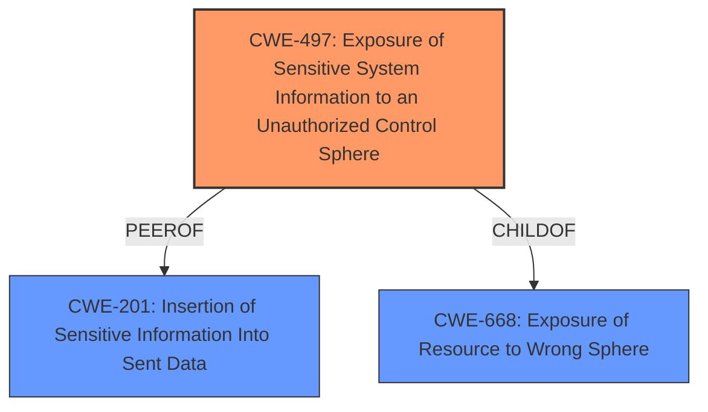

# Raw Analyzer Response for CVE-2024-47532

# Summary

| CWE ID  | CWE Name                                                                             | Confidence | CWE Abstraction Level | CWE Vulnerability Mapping Label | CWE-Vulnerability Mapping Notes |
| :-------- | :----------------------------------------------------------------------------------- | :--------- | :---------------------- | :------------------------------ | :------------------------------ |
| CWE-497   | Exposure of Sensitive System Information to an Unauthorized Control Sphere          | 0.9        | Base                    | Primary CWE                     | Allowed                       |
| CWE-668   | Exposure of Resource to Wrong Sphere                                                | 0.7        | Class                   | Secondary Candidate             | Discouraged                   |
| CWE-201   | Insertion of Sensitive Information Into Sent Data                                   | 0.6        | Base                    | Secondary Candidate             | Allowed                       |

## Evidence and Confidence

*   **Confidence Score:** 0.8
*   **Evidence Strength:** HIGH

## Relationship Analysis

The primary relationship that impacted the decision was the parent-child relationship. CWE-497 is a base-level CWE that directly addresses the **exposure of sensitive system information**, which aligns with the vulnerability description. CWE-668 is a class-level CWE and is a more general case of exposing resources. The relationship between CWE-497 and its parents and peers was considered to ensure that a more specific or relevant CWE was not overlooked.

## Vulnerability Chain

The vulnerability chain starts with the improper handling of `AttributeError` and the unrestricted access to the `string` module, leading to the **exposure of sensitive information**.

1.  `Improper Handling of AttributeError` leading to object reference exposure.
2.  `Unrestricted Access to 'string' module` allowing access to more of the underlying Python environment.
3.  `Exposure of Sensitive System Information` is the result of the above weaknesses.

## Summary of Analysis

The initial analysis focused on identifying the root cause of the vulnerability, which is the **exposure of sensitive information** through `AttributeError.obj` and the `string` module. The final decision was heavily influenced by the vulnerability description and the CVE Reference Links Content Summary, which clearly indicated that the vulnerability allowed a user to **gain access to protected information**.

The selection of CWE-497 is based on the fact that it directly addresses the **exposure of sensitive system information**. This is supported by the vulnerability description key phrases, which highlight the **weakness** as the ability to **gain access to protected information**. The fix implemented in the patch, which modifies the `_AttributeDelegator.__getattr__` method to no longer set the `obj` attribute on `AttributeError` and restricts access to the `string` module, further supports this classification.

CWE-668 was considered because it generally describes the **exposure of a resource to the wrong control sphere**. While this is a valid concern, CWE-497 is more specific in that it focuses on the **exposure of sensitive system information**. Since the vulnerability description explicitly mentions sensitive information, CWE-497 is a better fit.

CWE-201 was considered because the vulnerability results in insertion of sensitive information. While this is true, the primary issue is not the insertion of the data, but the initial **exposure** of the sensitive information.

The chosen CWEs are at the optimal level of specificity because they directly address the root cause and the resulting impact of the vulnerability. The evidence provided in the vulnerability description and the CVE Reference Links Content Summary supports this classification.

Relevant CWE Information:

# Enhanced Context (25 CWEs)
The following CWEs were identified as potentially relevant to this vulnerability:

## CWE-497: Exposure of Sensitive System Information to an Unauthorized Control Sphere

**Technical Explanation:** The `RestrictedPython` environment exposes internal object references through `AttributeError.obj` and the `string` module, allowing unauthorized access to sensitive data.

**Security Implications:** Unauthorized access to sensitive system information can lead to further exploitation, privilege escalation, or data breaches.

**Parent-Child Relationships:** CWE-497 is a base-level CWE and a child of CWE-668.

**Primary/Secondary:** Primary CWE

**Mitre Mapping Guidance:** Allowed. The CWE entry is at the Base level of abstraction, which is a preferred level of abstraction for mapping to the root causes of vulnerabilities.

## CWE-668: Exposure of Resource to Wrong Sphere

**Technical Explanation:** The `RestrictedPython` environment allows resources (internal object references, `string` module) to be accessed by actors who should not have access to them, thus exposing them to the wrong sphere of control.

**Security Implications:** Unauthorized access to resources can lead to privilege escalation, data breaches, or other security compromises.

**Parent-Child Relationships:** CWE-668 is a class-level CWE and a parent of CWE-497.

**Primary/Secondary:** Secondary CWE

**Mitre Mapping Guidance:** Discouraged. CWE-668 is high-level and is often misused as a catch-all when lower-level CWE IDs might be applicable.

## CWE-201: Insertion of Sensitive Information Into Sent Data

**Technical Explanation:** The vulnerability can lead to sensitive information being inserted into data that is sent or exposed to an attacker.

**Security Implications:** The insertion of sensitive information can lead to unauthorized access, data breaches, or other security compromises.

**Parent-Child Relationships:** CWE-201 is a base-level CWE.

**Primary/Secondary:** Secondary CWE

**Mitre Mapping Guidance:** Allowed. The CWE entry is at the Base level of abstraction, which is a preferred level of abstraction for mapping to the root causes of vulnerabilities.