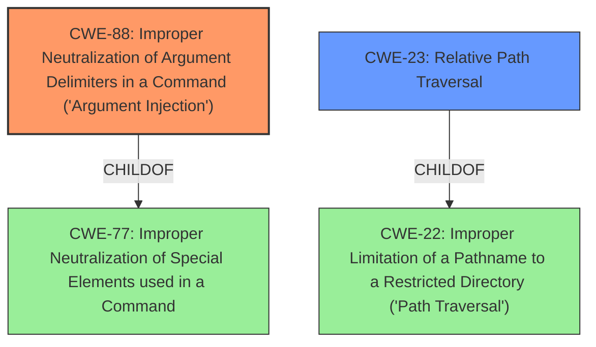

# Analysis Report for CVE-2024-47611

# Vulnerability Analysis Report: CVE-2024-47611

## Description

XZ Utils provide a general-purpose data-compression library plus command-line tools. When built for native Windows (MinGW-w64 or MSVC), the command line tools from XZ Utils 5.6.2 and older have a **command line argument injection** vulnerability. If a command line contains Unicode characters (for example, filenames) that dont exist in the current legacy code page, the characters are converted to similar-looking characters with best-fit mapping. Some best-fit mappings result in ASCII characters that change the meaning of the command line, which can be exploited with malicious filenames to do argument injection or **directory traversal** attacks. This vulnerability is fixed in 5.6.3. Command line tools built for Cygwin or MSYS2 are unaffected. liblzma is unaffected.

## Vulnerability Description Key Phrases

- **Rootcause:** improper handling of Unicode characters
- **Weakness:** ['command line argument injection', 'directory traversal']
- **Impact:** ["['change the meaning of the command line'", "'argument injection or directory traversal']"]
- **Vector:** malicious filenames
- **Product:** XZ Utils
- **Version:** 5.6.2 and older
- **Component:** command line tools

## Analysis (with Relationship Data)

# Summary
| CWE ID  | CWE Name  | Confidence | CWE Abstraction Level | CWE Vulnerability Mapping Label | CWE-Vulnerability Mapping Notes |
|---|---|---|---|---|---|
| CWE-88 | Improper Neutralization of Argument Delimiters in a Command ('Argument Injection') | 1.0 | Base | Allowed | Primary CWE |
| CWE-23 | Relative Path Traversal | 0.7 | Base | Allowed | Secondary Candidate |

## Evidence and Confidence

*   **Confidence Score:** 0.9
*   **Evidence Strength:** HIGH

## Relationship Analysis
The primary weakness is CWE-88. This vulnerability involves **improper neutralization of argument delimiters** in a command, leading to argument injection. The secondary weakness is CWE-23, which is a **relative path traversal**.
CWE-88 is related to CWE-77 (Improper Neutralization of Special Elements used in a Command) as a child. CWE-23 is related to CWE-22 (Improper Limitation of a Pathname to a Restricted Directory ('Path Traversal')) as a specific case.



## Vulnerability Chain
The vulnerability chain starts with the **improper handling of Unicode characters**, which leads to **command line argument injection** and can be exploited for **directory traversal** attacks.

1.  **Root Cause:** **Improper handling of Unicode characters** leads to incorrect character conversion.
2.  **Weakness 1:** **Improper Neutralization of Argument Delimiters** (CWE-88) due to the incorrect conversion of Unicode characters.
3.  **Weakness 2:** Relative Path Traversal (CWE-23) as a consequence of the argument injection, allowing access to unauthorized directories.
4.  **Impact:** Change in the meaning of the command line, leading to unintended actions and potentially unauthorized file access.

## Summary of Analysis
The primary weakness is CWE-88, as the **improper neutralization** of argument delimiters directly leads to the **argument injection** vulnerability. The vulnerability description explicitly mentions **command line argument injection**, which aligns perfectly with CWE-88. The secondary weakness, CWE-23, is a potential consequence of the argument injection, allowing for **directory traversal** attacks.

The evidence is strong, as the vulnerability description clearly states the **command line argument injection** and the possibility of **directory traversal** attacks due to **improper handling of Unicode characters**. The retriever results also support CWE-88 as the most relevant CWE for this vulnerability.

CWE-78 (Improper Neutralization of Special Elements used in an OS Command ('OS Command Injection')) was considered but not selected as the primary CWE because the vulnerability is more specific to the **improper handling of argument delimiters** rather than a general OS command injection.
CWE-22 (Improper Limitation of a Pathname to a Restricted Directory ('Path Traversal')) was considered as a potential primary CWE, but CWE-23 (Relative Path Traversal) is a more precise match since the vulnerability description explicitly mentions **directory traversal** attacks through manipulation of relative paths.

# Relevant CWE Information:
The following CWEs were identified as potentially relevant to this vulnerability:

## CWE-74: Improper Neutralization of Special Elements in Output Used by a Downstream Component ('Injection')
**Abstraction Level**: Class
**Similarity Score**: 0.74
**Source**: dense

**Description**:
The product constructs all or part of a command, data structure, or record using externally-influenced input from an upstream component, but it does not neutralize or incorrectly neutralizes special elements that could modify how it is parsed or interpreted when it is sent to a downstream component.

**Mapping Guidance**:
- Usage: Discouraged
- Rationale: CWE-74 is high-level and often misused when lower-level weaknesses are more appropriate.

## CWE-59: Improper Link Resolution Before File Access ('Link Following')
**Abstraction Level**: Base
**Similarity Score**: 0.73
**Source**: dense

**Description**:
The product attempts to access a file based on the filename, but it does not properly prevent that filename from identifying a link or shortcut that resolves to an unintended resource.

**Mapping Guidance**:
- Usage: Allowed
- Rationale: This CWE entry is at the Base level of abstraction, which is a preferred level of abstraction for mapping to the root causes of vulnerabilities.

## CWE-138: Improper Neutralization of Special Elements
**Abstraction Level**: Class
**Similarity Score**: 0.73
**Source**: dense

**Description**:
The product receives input from an upstream component, but it does not neutralize or incorrectly neutralizes special elements that could be interpreted as control elements or syntactic markers when they are sent to a downstream component.

**Mapping Guidance**:
- Usage: Discouraged
- Rationale: This CWE entry is a level-1 Class (i.e., a child of a Pillar). It might have lower-level children that would be more appropriate

## CWE-73: External Control of File Name or Path
**Abstraction Level**: Base
**Similarity Score**: 0.73
**Source**: dense

**Description**:
The product allows user input to control or influence paths or file names that are used in filesystem operations.

**Mapping Guidance**:
- Usage: Allowed
- Rationale: This CWE entry is at the Base level of abstraction, which is a preferred level of abstraction for mapping to the root causes of vulnerabilities.

## CWE-41: Improper Resolution of Path Equivalence
**Abstraction Level**: Base
**Similarity Score**: 0.73
**Source**: dense

**Description**:
The product is vulnerable to file system contents disclosure through path equivalence. Path equivalence involves the use of special characters in file and directory names. The associated manipulations are intended to generate multiple names for the same object.

**Mapping Guidance**:
- Usage: Allowed
- Rationale: This CWE entry is at the Base level of abstraction, which is a preferred level of abstraction for mapping to the root causes of vulnerabilities.

## CWE-184: Incomplete List of Disallowed Inputs
**Abstraction Level**: Base
**Similarity Score**: 0.72
**Source**: dense

**Description**:
The product implements a protection mechanism that relies on a list of inputs (or properties of inputs) that are not allowed by policy or otherwise require other action to neutralize before additional processing takes place, but the list is incomplete.

**Mapping Guidance**:
- Usage: Allowed
- Rationale: This CWE entry is at the Base level of abstraction, which is a preferred level of abstraction for mapping to the root causes of vulnerabilities.

## CWE-88: Improper Neutralization of Argument Delimiters in a Command ('Argument Injection')
**Abstraction Level**: Base
**Similarity Score**: 0.72
**Source**: dense

**Description**:
The product constructs a string for a command to be executed by a separate component
in another control sphere, but it does not properly delimit the
intended arguments, options, or switches within that command string.

**Mapping Guidance**:
- Usage: Allowed
- Rationale: This CWE entry is at the Base level of abstraction, which is a preferred level of abstraction for mapping to the root causes of vulnerabilities.

## CWE-23: Relative Path Traversal
**Abstraction Level**: Base
**Similarity Score**: 0.72
**Source**: dense

**Description**:
The product uses external input to construct a pathname that should be within a restricted directory, but it does not properly neutralize sequences such as ".." that can resolve to a location that is outside of that directory.

**Mapping Guidance**:
- Usage: Allowed
- Rationale: This CWE entry is at the Base level of abstraction, which is a preferred level of abstraction for mapping to the root causes of vulnerabilities.

## CWE-134: Use of Externally-Controlled Format String
**Abstraction Level**: Base
**Similarity Score**: 0.72
**Source**: dense

**Description**:
The product uses a function that accepts a format string as an argument, but the format string originates from an external source.

**Mapping Guidance**:
- Usage: Allowed
- Rationale: This CWE entry is at the Base level of abstraction, which is a preferred level of abstraction for mapping to the root causes of vulnerabilities.

## CWE-668: Exposure of Resource to Wrong Sphere
**Abstraction Level**: Class
**Similarity Score**: 0.72
**Source**: dense

**Description**:
The product exposes a resource to the wrong control sphere


## CWE Relationship Analysis

Current CWEs represent these abstraction levels: .


### Vulnerability Chain Analysis

**Chain starting from CWE-77:**
- 77 (Improper Neutralization of Special Elements used in a Command ('Command Injection')) - ROOT


**Chain starting from CWE-88:**
- 88 (Improper Neutralization of Argument Delimiters in a Command ('Argument Injection')) - ROOT


### CWE Relationship Diagram

```mermaid
graph TD
    classDef primary fill:#f96,stroke:#333,stroke-width:2px
    classDef secondary fill:#69f,stroke:#333
    classDef tertiary fill:#9e9,stroke:#333
```


*Report generated on 2025-07-13 18:19:22*
