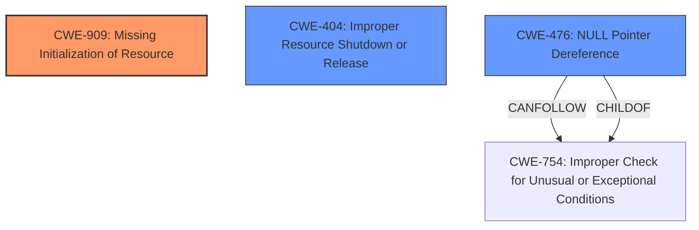

# Analysis for CVE-2024-47687

# Summary
| CWE ID  | CWE Name   | Confidence | CWE Abstraction Level | CWE Vulnerability Mapping Label | CWE-Vulnerability Mapping Notes |
|---|---|---|---|---|---|
| CWE-909 | Missing Initialization of Resource | 0.9 | Class | Primary | Allowed-with-Review |
| CWE-404 | Improper Resource Shutdown or Release | 0.7 | Class | Secondary | Allowed-with-Review |
| CWE-476 | NULL Pointer Dereference | 0.6 | Base | Secondary | Allowed |

## Evidence and Confidence

*   **Confidence Score:** 0.8
*   **Evidence Strength:** MEDIUM

## Relationship Analysis
The primary weakness is **CWE-909 (Missing Initialization of Resource)** because the vulnerability description mentions that memory resources were not initialized. **CWE-404 (Improper Resource Shutdown or Release)** is also relevant because the code attempts to release uninitialized resources. **CWE-476 (NULL Pointer Dereference)** is potentially a result of the missing initialization, leading to a NULL pointer being dereferenced, causing a crash. The abstraction levels guided the selection, with a preference for the most specific applicable level.

## Vulnerability Chain
The vulnerability chain starts with the **missing initialization** of memory resources (**CWE-909**). This leads to the attempted release of uninitialized memory resources (**CWE-404**), and potentially a **NULL pointer dereference** (**CWE-476**) when the code tries to access the uninitialized memory, causing a kernel panic or "Oops".

## Summary of Analysis
The primary weakness is the **missing initialization** of memory resources, as highlighted by the keyphrase "missing check". While the code attempts to free these uninitialized resources, this is a consequence of the initial error. The high retriever scores for **CWE-909 (Missing Initialization of Resource)** supports this assessment. The 'Oops' impact described in the vulnerability reinforces the likelihood of a **CWE-476 (NULL Pointer Dereference)**. **CWE-404 (Improper Resource Shutdown or Release)** is included because the uninitialized resources are attempted to be released.

The evidence from the vulnerability description, specifically the phrase "**missing check**" and "**invalid mr resource destroy**", strongly supports the selection of **CWE-909 (Missing Initialization of Resource)** as the primary CWE. The subsequent crash, indicated by "Oops", further suggests a **CWE-476 (NULL Pointer Dereference)** stemming from the initial **missing initialization**.

Relevant CWE Information:

# Enhanced Context (25 CWEs)
The following CWEs were identified as potentially relevant to this vulnerability:

## CWE-667: Improper Locking
**Abstraction Level**: Class
**Similarity Score**: 0.76
**Source**: dense

**Description**:
The product does not properly acquire or release a lock on a resource, leading to unexpected resource state changes and behaviors.

**Mapping Guidance**:
- Usage: Allowed-with-Review
- Rationale: This CWE entry is a Class and might have Base-level children that would be more appropriate

I considered **CWE-667 (Improper Locking)**, but it is less relevant as the core issue is not related to locking mechanisms.

## CWE-404: Improper Resource Shutdown or Release
**Abstraction Level**: Class
**Similarity Score**: 0.75
**Source**: dense

**Description**:
The product does not release or incorrectly releases a resource before it is made available for re-use.

**Mapping Guidance**:
- Usage: Allowed-with-Review
- Rationale: This CWE entry is a Class and might have Base-level children that would be more appropriate

**CWE-404 (Improper Resource Shutdown or Release)** is included because the vulnerability involves releasing memory resources that were never initialized.

## CWE-909: Missing Initialization of Resource
**Abstraction Level**: Class
**Similarity Score**: 0.75
**Source**: dense

**Description**:
The product does not initialize a critical resource.

**Mapping Guidance**:
- Usage: Allowed-with-Review
- Rationale: This CWE entry is a Class and might have Base-level children that would be more appropriate

**CWE-909 (Missing Initialization of Resource)** is the primary CWE because the core issue is the lack of resource initialization.

## CWE-824: Access of Uninitialized Pointer
**Abstraction Level**: Base
**Similarity Score**: 0.74
**Source**: dense

**Description**:
The product accesses or uses a pointer that has not been initialized.

**Mapping Guidance**:
- Usage: Allowed
- Rationale: This CWE entry is at the Base level of abstraction, which is a preferred level of abstraction for mapping to the root causes of vulnerabilities.

I considered **CWE-824 (Access of Uninitialized Pointer)** but it is more of a consequence of CWE-909, as the code attempts to access memory that was not initialized, potentially leading to a NULL pointer dereference.

## CWE-665: Improper Initialization
**Abstraction Level**: Class
**Similarity Score**: 0.74
**Source**: dense

**Description**:
The product does not initialize or incorrectly initializes a resource, which might leave the resource in an unexpected state when it is accessed or used.

**Mapping Guidance**:
- Usage: Discouraged
- Rationale: This CWE entry is a level-1 Class (i.e., a child of a Pillar). It might have lower-level children that would be more appropriate

I considered **CWE-665 (Improper Initialization)** but the description indicates a **missing initialization**, making **CWE-909** more specific.

## CWE-664: Improper Control of a Resource Through its Lifetime
**Abstraction Level**: Pillar
**Similarity Score**: 0.73
**Source**: dense

**Description**:
The product does not maintain or incorrectly maintains control over a resource throughout its lifetime of creation, use, and release.

**Mapping Guidance**:
- Usage: Discouraged
- Rationale: This CWE entry is high-level when lower-level children are available.

I considered **CWE-664 (Improper Control of a Resource Through its Lifetime)**, but it is too high-level.

## CWE-413: Improper Resource Locking
**Abstraction Level**: Base
**Similarity Score**: 0.73
**Source**: dense

**Description**:
The product does not lock or does not correctly lock a resource when the product must have exclusive access to the resource.

**Mapping Guidance**:
- Usage: Allowed
- Rationale: This CWE entry is at the Base level of abstraction, which is a preferred level of abstraction for mapping to the root causes of vulnerabilities.

I considered **CWE-413 (Improper Resource Locking)**, but it is not relevant as the core issue is not related to locking mechanisms.

## CWE-703: Improper Check or Handling of Exceptional Conditions
**Abstraction Level**: Pillar
**Similarity Score**: 0.73
**Source**: dense

**Description**:
The product does not properly anticipate or handle exceptional conditions that rarely occur during normal operation of the product.

**Mapping Guidance**:
- Usage: Discouraged
- Rationale: This CWE entry is extremely high-level, a Pillar.

I considered **CWE-703 (Improper Check or Handling of Exceptional Conditions)**, but it is too high-level.

## CWE-696: Incorrect Behavior Order
**Abstraction Level**: Class
**Similarity Score**: 0.73
**Source**: dense

**Description**:
The product performs multiple related behaviors, but the behaviors are performed in the wrong order in ways which may produce resultant weaknesses.

**Mapping Guidance**:
- Usage: Allowed-with-Review
- Rationale: This CWE entry is a Class and might have Base-level children that would be more appropriate

I considered **CWE-696 (Incorrect Behavior Order)**, but it is not a matter of incorrect order, but a **missing step** in initialization.

## CWE-754: Improper Check for Unusual or Exceptional Conditions
**Abstraction Level**: Class
**Similarity Score**: 0.73
**Source**: dense

**Description**:
The product does not check or incorrectly checks for unusual or exceptional conditions that are not expected to occur frequently during day to day operation of the product.

**Mapping Guidance**:
- Usage: Allowed-with-Review
- Rationale: This CWE entry is a