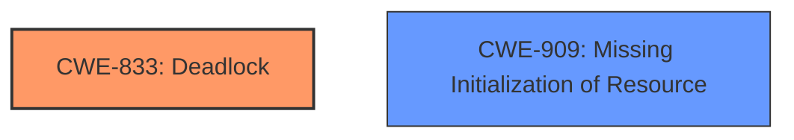

# Analysis for CVE-2024-47696

# Summary
| CWE ID | CWE Name | Confidence | CWE Abstraction Level | CWE Vulnerability Mapping Label | CWE-Vulnerability Mapping Notes |
|---|---|---|---|---|---|
| CWE-833 | Deadlock | 0.9 | Base | Primary | Allowed |
| CWE-909 | Missing Initialization of Resource | 0.7 | Class | Secondary | Allowed-with-Review |

## Evidence and Confidence

*   **Confidence Score:** 0.8
*   **Evidence Strength:** HIGH

## Relationship Analysis
The primary relationship influencing the CWE selection is the root cause of the deadlock. The **missing** `WQ_MEM_RECLAIM` flag during workqueue creation is the **rootcause**. While `CWE-909` describes the **missing** initialization, `CWE-833` more accurately captures the resulting deadlock scenario directly described in the vulnerability. `CWE-833` is a Base level CWE, which is preferred. `CWE-909` is a Class level CWE, and although it describes the **missing** initialization of a resource, it does not fully capture the deadlock itself.



## Vulnerability Chain
The vulnerability chain starts with the **missing** initialization of the `WQ_MEM_RECLAIM` flag when the `iwcm_wq` workqueue is created (`CWE-909`). This leads to a situation where flushing the workqueue during memory reclamation can cause a deadlock (`CWE-833`).

`CWE-909` -> `CWE-833`

## Summary of Analysis
The analysis focuses on identifying the **rootcause** and the resulting impact. The **rootcause** is the **missing** `WQ_MEM_RECLAIM` flag, leading to a deadlock. The evidence provided in the vulnerability description clearly points to this sequence of events. The selection of `CWE-833` as the primary CWE is based on the direct evidence of a deadlock occurring.
The analysis is heavily based on the provided evidence, specifically the **Vulnerability Description Key Phrases** and the **CVE Reference Links Content Summary**.
```
**rootcause:** The workqueue iwcm_wq was created without the WQ_MEM_RECLAIM flag, leading to a potential deadlock when trying to flush it during memory reclamation.
**weakness:** The workqueue iwcm_wq lacks the WQ_MEM_RECLAIM flag, which is necessary for safe flushing during memory reclamation.
**impact:** A deadlock can occur, causing the system to become unresponsive.
```
The hierarchical relationships and retriever scores were considered, but the primary decision driver was the explicit mention of a deadlock and the **missing** flag. The selected CWEs are at the optimal level of specificity because `CWE-833` is a Base CWE and `CWE-909` captures the **missing** initialization aspect.

Relevant CWE Information:

# Enhanced Context (25 CWEs)
The following CWEs were identified as potentially relevant to this vulnerability:

## CWE-667: Improper Locking
**Abstraction Level**: Class
**Similarity Score**: 0.79
**Source**: dense

**Description**:
The product does not properly acquire or release a lock on a resource, leading to unexpected resource state changes and behaviors.

**Mapping Guidance**:
- Usage: Allowed-with-Review
- Rationale: This CWE entry is a Class and might have Base-level children that would be more appropriate

Technical Explanation for CWE-833: Deadlock
*   How the vulnerability's details match the CWE's characteristics: The vulnerability description explicitly mentions a deadlock caused by the workqueue `iwcm_wq` being flushed without the `WQ_MEM_RECLAIM` flag set, which is detected by `check_flush_dependency`.
*   The security implications and potential impact: The deadlock leads to a denial of service, causing the system to become unresponsive.
*   Any parent-child relationships or chain patterns that influenced your mapping: N/A
*   Whether the weakness is primary or secondary in the vulnerability: Primary
*   How the official MITRE mapping guidance influenced your decision: The MITRE mapping guidance allows the use of `CWE-833` with the rationale that it is at the Base level of abstraction.

Technical Explanation for CWE-909: Missing Initialization of Resource
*   How the vulnerability's details match the CWE's characteristics: The workqueue `iwcm_wq` is created without the `WQ_MEM_RECLAIM` flag, which can be considered as a **missing** initialization.
*   The security implications and potential impact: The **missing** initialization leads to a deadlock during memory reclamation.
*   Any parent-child relationships or chain patterns that influenced your mapping: N/A
*   Whether the weakness is primary or secondary in the vulnerability: Secondary
*   How the official MITRE mapping guidance influenced your decision: The MITRE mapping guidance allows the use of `CWE-909` with review because it is a Class-level CWE.

Other CWEs Considered but Not Used:

*   CWE-667: Improper Locking: While locking is involved in deadlocks, the **rootcause** is the **missing** flag and not directly an improper locking mechanism.
*   CWE-362: Concurrent Execution using Shared Resource with Improper Synchronization ('Race Condition'): While a race condition may contribute to the deadlock, the core issue is the **missing** `WQ_MEM_RECLAIM` flag.
*   CWE-416: Use After Free: Not applicable, as the issue is not related to use-after-free.
*   CWE-789: Memory Allocation with Excessive Size Value: Not applicable, as the issue is not about excessive memory allocation.
*   CWE-755: Improper Handling of Exceptional Conditions: While a deadlock is an exceptional condition, the **rootcause** is not the handling of the condition, but the **missing** flag.
*   CWE-476: NULL Pointer Dereference: Not applicable, as the issue is not related to null pointer dereference.
*   CWE-119: Improper Restriction of Operations within the Bounds of a Memory Buffer: Not applicable, as the issue is not related to buffer operations.
*   CWE-191: Integer Underflow (Wrap or Wraparound): Not applicable, as the issue is not related to integer underflow.
*   CWE-824: Access of Uninitialized Pointer: Not applicable, as the issue is not related to pointer access.