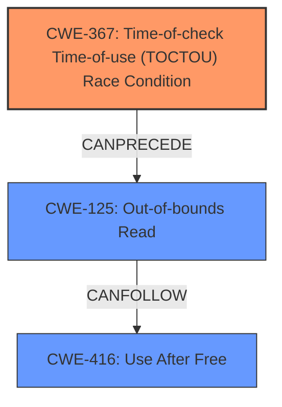

# Analysis Report for CVE-2024-47701

# Vulnerability Analysis Report: CVE-2024-47701

## Description

In the Linux kernel, the following vulnerability has been resolved ext4 avoid OOB when system.data xattr changes underneath the filesystem When looking up for an entry in an inlined directory, if e_value_offs is changed underneath the filesystem by some change in the block device, it will lead to an out-of-bounds access that KASAN detects as an UAF. EXT4-fs (loop0) mounted filesystem 00000000-0000-0000-0000-000000000000 r/w without journal. Quota mode none. loop0 detected capacity change from 2048 to 2047 ================================================================== BUG KASAN use-after-free in ext4_search_dir+0xf2/0x1c0 fs/ext4/namei.c1500 Read of size 1 at addr ffff88803e91130f by task syz-executor269/5103 CPU 0 UID 0 PID 5103 Comm syz-executor269 Not tainted 6.11.0-rc4-syzkaller #0 Hardware name QEMU Standard PC (Q35 + ICH9, 2009), BIOS 1.16.3-debian-1.16.3-2~bpo12+1 04/01/2014 Call Trace __dump_stack lib/dump_stack.c93 [inline] dump_stack_lvl+0x241/0x360 lib/dump_stack.c119 print_address_description mm/kasan/report.c377 [inline] print_report+0x169/0x550 mm/kasan/report.c488 kasan_report+0x143/0x180 mm/kasan/report.c601 ext4_search_dir+0xf2/0x1c0 fs/ext4/namei.c1500 ext4_find_inline_entry+0x4be/0x5e0 fs/ext4/inline.c1697 __ext4_find_entry+0x2b4/0x1b30 fs/ext4/namei.c1573 ext4_lookup_entry fs/ext4/namei.c1727 [inline] ext4_lookup+0x15f/0x750 fs/ext4/namei.c1795 lookup_one_qstr_excl+0x11f/0x260 fs/namei.c1633 filename_create+0x297/0x540 fs/namei.c3980 do_symlinkat+0xf9/0x3a0 fs/namei.c4587 __do_sys_symlinkat fs/namei.c4610 [inline] __se_sys_symlinkat fs/namei.c4607 [inline] __x64_sys_symlinkat+0x95/0xb0 fs/namei.c4607 do_syscall_x64 arch/x86/entry/common.c52 [inline] do_syscall_64+0xf3/0x230 arch/x86/entry/common.c83 entry_SYSCALL_64_after_hwframe+0x77/0x7f RIP 00330x7f3e73ced469 Code 28 00 00 00 75 05 48 83 c4 28 c3 e8 21 18 00 00 90 48 89 f8 48 89 f7 48 89 d6 48 89 ca 4d 89 c2 4d 89 c8 4c 8b 4c 24 08 0f 05 3d 01 f0 ff ff 73 01 c3 48 c7 c1 b8 ff ff ff f7 d8 64 89 01 48 RSP 002b00007fff4d40c258 EFLAGS 00000246 ORIG_RAX 000000000000010a RAX ffffffffffffffda RBX 0032656c69662f2e RCX 00007f3e73ced469 RDX 0000000020000200 RSI 00000000ffffff9c RDI 00000000200001c0 RBP 0000000000000000 R08 00007fff4d40c290 R09 00007fff4d40c290 R10 0023706f6f6c2f76 R11 0000000000000246 R12 00007fff4d40c27c R13 0000000000000003 R14 431bde82d7b634db R15 00007fff4d40c2b0 Calling ext4_xattr_ibody_find right after reading the inode with ext4_get_inode_loc will lead to a check of the validity of the xattrs, avoiding this problem.

## Vulnerability Description Key Phrases

- **Rootcause:** An out-of-bounds access occurs in ext4_search_dir when e_value_offs is changed underneath the filesystem, leading to a use-after-free condition.
- **Weakness:** The vulnerability arises from a race condition where the value of e_value_offs in an inlined directory entry can change after it's initially read, leading to an out-of-bounds access.
- **Impact:** The out-of-bounds access results in a use-after-free (UAF) condition, potentially leading to a system crash or other unpredictable behavior.
- **Vector:** The vulnerability is triggered by changes in the block device affecting e_value_offs while looking up an entry in an inlined directory.
- **Attacker:** An attacker can trigger the vulnerability by making changes to the underlying block device.
- **Product:** Linux Kernel
- **Version:** 6.11.0-rc4
- **Component:** ext4 filesystem

## Analysis (with Relationship Data)

# Summary
| CWE ID | CWE Name | Confidence | CWE Abstraction Level | CWE Vulnerability Mapping Label | CWE-Vulnerability Mapping Notes |
|---|---|---|---|---|---|
| CWE-367 | Time-of-check Time-of-use (TOCTOU) Race Condition | 0.9 | Base |  Primary CWE | Allowed |
| CWE-125 | Out-of-bounds Read | 0.8 | Base | Secondary Candidate | Allowed |
| CWE-416 | Use After Free | 0.7 | Variant | Secondary Candidate | Allowed |

## Evidence and Confidence

*   **Confidence Score:** 0.8
*   **Evidence Strength:** HIGH

## Relationship Analysis
The primary relationship impacting the decision is that CWE-367 is a **Race Condition** which **CANPRECEDE** other weaknesses. CWE-125 and CWE-416 are related in that they are often the result of memory corruption, which can be influenced by race conditions. The abstraction levels were considered, and the Base level was chosen for CWE-367 and CWE-125 as they best represent the specific vulnerability.



## Vulnerability Chain
The vulnerability chain starts with a **Race Condition** (CWE-367) where the `e_value_offs` is changed underneath the filesystem. This leads to an **Out-of-bounds Read** (CWE-125) because the stale offset is used. The KASAN detects a **Use After Free** (CWE-416), which is a consequence of accessing the memory out of bounds.

## Summary of Analysis
The primary weakness is a **Time-of-check Time-of-use (TOCTOU) Race Condition** (CWE-367) where the value of `e_value_offs` changes between the check and the use, leading to an **Out-of-bounds Read** (CWE-125) and triggering a **Use After Free** (CWE-416) error. The evidence strongly supports this classification, particularly the description of the race condition involving `e_value_offs` and the resulting memory access issues. The graph relationships highlight that the race condition precedes the out-of-bounds read and use-after-free. These CWEs are at the appropriate level of specificity, accurately reflecting the root cause and consequences of the vulnerability.

Relevant CWE Information:

# Enhanced Context (25 CWEs)
The following CWEs were identified as potentially relevant to this vulnerability:

## CWE-362: Concurrent Execution using Shared Resource with Improper Synchronization ('Race Condition')
**Abstraction Level**: Class
**Similarity Score**: 0.79
**Source**: dense

**Description**:
The product contains a concurrent code sequence that requires temporary, exclusive access to a shared resource, but a timing window exists in which the shared resource can be modified by another code sequence operating concurrently.

**Mapping Guidance**:
- Usage: Allowed-with-Review
- Rationale: This CWE entry is a Class and might have Base-level children that would be more appropriate

## CWE-667: Improper Locking
**Abstraction Level**: Class
**Similarity Score**: 0.77
**Source**: dense

**Description**:
The product does not properly acquire or release a lock on a resource, leading to unexpected resource state changes and behaviors.

**Mapping Guidance**:
- Usage: Allowed-with-Review
- Rationale: This CWE entry is a Class and might have Base-level children that would be more appropriate

## CWE-367: Time-of-check Time-of-use (TOCTOU) Race Condition
**Abstraction Level**: Base
**Similarity Score**: 0.77
**Source**: dense

**Description**:
The product checks the state of a resource before using that resource, but the resource's state can change between the check and the use in a way that invalidates the results of the check. This can cause the product to perform invalid actions when the resource is in an unexpected state.

**Mapping Guidance**:
- Usage: Allowed
- Rationale: This CWE entry is at the Base level of abstraction, which is a preferred level of abstraction for mapping to the root causes of vulnerabilities.

## CWE-125: Out-of-bounds Read
**Abstraction Level**: Base
**Similarity Score**: 0.76
**Source**: dense

**Description**:
The product reads data past the end, or before the beginning, of the intended buffer.

**Mapping Guidance**:
- Usage: Allowed
- Rationale: This CWE entry is at the Base level of abstraction, which is a preferred level of abstraction for mapping to the root causes of vulnerabilities.

## CWE-59: Improper Link Resolution Before File Access ('Link Following')
**Abstraction Level**: Base
**Similarity Score**: 0.75
**Source**: dense

**Description**:
The product attempts to access a file based on the filename, but it does not properly prevent that filename from identifying a link or shortcut that resolves to an unintended resource.

**Mapping Guidance**:
- Usage: Allowed
- Rationale: This CWE entry is at the Base level of abstraction, which is a preferred level of abstraction for mapping to the root causes of vulnerabilities.

## CWE-755: Improper Handling of Exceptional Conditions
**Abstraction Level**: Class
**Similarity Score**: 0.75
**Source**: dense

**Description**:
The product does not handle or incorrectly handles an exceptional condition.

**Mapping Guidance**:
- Usage: Discouraged
- Rationale: This CWE entry is a level-1 Class (i.e., a child of a Pillar). It might have lower-level children that would be more appropriate

## CWE-754: Improper Check for Unusual or Exceptional Conditions
**Abstraction Level**: Class
**Similarity Score**: 0.75
**Source**: dense

**Description**:
The product does not check or incorrectly checks for unusual or exceptional conditions that are not expected to occur frequently during day to day operation of the product.

**Mapping Guidance**:
- Usage: Allowed-with-Review
- Rationale: This CWE entry is a Class and might have Base-level children that would be more appropriate

## CWE-252: Unchecked Return Value
**Abstraction Level**: Base
**Similarity Score**: 0.75
**Source**: dense

**Description**:
The product does not check the return value from a method or function, which can prevent it from detecting unexpected states and conditions.

**Mapping Guidance**:
- Usage: Allowed
- Rationale: This CWE entry is at the Base level of abstraction, which is a preferred level of abstraction for mapping to the root causes of vulnerabilities.

## CWE-824: Access of Uninitialized Pointer
**Abstraction Level**: Base
**Similarity Score**: 0.74
**Source**: dense

**Description**:
The product accesses or uses a pointer that has not been initialized.

**Mapping Guidance**:
- Usage: Allowed
- Rationale: This CWE entry is at the Base level of abstraction, which is a preferred level of abstraction for mapping to the root causes of vulnerabilities.

## CWE-366: Race Condition within a Thread
**Abstraction Level**: Base
**Similarity Score**: 0.74
**Source**: dense

**Description**:
If two threads of execution use a resource simultaneously, there exists the possibility that resources may be used while invalid, in turn making the state of execution undefined.

**Mapping Guidance**:
- Usage: Allowed
- Rationale: This CWE entry is at the Base level of abstraction, which is a preferred level of abstraction for mapping to the root causes of vulnerabilities.

## CWE-362: Concurrent Execution using Shared Resource with Improper Synchronization ('Race Condition')
**Abstraction Level**: Class
**Similarity Score**: 1772.46
**Source**: sparse

**Description**:
The product contains a concurrent code sequence that requires temporary, exclusive access to a shared resource, but a timing window exists in which the shared resource can be modified by another code sequence operating concurrently.

**Mapping Guidance**:
- Usage: Allowed-with-Review
- Rationale: This CWE entry is a Class and might have Base-level children that would be more appropriate

## CWE-367: Time-of-check Time-of-use (TOCTOU) Race Condition
**Abstraction Level**: Base
**Similarity Score**: 1743.11
**Source**: sparse

**Description**:
The product checks the state of a resource before using that resource, but the resource's state can change between the check


## CWE Relationship Analysis

Current CWEs represent these abstraction levels: .


### Vulnerability Chain Analysis

**Chain starting from CWE-416:**
- 416 (Use After Free) - ROOT


**Chain starting from CWE-125:**
- 125 (Out-of-bounds Read) - ROOT


### CWE Relationship Diagram

```mermaid
graph TD
    classDef primary fill:#f96,stroke:#333,stroke-width:2px
    classDef secondary fill:#69f,stroke:#333
    classDef tertiary fill:#9e9,stroke:#333
```


*Report generated on 2025-07-13 18:21:51*
