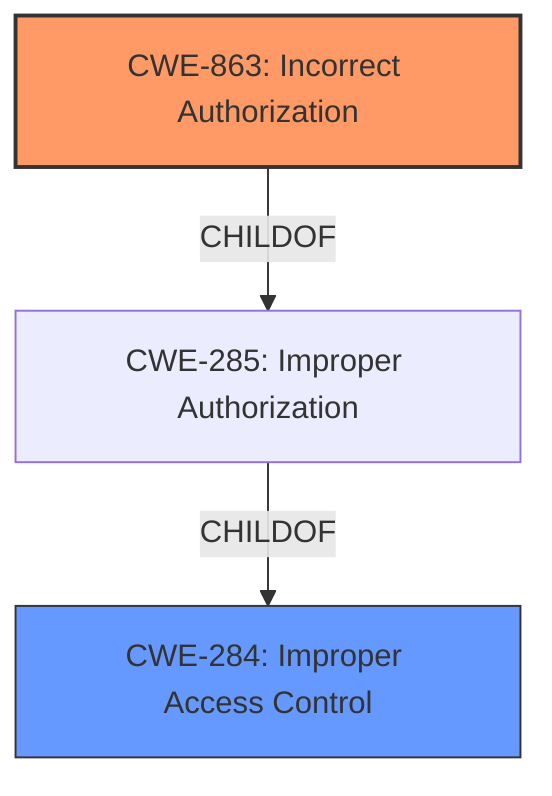

# Raw Analyzer Response for CVE-2024-47758

# Summary
| CWE ID    | CWE Name                                                                       | Confidence | CWE Abstraction Level | CWE Vulnerability Mapping Label | CWE-Vulnerability Mapping Notes |
| :-------- | :----------------------------------------------------------------------------- | :--------- | :-------------------- | :------------------------------ | :------------------------------ |
| CWE-863   | Incorrect Authorization                                                        | 0.9        | Class                 | Allowed-with-Review           | Primary CWE                     |
| CWE-284   | Improper Access Control                                                        | 0.7        | Pillar                | Discouraged                   | Secondary Candidate             |

## Evidence and Confidence

*   **Confidence Score:** 0.8
*   **Evidence Strength:** MEDIUM

## Relationship Analysis

The primary CWE selected is CWE-863 (Incorrect Authorization), which is a Class-level CWE. While it's generally preferred to choose a more specific Base or Variant CWE, the available evidence does not provide enough detail to pinpoint the exact authorization mechanism that failed. CWE-863 is a child of CWE-285 (Improper Authorization), which is in turn a child of CWE-284 (Improper Access Control). Given the lack of specificity, CWE-284 serves as a reasonable, albeit less precise, secondary CWE.

## Vulnerability Chain

The vulnerability chain starts with the **incorrect authorization** (CWE-863) within the API. This allows an authenticated user to bypass access controls, leading to the **impact** of taking control of other users' accounts with the same or lower privileges. The root cause is the flawed authorization check, and the impact is unauthorized access and control.

## Summary of Analysis

The initial assessment, influenced by the provided evidence and retriever results, points towards an authorization issue. The vulnerability description states that an authenticated user can take control of other user accounts via the API due to a flaw that allows even users with the same or lower privileges to be compromised. The retriever results suggest CWE-863 (Incorrect Authorization) and CWE-284 (Improper Access Control) as potential candidates.

The "CVE Reference Links Content Summary" section states:
- "**Root Cause of Vulnerability:** The vulnerability stems from a flaw in the GLPI API that allows an authenticated user to take control of another user's account, even if the target user has the same or lower privileges."
- "**Weaknesses/Vulnerabilities Present:** - Improper access control in the API. - Insufficient privilege checks when performing actions through the API."
- "The CWE associated with this vulnerability is CWE-284: Improper Access Control."

However, the mapping guidance for CWE-284 notes that it's often overused and that more specific children should be considered first. CWE-863 represents a more specific scenario where authorization checks are present but **incorrect**. Given the evidence, it's more accurate to state the authorization check is flawed versus simply missing.

The selection of CWE-863 is at the optimal level of specificity given the available information. While a more granular CWE might exist, the current description does not provide enough detail to justify its selection. CWE-284 is a reasonable secondary classification, as it represents the broader category of access control issues.

Relevant CWE Information:

# Enhanced Context (25 CWEs)

## CWE-267: Privilege Defined With Unsafe Actions
**Abstraction Level**: Base
**Similarity Score**: 0.79
**Source**: dense

**Description**:
A particular privilege, role, capability, or right can be used to perform unsafe actions that were not intended, even when it is assigned to the correct entity.
N/A

## CWE-266: Incorrect Privilege Assignment
**Abstraction Level**: Base
**Similarity Score**: 0.79
**Source**: dense

**Description**:
A product incorrectly assigns a privilege to a particular actor, creating an unintended sphere of control for that actor.
N/A

## CWE-274: Improper Handling of Insufficient Privileges
**Abstraction Level**: Base
**Similarity Score**: 0.77
**Source**: dense

**Description**:
The product does not handle or incorrectly handles when it has insufficient privileges to perform an operation, leading to resultant weaknesses.
N/A

## CWE-280: Improper Handling of Insufficient Permissions or Privileges
**Abstraction Level**: Base
**Similarity Score**: 0.77
**Source**: dense

**Description**:
The product does not handle or incorrectly handles when it has insufficient privileges to access resources or functionality as specified by their permissions. This may cause it to follow unexpected code paths that may leave the product in an invalid state.
N/A

## CWE-639: Authorization Bypass Through User-Controlled Key
**Abstraction Level**: Base
**Similarity Score**: 0.75
**Source**: dense

**Description**:
The system's authorization functionality does not prevent one user from gaining access to another user's data or record by modifying the key value identifying the data.
N/A

## CWE-668: Exposure of Resource to Wrong Sphere
**Abstraction Level**: Class
**Similarity Score**: 0.75
**Source**: dense

**Description**:
The product exposes a resource to the wrong control sphere, providing unintended actors with inappropriate access to the resource.
N/A

## CWE-472: External Control of Assumed-Immutable Web Parameter
**Abstraction Level**: Base
**Similarity Score**: 0.75
**Source**: dense

**Description**:
The web application does not sufficiently verify inputs that are assumed to be immutable but are actually externally controllable, such as hidden form fields.
N/A

## CWE-276: Incorrect Default Permissions
**Abstraction Level**: Base
**Similarity Score**: 0.75
**Source**: dense

**Description**:
During installation, installed file permissions are set to allow anyone to modify those files.
N/A

## CWE-41: Improper Resolution of Path Equivalence
**Abstraction Level**: Base
**Similarity Score**: 0.74
**Source**: dense

**Description**:
The product is vulnerable to file system contents disclosure through path equivalence. Path equivalence involves the use of special characters in file and directory names. The associated manipulations are intended to generate multiple names for the same object.
N/A

## CWE-59: Improper Link Resolution Before File Access ('Link Following')
**Abstraction Level**: Base
**Similarity Score**: 0.74
**Source**: dense

**Description**:
The product attempts to access a file based on the filename, but it does not properly prevent that filename from identifying a link or shortcut that resolves to an unintended resource.
N/A

## CWE-863: Incorrect Authorization
**Abstraction Level**: Class
**Similarity Score**: 1806.03
**Source**: sparse

**Description**:
The product performs an authorization check when an actor attempts to access a resource or perform an action, but it does not correctly perform the check.

**Mapping Guidance**:
- Usage: Allowed-with-Review
- Rationale: This CWE entry is a Class and might have Base-level children that would be more appropriate
**Match.** The vulnerability description indicates that authorization checks are in place but **incorrectly** allow an authenticated user to take control of other user accounts. This aligns perfectly with the description of CWE-863.

## CWE-269: Improper Privilege Management
**Abstraction Level**: Class
**Similarity Score**: 1765.54
**Source**: sparse

**Description**:
The product does not properly assign, modify, track, or check privileges for an actor, creating an unintended sphere of control for that actor.
N/A

## CWE-285: Improper Authorization
**Abstraction Level**: Class
**Similarity Score**: 1761.80
**Source**: sparse

**Description**:
The product does not perform or incorrectly performs an authorization check when an actor attempts to access a resource or perform an action.
N/A

## CWE-267: Privilege Defined With Unsafe Actions
**Abstraction Level**: Base
**Similarity Score**: 1704.81
**Source**: sparse

**Description**:
A particular privilege, role, capability, or right can be used to perform unsafe actions that were not intended, even when it is assigned to the correct entity.
N/A

## CWE-732: Incorrect Permission Assignment for Critical Resource
**Abstraction Level**: Class
**Similarity Score**: 1678.53
**Source**: sparse

**Description**:
The product specifies permissions for a security-critical resource in a way that allows that resource to be read or modified by unintended actors.
N/A

## CWE-3